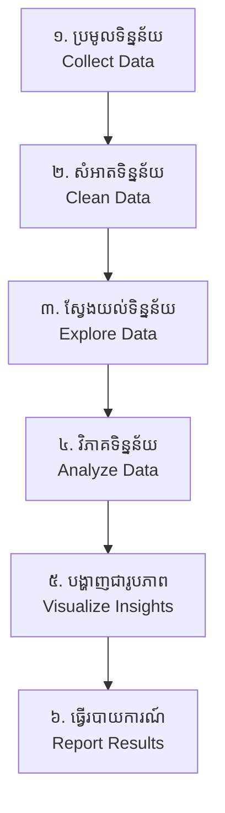

## 🌐 សេចក្តីផ្តើម (Overview)

ការធ្វើការងារជាអ្នកវិភាគទិន្នន័យ ប្រៀបដូចជាចុងភៅដែលរៀបចំមុខម្ហូបអញ្ចឹង។ អ្នកមិនអាចយកបន្លែដែលទើបតែបេះចេញពីចម្ការ មកឆាភ្លាមៗនោះទេ។ វាមានក្បួនខ្នាតច្បាស់លាស់ដើម្បីធានាអនាម័យ និងរសជាតិ! នៅក្នុង Data Analysis វដ្តនោះមាន ៦ ជំហានធំៗ។

---

## 🔄 ជំហានទាំង ៦ (The Workflow)

### ១. ការប្រមូលទិន្នន័យ (Collect Data)
មុននឹងធ្វើអ្វីទាំងអស់ យើងត្រូវការវត្ថុធាតុដើម។ 
- **សំណួរ:** តើទិន្នន័យនៅឯណា? តើវាជាឯកសារ Excel, CSV, ឬស្ថិតនៅក្នុង Database?
- **ឧបករណ៍ (Tools):** SQL, Python (Pandas `read_csv`), Web Scraping។

### ២. ការសំអាតទិន្នន័យ (Clean Data - *សំខាន់បំផុត*)
ទិន្នន័យពិតមិនមានរបៀបរៀបរយទេ។
- **សកម្មភាព:** លុបចោលអ្នកដែលបំពេញ Form មិនអស់, កែតម្រូវទម្រង់កាលបរិច្ឆេទ (DD/MM/YYYY), លុបទិន្នន័យស្ទួន។
- **ឧបករណ៍ (Tools):** Python (Pandas, NumPy) ឬ Excel។

### ៣. ការស្វែងយល់ពីទិន្នន័យ (Explore Data - EDA)
ដើរមើលទិន្នន័យត្រួសៗ ដើម្បីស្គាល់វាអោយកាន់តែច្បាស់។
- **សកម្មភាព:** រកមើលអាយុមធ្យមរបស់អតិថិជន, រកមើលអ្នកដែលទិញច្រើនជាងគេ, រកមើលភាពមិនប្រក្រតី (Outliers)។
- **ឧបករណ៍ (Tools):** Python (Pandas `describe()`, `info()`)។

### ៤. ការវិភាគទិន្នន័យ (Analyze Data)
នេះជាពេលដែលយើងចាប់ផ្តើមឆ្លើយសំណួរអាជីវកម្ម ឫស្វែងរកទំនាក់ទំនងរវាងកត្តាផ្សេងៗ។
- **សកម្មភាព:** តើមានទំនាក់ទំនងរវាង "ការបញ្ចុះតម្លៃ" និង "ការកើនឡើងនៃការលក់" ដែរឬទេ?
- **ឧបករណ៍ (Tools):** គណិតវិទ្យា, ស្ថិតិ (Statistics), Python (Pandas GroupBy)។

### ៥. ការបង្ហាញជារូបភាព (Visualize Insights)
គ្មានអ្នកណាចូលចិត្តមើលតារាងលេខរាប់ម៉ឺនជួរទេ។ ភ្នែកមនុស្សចូលចិត្តមើលរូបភាព និងពណ៌។
- **សកម្មភាព:** គូរក្រាហ្វិកចំណែកទីផ្សារ (Pie chart), ក្រាហ្វិកចំណូលប្រចាំខែ (Line chart)។
- **ឧបករណ៍ (Tools):** Python (Matplotlib, Seaborn) ឫ BI Tools (Tableau, Power BI)។

### ៦. ការធ្វើរបាយការណ៍ និងបទបង្ហាញ (Report Results)
ជំហានចុងក្រោយ គឺការយកលទ្ធផលទៅប្រាប់មេកោយ (Stakeholders) ជារឿងរ៉ាវ (Data Storytelling)។
- **សកម្មភាព:** បង្កើត Dashboard ឫ Slideshow ដោយសង្កត់ធ្ងន់លើសកម្មភាពដែលក្រុមហ៊ុនគួរតែធ្វើបន្ទាប់ (Actionable Recommendations)។
- **ឧបករណ៍ (Tools):** Power BI, Tableau, PowerPoint។

វគ្គសិក្សានេះ នឹងបង្រៀនអ្នកអោយចេះប្រើប្រាស់ Python ដើម្បីសម្រេចជំហានទាំង ៦ នេះប្រកបដោយវិជ្ជាជីវៈ!
