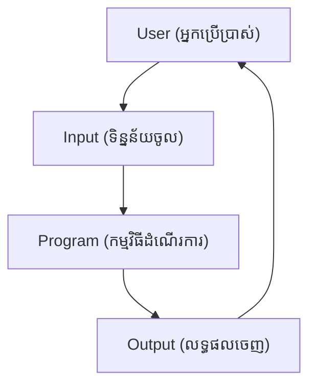
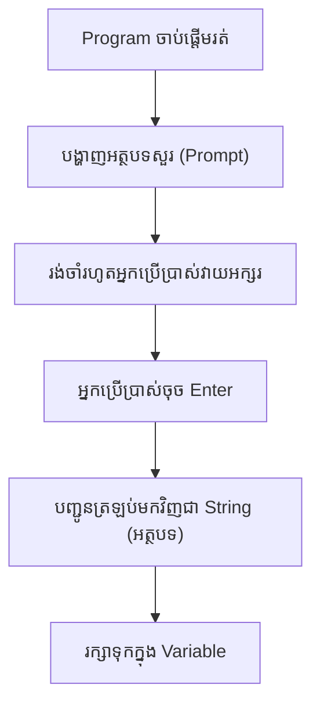
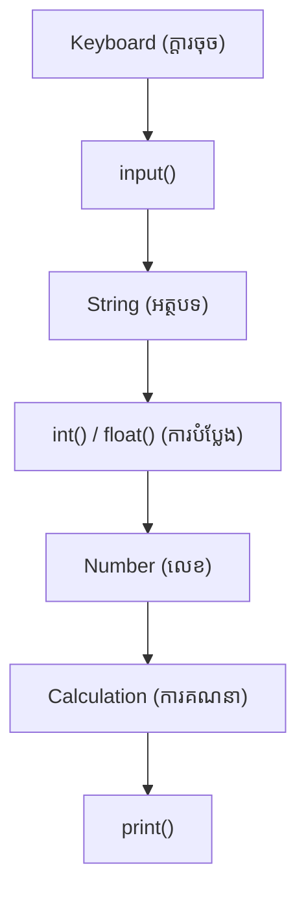
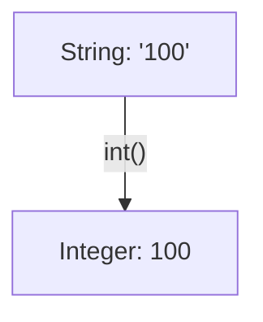

## 🎯 ហេតុអ្វីយើងត្រូវការ Input និង Output?

មុននឹងស្វែងយល់ពីរបៀបសរសេរកូដ សូមស្វែងយល់ពីមូលហេតុដែលកម្មវិធីមួយត្រូវការ Input និង Output។

បើគ្មាន **Input** ទេ កម្មវិធីមិនអាចទទួលបានព័ត៌មានពីអ្នកប្រើប្រាស់ឡើយ។
បើគ្មាន **Output** ទេ អ្នកប្រើប្រាស់ក៏មិនអាចមើលឃើញលទ្ធផលដែរ។

ចូរចាត់ទុកកម្មវិធីកុំព្យូទ័រដូចជាការសន្ទនាមួយ៖



រាល់កម្មវិធី (Interactive Applications) ទាំងអស់ តែងតែដើរតាមវដ្តមួយនេះ។
ឧទាហរណ៍៖
* **ទូ ATM**: ស្នើសុំលេខកូដ PIN (Input) → បង្ហាញសមតុល្យទឹកប្រាក់ (Output)
* **Login ទំព័រវិបសាយ**: ស្នើសុំអ៊ីមែល/លេខសម្ងាត់ (Input) → បង្ហាញការជោគជ័យ ឬកំហុស (Output)
* **ម៉ាស៊ីនគិតលេខ**: ស្នើសុំលេខ (Input) → បង្ហាញលទ្ធផលនៃការគណនា (Output)
* **ChatGPT**: ទទួលបានសំណួររបស់អ្នក (Input) → បង្កើតចម្លើយឆ្លើយតប (Output)

---

## 🔄 លំហូរការងាររបស់ `input()`

អ្នករៀនដំបូងភាគច្រើនមិនទាន់យល់ច្បាស់ពីអ្វីដែលកើតឡើងនៅពីក្រោយកូដនេះទេ៖

```python
name = input("Enter your name: ")
```

នេះគឺជាលំហូរនៃដំណើរការ (Execution flow)៖



ចំណុចដ៏សំខាន់ដែលអ្នកត្រូវចាំគឺ៖
> **`input()` នឹងផ្អាក (Pause) កម្មវិធីរហូតទាល់តែអ្នកប្រើប្រាស់ចុច Enter។**

---

## ❓ ហេតុអ្វីបានជា `input()` តែងតែបញ្ជូនត្រឡប់មកជា `str`?

នេះគឺជាប្រធានបទដែលធ្វើឱ្យអ្នករៀនដំបូងយល់ច្រឡំជាងគេ។

ទោះបីជាអ្នកប្រើប្រាស់វាយលេខ៖
```text
25
```
ក៏ Python ទទួលបានលទ្ធផលជា៖
```python
"25"
```

**ហេតុអ្វី?**
ពីព្រោះក្តារចុច (Keyboard) របស់អ្នកបញ្ជូនទិន្នន័យជា **តួអក្សរ (Characters)** មិនមែនជាលេខនោះទេ។ 
Python មិនអាចសន្មតដោយខ្លួនឯងបានទេថា តើលេខ `25` នេះមានន័យថាជា៖
* អាយុ (age)
* លេខសម្គាល់ (ID)
* លេខកូដតំបន់ (ZIP code)
* លេខទូរស័ព្ទ (phone number)
* ឬលេខកូដទំនិញ (product code) នោះទេ!

ដើម្បីសុវត្ថិភាព Python បញ្ជូនអ្វីៗទាំងអស់មកវិញជាអត្ថបទ (String)។ 
អ្នកសរសេរកម្មវិធី (Programmer) ជាអ្នកសម្រេចចិត្តដោយខ្លួនឯង ថាតើត្រូវបំប្លែងវាទៅជាអ្វី។

---

## 🗺️ គំនូសតាង៖ Input → ការបំប្លែង → ដំណើរការ → Output



គំរូផ្នត់គំនិតនេះមានតម្លៃខ្លាំងណាស់ ក្នុងការជួយអ្នកឱ្យយល់ពីលំហូរទិន្នន័យពិតប្រាកដ។

---

## 🖨️ ការប្រើប្រាស់ `print()` កម្រិតខ្ពស់

វគ្គសិក្សាភាគច្រើនពន្យល់តែការប្រើប្រាស់ធម្មតា។ តោះមើលជម្រើសផ្សេងៗទៀត៖

ការប្រើប្រាស់ធម្មតា៖
```python
print("Python")
```

បង្ហាញតម្លៃច្រើនក្នុងពេលតែមួយ៖
```python
name = "Sokha"
age = 20
print(name, age)
```

ការប្រើប្រាស់ `sep` (អក្សរខណ្ឌចែក)៖
```python
print("Python", "AI", sep=" | ")
# លទ្ធផល: Python | AI
```

ការប្រើប្រាស់ `end` (ការបញ្ចាំងអក្សរបញ្ចប់ជំនួសការចុះបន្ទាត់)៖
```python
print("Loading", end="...")
print("Done")
# លទ្ធផល: Loading...Done
```

ជម្រើសទាំងនេះនឹងមានប្រយោជន៍ខ្លាំងណាស់ពេលអ្នកសរសេរកម្មវិធី។

---

## 🪄 ហេតុអ្វីត្រូវប្រើ f-Strings?

ជំនួសឱ្យការបង្ហាញតែទម្រង់កូដ តោះប្រៀបធៀបវិធីសាស្រ្តទាំង ៣៖

វិធីសាស្រ្តចាស់ (មិនសូវល្អ):
```python
print("Hello " + name)
```

វិធីសាស្រ្តមធ្យម:
```python
print("Hello {}".format(name))
```

វិធីសាស្រ្តល្អបំផុត (f-strings):
```python
print(f"Hello {name}")
```

ហេតុអ្វីបានជាយើងគួរប្រើ **f-strings**?
* លឿនជាងគេ (Faster)
* ស្អាតជាងគេ (Cleaner)
* ងាយស្រួលអានបំផុត (Easier to read)

---

## 🔄 គំនូសតាង ការបំប្លែង Data Type

រូបភាពអាចជួយឱ្យអ្នកចងចាំបានល្អជាងការអានអត្ថបទ៖



---

## ⚖️ Implicit ធៀបនឹង Explicit Conversion

**Implicit (ការបំប្លែងដោយស្វ័យប្រវត្តិពី Python)**
```python
5 + 3.2
```
លទ្ធផល៖
```python
8.2
```
Python បានបំប្លែង `5` ទៅជា `5.0` ដោយស្វ័យប្រវត្តិដើម្បីអាចបូកជាមួយ `3.2` បាន។

**Explicit (ការបំប្លែងដោយបង្ខំពីអ្នកសរសេរកូដ)**
```python
int("5")
```
នេះជាការដែលយើងប្រើប្រាស់ Function ដើម្បីបំប្លែងដោយផ្ទាល់។

---

## 🛠️ ឧទាហរណ៍នៃការបំប្លែង (Conversion Examples)

យើងអាចបំប្លែងទិន្នន័យគ្រប់ប្រភេទ៖

បំប្លែងទៅអត្ថបទ (String)៖
```python
str(100)
# លទ្ធផល: "100"
```

បំប្លែងទៅលេខទសភាគ (Float)៖
```python
float(10)
# លទ្ធផល: 10.0
```

បំប្លែងទៅពិត/មិនពិត (Boolean)៖
```python
bool(1)
# លទ្ធផល: True

bool(0)
# លទ្ធផល: False
```

---

## ✅ គំនិត Truthy និង Falsy

នេះជាគន្លឹះដ៏សំខាន់នៅក្នុង Python។ តម្លៃមួយចំនួនត្រូវបានចាត់ទុកថាជា Falsy (មិនពិត)៖

| តម្លៃ (Value)     | លទ្ធផល (Result) |
| --------------- | ------ |
| `0`               | False  |
| `0.0`             | False  |
| `""` (ទទេ)       | False  |
| `[]` (បញ្ជីទទេ)    | False  |
| `{}` (វចនានុក្រមទទេ) | False  |
| `None`            | False  |
| **តម្លៃផ្សេងៗទៀតទាំងអស់**| **True**   |

ចំណេះដឹងនេះនឹងជួយអ្នកយ៉ាងច្រើននៅពេលយើងរៀនដល់ `if` statements។

---

## ❌ ឧទាហរណ៍នៃកំហុសការបំប្លែង (Conversion Errors)

តើមានអ្វីកើតឡើងបើយើងបំប្លែងមិនត្រឹមត្រូវ?

```python
int("Hello")
# លទ្ធផល: ValueError (កំហុសតម្លៃ)
```

```python
float("abc")
# លទ្ធផល: ValueError
```

**មូលហេតុ:** ការបំប្លែងនឹងដំណើរការទៅបាន លុះត្រាតែអត្ថបទនោះតំណាងឱ្យតួលេខដ៏ត្រឹមត្រូវមួយតែប៉ុណ្ណោះ។

---

## 🛡️ ការគ្រប់គ្រងកំហុស (Error Handling Preview)

ជំនួសឱ្យការទុកឱ្យកម្មវិធីគាំង (Crash) នៅពេលអ្នកប្រើប្រាស់វាយអក្សរជំនួសលេខ៖
```python
age = int(input("Age: "))
```

នៅមេរៀនក្រោយៗ អ្នកនឹងរៀនពីវិធីដោះស្រាយបញ្ហានេះ៖
```python
try:
    age = int(input("Age: "))
except ValueError:
    print("Invalid number")
```
នេះជាការត្រួសត្រាយផ្លូវទៅកាន់មេរៀន Error Handling។

---

## 🌍 ការអនុវត្តជាក់ស្តែង (Real-World Applications)

ក្រៅពីវិស័យ Data Science, Input/Output មានវត្តមានស្ទើរតែគ្រប់កម្មវិធីទាំងអស់៖
* ប្រព័ន្ធ Login (Login systems)
* ធនាគារអនឡាញ (Online banking)
* ការបញ្ជាទិញទំនិញ (E-commerce checkout)
* ការចុះឈ្មោះសិស្ស (Student registration)
* ប្រព័ន្ធគិតលុយ (POS systems)
* កម្មវិធី Chatbots

នេះជាមូលហេតុដែល Input និង Output មានសារៈសំខាន់បំផុតគ្រប់ទីកន្លែង។

---

## 🧪 លំហាត់អនុវត្តន៍ខ្លីៗ (Mini Exercises)

### លំហាត់ទី ១
បង្កើតកម្មវិធីមួយដើម្បីស្នើសុំ៖
* ឈ្មោះ (Name)
* អាយុ (Age)
* ប្រទេស (Country)

រួចបង្ហាញលទ្ធផលដូចនេះ៖
```text
Hello Sokha!

You are 20 years old.

You live in Cambodia.
```

---

### លំហាត់ទី ២
ស្នើសុំលេខពីរពីអ្នកប្រើប្រាស់។
រួចធ្វើការគណនារក៖
* ផលបូក (Sum)
* ផលដក (Difference)
* ផលគុណ (Product)
* ផលចែក (Quotient)

---

### លំហាត់ទី ៣
តើកូដខាងក្រោមនេះនឹងបង្ហាញលទ្ធផលអ្វី? (ទាយលទ្ធផលមុនរត់កូដ)

កូដទី 1៖
```python
print(int("25") + 5)
```

កូដទី 2៖
```python
print("25" + "5")
```

កូដទី 3៖
```python
print(int("25") + int("5"))
```

---

### លំហាត់ទី ៤
ស្វែងរក និងកែតម្រូវកំហុសនៅក្នុងកូដនេះ៖
```python
age = input("Age: ")

print(age + 5)
```

---

## 📊 តារាងសេចក្តីសង្ខេប (Summary Table)

| អនុគមន៍ (Function) | គោលបំណង (Purpose)            |
| -------- | ------------------ |
| `input()`  | អានទិន្នន័យបញ្ចូលពីអ្នកប្រើប្រាស់    |
| `print()`  | បង្ហាញលទ្ធផលចេញមកក្រៅ     |
| `int()`    | បំប្លែងទៅជាលេខគត់ |
| `float()`  | បំប្លែងទៅជាលេខទសភាគ |
| `str()`    | បំប្លែងទៅជាអត្ថបទ  |
| `bool()`   | បំប្លែងទៅជាប្រភេទពិត/មិនពិត |

---

## 📝 សំណួរសម្ភាសន៍ទូទៅ (Common Interview Question)

សំណួរ៖ 
```python
age = input("Age: ")

print(type(age))
```
ប្រសិនបើអ្នកប្រើប្រាស់វាយបញ្ចូលលេខ៖
```text
25
```
តើលទ្ធផល (Output) នឹងចេញអ្វី?

**ចម្លើយ:** 
```python
<class 'str'>
```

នេះគឺជាគំនិតដ៏សំខាន់បំផុតមួយដែលអ្នកត្រូវចាំជានិច្ចនៅពេលប្រើប្រាស់ `input()`!
