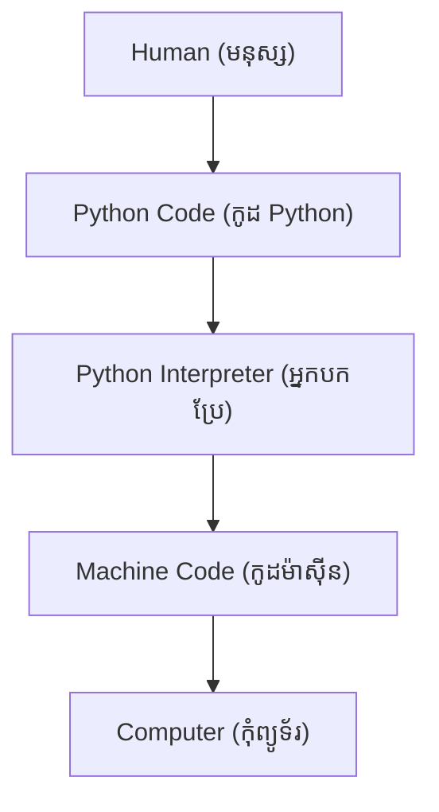

## 🎯 ហេតុអ្វីត្រូវរៀន Python? (Why Learn Python?)

មុននឹងរៀនសរសេរកូដ សូមសួរខ្លួនឯងថា៖

> **ហេតុអ្វីបានជាអ្នកអភិវឌ្ឍន៍ អ្នកស្រាវជ្រាវ សាកលវិទ្យាល័យ និងក្រុមហ៊ុនរាប់លាន ជ្រើសរើសប្រើប្រាស់ Python?**

Python មិនមែនគ្រាន់តែជាភាសាសរសេរកូដធម្មតានោះទេ។ 

វាបានក្លាយជា **ភាសាស្តង់ដារ (Standard Language)** សម្រាប់៖

* 📊 Data Science
* 🤖 Artificial Intelligence (AI)
* 🧠 Machine Learning
* 💬 Large Language Models (LLMs)
* 🌐 Web Development
* ⚙️ Automation
* ☁️ Cloud Computing
* 🔬 Scientific Computing
* 🛡 Cybersecurity
* 📈 Data Engineering

ការចេះ Python នឹងបើកទ្វារឱកាសការងារជាច្រើននៅក្នុងវិស័យបច្ចេកវិទ្យា។

---

## 🕰️ ប្រវត្តិសង្ខេបរបស់ Python

| ឆ្នាំ  | ព្រឹត្តិការណ៍                                                 |
| ----- | ----------------------------------------------------- |
| 1989  | លោក Guido van Rossum ចាប់ផ្តើមបង្កើត Python              |
| 1991  | Python ត្រូវបានចេញផ្សាយជាផ្លូវការ                        |
| 2000  | ការចេញផ្សាយ Python 2.0                                 |
| 2008  | ការចេញផ្សាយ Python 3.0                                 |
| បច្ចុប្បន្ន | ក្លាយជាភាសាកូដដ៏ពេញនិយមបំផុតមួយនៅលើពិភពលោក |

> Python ត្រូវបានបង្កើតឡើងជាមួយនឹងគោលដៅដ៏សាមញ្ញមួយ៖

**"ការសរសេរកូដគួរតែងាយស្រួលសម្រាប់មនុស្សក្នុងការអាន និងសរសេរ។"**

---

## 📚 ពាក្យបច្ចេកទេសគួរយល់ដឹង (Definitions)

មុននឹងបន្ត សូមស្វែងយល់ពាក្យបច្ចេកទេសមួយចំនួន៖
- **Programming Language**: ជាភាសាដែលមនុស្សប្រើសម្រាប់ប្រាប់កុំព្យូទ័រឱ្យធ្វើអ្វីមួយ (ឧទាហរណ៍: Python, Java, C++)។
- **Syntax**: ជាក្បួនវេយ្យាករណ៍នៃភាសាកូដ។ បើសរសេរខុសក្បួន កុំព្យូទ័រនឹងមិនយល់ (Syntax Error)។
- **Interpreted Language**: ជាភាសាដែលកុំព្យូទ័រអាន និងដំណើរការកូដម្ដងមួយបន្ទាត់ៗ ផ្ទុយពី Compiled Language ដែលត្រូវប្រែជាភាសាម៉ាស៊ីនទាំងស្រុងមុននឹងរត់។
- **High-level Language**: ភាសាដែលសរសេរមកស្រដៀងភាសាមនុស្ស (ភាសាអង់គ្លេស) ងាយស្រួលអាននិងសរសេរ។

---

## 🧠 គំរូផ្នត់គំនិត (Mental Model)

ជំនួសឱ្យការទន្ទេញនិយមន័យ... សូមស្រមៃអំពីដំណើរការនេះ៖



Python ដើរតួដូចជាអ្នកបកប្រែរវាងអ្នក និងកុំព្យូទ័រ។ 
អ្នកសរសេរការណែនាំដែលស្រដៀងនឹងភាសាអង់គ្លេស ហើយ Python នឹងបំប្លែងវាទៅជាការណែនាំដែលកុំព្យូទ័រអាចយល់បាន។

---

## ⚙️ របៀបដែល Python ដំណើរការកូដ

នៅពេលអ្នករត់កូដ៖

```python
print("Hello")
```

Python នឹងឆ្លងកាត់ដំណាក់កាលដូចខាងក្រោម៖

```text
Source Code
      │
      ▼
Python Interpreter
      │
Bytecode
      │
Python Virtual Machine (PVM)
      │
      ▼
Output
```

ការយល់ពីដំណើរការនេះជួយពន្យល់ពីមូលហេតុដែល Python ត្រូវបានហៅថាជា **interpreted language**។

---

## 💻 ការសរសេរកូដដំបូង (Code Breakdown)

តោះមើលកូដ Python ដំបូងរបស់អ្នក និងរបៀបដែលវាដំណើរការ៖

```python
# ១. បង្ហាញអត្ថបទទៅកាន់អេក្រង់
print("Hello, Data Science!")

# ២. ការបង្កើតអថេរ (Variables) និងការគណនា
name = "Python"
version = 3.12

# ៣. ការបង្ហាញលទ្ធផលរួមគ្នា (f-string)
print(f"Welcome to {name} version {version}")
```

**ការពន្យល់កូដមួយបន្ទាត់ម្ដងៗ:**
- `print(...)`: គឺជា function របស់ Python ដែលមានតួនាទីយកអ្វីដែលនៅក្នុងវង់ក្រចក ទៅបង្ហាញនៅលើអេក្រង់ (Console)។
- `"Hello, Data Science!"`: អត្ថបទដែលនៅក្នុងសញ្ញា `"` ឬ `'` ត្រូវបានហៅថា String។
- `name = "Python"`: យើងបង្កើតប្រអប់មួយឈ្មោះថា `name` ហើយដាក់ពាក្យ `"Python"` ចូលទៅក្នុងនោះ។
- `version = 3.12`: យើងបង្កើតប្រអប់មួយទៀតឈ្មោះថា `version` ហើយដាក់លេខ `3.12` ចូល។
- `f"..."`: អក្សរ `f` នៅពីមុខសញ្ញា `"` អនុញ្ញាតឱ្យយើងទាញយកទិន្នន័យពីក្នុងប្រអប់ (Variables) មកបង្ហាញរួមគ្នាជាមួយអត្ថបទដោយប្រើសញ្ញា `{ }` បានយ៉ាងងាយស្រួល។

---

## 🔥 ហេតុអ្វី Python ក្លាយជាលេខ១ សម្រាប់ Data Science

Python ខ្លួនវាផ្ទាល់មិនមានអ្វីពិសេសដោយសារតែ Syntax របស់វានោះទេ។
ថាមពលពិតប្រាកដរបស់វាគឺស្ថិតនៅលើ **Ecosystem**។

| Library      | គោលបំណង                          |
| ------------ | -------------------------------- |
| NumPy        | Numerical Computing (ការគណនាលេខ)  |
| Pandas       | Data Analysis (ការវិភាគទិន្នន័យ)    |
| Matplotlib   | Visualization (ការបង្ហាញទិន្នន័យជាក្រាហ្វ) |
| Seaborn      | Statistical Charts (ក្រាហ្វស្ថិតិ)   |
| Scikit-learn | Machine Learning                 |
| TensorFlow   | Deep Learning                    |
| PyTorch      | AI Research                      |
| OpenCV       | Computer Vision                  |
| Hugging Face | Generative AI                    |
| Polars       | High-performance Data Processing |

អ្នកអាចប្រៀបធៀប Python ទៅនឹងស្មាតហ្វូន (Smartphone) មួយ៖
ភាសា Python គឺដូចជាតួទូរស័ព្ទ ចំណែកឯ Libraries គឺដូចជាកម្មវិធី (Apps) ដែលអ្នកដំឡើង។
បើគ្មានកម្មវិធីទេ ទូរស័ព្ទនឹងមិនសូវមានប្រយោជន៍នោះទេ។ បើគ្មាន Libraries ទេ Python ក៏មិនអាចគ្របដណ្ដប់វិស័យ Data Science ដែរ។

---

## 📊 តួនាទីរបស់ Python នៅក្នុង Data Science Workflow

```text
Raw Data (ទិន្នន័យដើម)
     │
     ▼
Python
     │
     ├── Pandas
     ├── NumPy
     ├── Matplotlib
     ├── Scikit-learn
     ├── TensorFlow
     │
     ▼
Insights (ចំណេះដឹងពីទិន្នន័យ)
     │
     ▼
Business Decisions (ការសម្រេចចិត្តអាជីវកម្ម)
```

Python គឺជាកាវ (Glue) ដែលភ្ជាប់គ្រប់ដំណាក់កាលនៃ Data Science pipeline។

---

## ⚖️ Python ប្រៀបធៀបជាមួយភាសាផ្សេងៗ

| ភាសា   | ភាពងាយស្រួល | ល្បឿន | AI    | Web   | Data Science |
| ---------- | ----- | ----- | ----- | ----- | ------------ |
| Python     | ⭐⭐⭐⭐⭐ | ⭐⭐⭐   | ⭐⭐⭐⭐⭐ | ⭐⭐⭐⭐  | ⭐⭐⭐⭐⭐        |
| Java       | ⭐⭐⭐   | ⭐⭐⭐⭐  | ⭐⭐    | ⭐⭐⭐⭐⭐ | ⭐⭐           |
| C++        | ⭐     | ⭐⭐⭐⭐⭐ | ⭐⭐⭐   | ⭐     | ⭐⭐           |
| JavaScript | ⭐⭐⭐⭐  | ⭐⭐⭐   | ⭐⭐    | ⭐⭐⭐⭐⭐ | ⭐            |

**Python មិនមែនជាភាសាដែលលឿនជាងគេនោះទេ** ប៉ុន្តែវាជាភាសាដែលផ្តល់ផលិតភាពខ្ពស់បំផុត (Most Productive) ដោយសារតែភាពងាយស្រួលអាន និង Ecosystem ដ៏សម្បូរបែបរបស់វា។

---

## 🌍 ក្រុមហ៊ុនធំៗដែលប្រើប្រាស់ Python

សិស្សតែងតែសួរថា៖
> "តើ Python ពិតជាត្រូវបានប្រើប្រាស់ក្នុងការងារជាក់ស្តែងមែនទេ?"

ចម្លើយគឺ **ពិតមែន**។

ក្រុមហ៊ុនធំៗជាច្រើនពឹងផ្អែកយ៉ាងខ្លាំងទៅលើ Python រួមមាន៖
* Google
* Microsoft
* Netflix
* Spotify
* Instagram
* Dropbox
* Reddit
* NVIDIA
* OpenAI

Python បើកដំណើរការប្រព័ន្ធជាច្រើនចាប់ពី Recommendation Systems រហូតដល់ AI Assistants និងការស្រាវជ្រាវបែបវិទ្យាសាស្ត្រ។

---

## ❌ កំហុសទូទៅ (Common Mistakes)

សម្រាប់អ្នកទើបចាប់ផ្ដើម តែងតែមានកំហុសមួយចំនួន៖
- **ភ្លេចសញ្ញាវង់ក្រចក:** សរសេរ `print "Hello"` ជំនួសឱ្យ `print("Hello")`។ កំណែ Python 3 តម្រូវឱ្យប្រើវង់ក្រចកជានិច្ច។
- **បញ្ហាអក្សរធំតូច (Case Sensitivity):** Python ចាត់ទុកអក្សរធំ និងអក្សរតូចជាអក្សរខុសគ្នាទាំងស្រុង។ ឧទាហរណ៍ `Print("Hello")` (អក្សរ P ធំ) នឹងលោត Error ព្រោះ Python ស្គាល់តែ `print` តូចប៉ុណ្ណោះ។

---

## 🧪 លំហាត់អនុវត្តន៍ខ្លីៗ (Mini Exercise)

មុននឹងឈានទៅដល់ការធ្វើសំណួរ (Quiz) សាកល្បងចំណេះដឹងរបស់អ្នក៖

### លំហាត់ទី ១
តើកូដនេះនឹងបង្ហាញលទ្ធផលអ្វី?

```python
print("Python")
print("Data Science")
```

---

### លំហាត់ទី ២
ស្វែងរក និងកែតម្រូវកំហុស (Error) នៅក្នុងកូដនេះ៖

```python
Print("Hello")
```

---

### លំហាត់ទី ៣
សរសេរកូដមួយដើម្បីបង្ហាញលទ្ធផលដូចខាងក្រោម៖

```text
Hello
My name is Alice
Welcome to Python
```

---

## 💬 តើអ្នកដឹងទេ? (Did You Know?)

* Python ត្រូវបានដាក់ឈ្មោះតាមក្រុមតារាកំប្លែងអង់គ្លេស **Monty Python's Flying Circus** មិនមែនតាមសត្វពស់នោះទេ។
* Python ផ្តល់តម្លៃទៅលើ **ភាពងាយស្រួលអាន (Readability) ជាជាងភាពស្មុគស្មាញ (Complexity)**។
* AI models ថ្មីៗរាប់ពាន់ត្រូវបានចេញផ្សាយជារៀងរាល់ឆ្នាំជាមួយនឹងការគាំទ្រពី Python។
* វគ្គសិក្សា programming ដំបូងៗនៅតាមសាកលវិទ្យាល័យភាគច្រើនបច្ចុប្បន្នបង្រៀន Python ជាមុន។

---

## 📝 សេចក្តីសង្ខេប (Summary)

បន្ទាប់ពីបញ្ចប់មេរៀននេះ អ្នកមិនត្រឹមតែយល់ពី **អ្វីទៅជា Python ប៉ុណ្ណោះទេ** ប៉ុន្តែថែមទាំងយល់ពី៖

* **ហេតុអ្វីបានជា Python ត្រូវបានបង្កើតឡើង។**
* **របៀបដែល Python ដំណើរការកូដនៅខាងក្រោយ។**
* **ហេតុអ្វីបានជា Python ក្លាយជាភាសាស្តង់ដារសម្រាប់ Data Science និង AI។**
* **តួនាទីរបស់ Python នៅក្នុង Ecosystem នៃបច្ចេកវិទ្យាទំនើប។**
* **ការរៀន Python ថ្ងៃនេះនឹងបង្កើតឱកាសការងារជាច្រើននៅក្នុងវិស័យ Software Engineering និង AI។**
