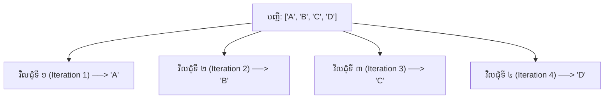

## 🎯 ហេតុអ្វីយើងត្រូវការរង្វិលជុំ (Loops)?

កុំទាន់អាលគិតពីរបៀបសរសេរកូដ សូមគិតពីបញ្ហាជាមុនសិន។
ស្រមៃថាអ្នកចង់បង្ហាញលេខពី ១ ដល់ ៥។ បើគ្មាន Loop ទេ អ្នកត្រូវសរសេរ៖

```python
print(1)
print(2)
print(3)
print(4)
print(5)
```

ចុះប្រសិនបើអ្នកចង់បង្ហាញ **១លាន (1,000,000) លេខ** វិញ?
វាជារឿងដែលមិនអាចទៅរួចទេក្នុងការសរសេរដោយដៃ។ 

Loop គឺជាការបញ្ជាទៅកាន់ Python ថា៖
> **"សូមធ្វើការងារនេះដដែលៗដោយស្វ័យប្រវត្តិ"**

នេះគឺជាមូលហេតុដែលការសរសេរកម្មវិធីមានថាមពលខ្លាំង!

---

## 🔄 តើ Iteration (ការវិលជុំ) មានន័យដូចម្តេច?

សិស្សភាគច្រើនទន្ទេញពាក្យ "Iteration" ដោយមិនយល់ពីអត្ថន័យ។ សូមមើលរូបភាពខាងក្រោម៖



រាល់ការដើរកាត់ទិន្នន័យម្តងមួយៗនៅក្នុង Loop យើងហៅថា **មួយ Iteration (ការវិលជុំម្តង)**។

---

## 📦 អ្វីទៅជា Iterable?

Iterable គឺជាអ្វីមួយដែល Python អាច **ដើរទៅមើលទិន្នន័យម្តងមួយៗបាន (visit one item at a time)**។

**អាច Iterate បាន (Iterable) ✅**
```python
list
tuple
string
dictionary
set
range()
```

**មិនអាច Iterate បាន (Not iterable) ❌**
```python
10      # លេខគត់
3.14    # លេខទសភាគ
True    # ប៊ូលីន (Boolean)
None    # ទទេ
```

---

## 🧠 របៀបដែល `for` ដំណើរការនៅពីក្រោយខ្នង

កុំគិតថា `for` មានវេទមន្តអាចដឹងខ្លួនឯងនោះទេ។ នេះគឺជាលំហូរការងារពិតប្រាកដរបស់វា៖

```python
numbers = [10, 20, 30]
```

Python ធ្វើបែបនេះនៅក្នុងខួរក្បាលរបស់វា៖

```text
ចាប់យកទិន្នន័យទី ១

↓

10

↓

ដំណើរការកូដក្នុង Loop (Run loop body)

↓

ចាប់យកទិន្នន័យទី ២

↓

20

↓

ដំណើរការកូដក្នុង Loop (Run loop body)

↓

ចាប់យកទិន្នន័យទី ៣

↓

30

↓

ដំណើរការកូដក្នុង Loop (Run loop body)

↓

បញ្ចប់ (End)
```

---

## 🔢 ការយល់ដឹងស៊ីជម្រៅពី `range()`

អ្នកចាប់ផ្ដើមភាគច្រើនច្រើនតែជួបការលំបាកជាមួយ `range()`។ វាមានទម្រង់ ៣ យ៉ាង៖

### ទម្រង់ទី ១៖ ប្រើប្រាស់លេខ ១ ខ្ទង់ (One argument)
```python
range(5)
```
↓
```text
0 1 2 3 4
```

### ទម្រង់ទី ២៖ ប្រើប្រាស់លេខ ២ ខ្ទង់ (Two arguments)
```python
range(2, 6)
```
↓
```text
2 3 4 5
```

### ទម្រង់ទី ៣៖ ប្រើប្រាស់លេខ ៣ ខ្ទង់ (Three arguments)
```python
range(2, 15, 3)
```
↓
```text
2 5 8 11 14
```

### ការដើរថយក្រោយ (Negative step)
```python
range(10, 0, -2)
```
↓
```text
10 8 6 4 2
```

> **⚠️ ចំណុចសំខាន់ត្រូវចាំ:** លេខបញ្ឈប់ (Stop value) គឺ **មិនត្រូវបានរាប់បញ្ចូលនោះទេ (Excluded)** ជានិច្ច!

---

## 🔍 អត្ថប្រយោជន៍ដ៏ធំធេងនៃ `enumerate()`

ហេតុអ្វីបានជាយើងប្រើ `enumerate()`? 

បើគ្មាន enumerate:
```python
for i in range(len(names)):
    print(i, names[i])
```

បើមាន enumerate:
```python
for index, name in enumerate(names):
    print(index, name)
```
វាជួយឱ្យកូដ **ស្រឡះជាងមុន (Cleaner)** ទាក់ទាញជាងមុន និងមានលក្ខណៈជា **Pythonic**។

អ្នកថែមទាំងអាចកំណត់លេខចាប់ផ្តើមបានទៀតផង៖
```python
enumerate(names, start=1)
```

---

## 🔗 ការប្រើប្រាស់ `zip()` សម្រាប់ភ្ជាប់ទិន្នន័យ

ជំនួសឱ្យការប្រើ Index ដើម្បីចាប់ទិន្នន័យពី List ពីរផ្សេងគ្នា `zip()` ជួយភ្ជាប់វាចូលគ្នាដោយផ្ទាល់៖

```python
students = ["A", "B", "C"]
scores = [90, 80, 95]

for student, score in zip(students, scores):
    print(student, score)
```
លទ្ធផល៖
```text
A 90
B 80
C 95
```

**ចំណាំ:** `zip()` នឹង **បញ្ឈប់ការវិលជុំ** ដោយផ្អែកលើ Iterable ណាដែលខ្លីជាងគេបំផុត។

---

## 📖 ការ Iterate ក្នុង Dictionaries ឱ្យបានត្រឹមត្រូវ

មានវិធី ៣ យ៉ាងក្នុងការទាញយកទិន្នន័យពី Dictionary:

**១. ទាញយកតែ Keys:**
```python
for key in student:
```

**២. ទាញយកតែ Values:**
```python
for value in student.values():
```

**៣. ទាញយកទាំង Keys និង Values (ប្រើច្រើនបំផុត):**
```python
for key, value in student.items():
```

---

## 🔄 រង្វិលជុំត្រួតគ្នា (Nested Loops)

នេះគឺជារឿងសំខាន់ណាស់ សម្រាប់ការរៀបចំទិន្នន័យទៅជាតារាង (Matrix) នាពេលអនាគត។

```python
for row in range(3):
    for col in range(3):
        print(row, col)
```

លទ្ធផលជាទម្រង់រូបភាព (Visual):
```text
(0,0)

(0,1)

(0,2)

(1,0)

...
```
នៅពេលអ្នកសិក្សាពី NumPy ការយល់ដឹងពី Nested Loops គឺជារឿងចាំបាច់បំផុត។

---

## 🎯 ការពិតអំពីអថេរក្នុងរង្វិលជុំ (Loop Variables)

អ្នករៀនថ្មីថ្មោងតែងគិតថា៖
```python
for fruit in fruits:
```
វាបង្កើតជារបស់ចម្លង (Copies)។ តាមពិតមិនមែនទេ! រាល់ការវិលជុំម្តងៗ៖

```text
fruit

↓

Apple

↓

Banana

↓

Orange
```
អថេរ (Variable) គ្រាន់តែ **ចង្អុល (Points)** ទៅកាន់ទិន្នន័យបច្ចុប្បន្ននោះប៉ុណ្ណោះ វាមិនមែនជាការ Copy ឡើយ។

---

## 🛑 ការយល់ដឹងពី `break` 

វាមិនមែនគ្រាន់តែជាពាក្យបញ្ជាទេ វាគឺជាការគ្រប់គ្រងលំហូរ (Flow)។

```text
1

2

3

BREAK (ផ្តាច់ចរន្ត)

រង្វិលជុំត្រូវបានបញ្ចប់ភ្លាមៗ

4 (មិនត្រូវបានដំណើរការ)

5 (មិនត្រូវបានដំណើរការ)
```

---

## ⏭️ ការយល់ដឹងពី `continue`

```text
1

2

Continue (រំលង)

↓

រំលងកូដដែលនៅសល់ខាងក្រោមទាំងអស់ សម្រាប់ការវិលជុំនេះ

↓

3

↓

4
```
ការបង្ហាញជារូបភាពបែបនេះ ជួយឱ្យអ្នកចងចាំបានយូរ។

---

## 🚧 អត្ថប្រយោជន៍នៃ `pass`

វគ្គសិក្សាជាច្រើនតែងតែរំលងវាចោល។ 

```python
for item in items:
    pass
```

`pass` មានន័យថា៖ **កន្លែងទុកចន្លោះ (Placeholder)**។ វាមានប្រយោជន៍ខ្លាំងណាស់នៅពេលអ្នកកំពុងសរសេរគ្រោងឆ្អឹងកម្មវិធី ហើយមិនទាន់ចង់សរសេរកូដលម្អិត។

---

## ✨ ការបំប្លែងកូដទៅជា List Comprehension

ជំនួសឱ្យការពន្យល់មួយៗ តោះមើលការបំប្លែងកូដដោយផ្ទាល់។

**Loop ធម្មតា៖**
```python
numbers = []

for i in range(5):
    numbers.append(i * 2)
```

**List Comprehension (កូដខ្លី):**
```python
numbers = [i * 2 for i in range(5)]
```

**ប្រើប្រាស់ជាមួយលក្ខខណ្ឌក្នុងការច្រោះ (Filtering):**
```python
evens = [x for x in range(20) if x % 2 == 0]
```
អ្នកត្រូវតែមើល និងយល់ពីទម្រង់ទាំង ២ នេះផ្ទឹមគ្នា ទើបដឹងពីអត្ថប្រយោជន៍របស់វា!

---

## 🧱 គំរូកូដដែលជួបញឹកញាប់បំផុត (Common Patterns)

រាល់ការសរសេរកម្មវិធីតែងតែជួបគំរូទាំងនេះ៖

**ការបូកសរុប (Sum)**
```python
total = 0

for n in numbers:
    total += n
```

**ស្វែងរកតម្លៃធំបំផុត (Maximum)**
```python
largest = numbers[0]

for n in numbers:
    if n > largest:
        largest = n
```

**ការរាប់ចំនួន (Counting)**
```python
count = 0
for n in numbers:
    count += 1
```

**ការស្វែងរក (Searching)**
```python
for item in items:
    if item == "Apple":
        print("Found it!")
        break
```

---

## 🌍 ការអនុវត្តជាក់ស្តែងក្នុង Data Science

ជំនួសឱ្យការត្រឹមតែ Clean ឈ្មោះ តោះមើលពីការទាញយកលក្ខណៈពិសេស (Feature Extraction) ក្នុង Data Science៖

```python
temperatures = [30, 32, 29, 35]

# ការបំប្លែងកម្តៅពីអង្សាសេ ទៅ ហ្វារិនហៃ (Fahrenheit) 
fahrenheit = [
    t * 9 / 5 + 32
    for t in temperatures
]
```

ឬការច្រោះទិន្នន័យ (Filtering Data)៖
```python
adults = [
    age
    for age in ages
    if age >= 18
]
```
រចនាសម្ព័ន្ធបែបនេះ ត្រូវបានប្រើប្រាស់គ្រប់ពេលវេលានៅក្នុង Pandas និង NumPy។

---

## ⚡ សេចក្តីផ្តើមអំពីល្បឿន (Performance)

នៅក្នុង Python ការប្រើប្រាស់ Loops គឺល្អធម្មតាទេ។ 

ប៉ុន្តែនៅពេលអ្នកក្លាយជា Data Scientist ការប្រើប្រាស់៖
* **NumPy Vectorization**
* **Pandas Operations**

គឺ **លឿនជាងការប្រើ for loop ធម្មតារាប់ពាន់ដង** ព្រោះវាគណនាទិន្នន័យរាប់លានក្នុងពេលតែមួយ។ (នេះជាអ្វីដែលយើងនឹងសិក្សានៅវគ្គបន្ទាប់ៗ!)

---

## 📝 សំណួរសម្ភាសន៍ទូទៅ (Common Interview Questions)

សំណួរទី ១៖ តើកូដនេះនឹងចេញលទ្ធផលអ្វី?
```python
for i in range(5):
    print(i)
```

សំណួរទី ២៖ តើកូដនេះនឹងចេញលទ្ធផលអ្វី?
```python
for i in range(5, 0, -1):
    print(i)
```

សំណួរទី ៣៖ (សំនួរបញ្ឆោត)
```python
for i in []:
    print(i)

print("Done")
```
**ចម្លើយ:** វានឹងចេញតែអក្សរ `Done` ប៉ុណ្ណោះ។ សិស្សត្រូវតែដឹងថា នៅពេលបញ្ជីគ្មានទិន្នន័យ កូដខាងក្នុងរង្វិលជុំ (Loop body) **នឹងមិនត្រូវបានដំណើរការសូម្បីតែម្តង**។

---

## ❌ កំហុសដែលត្រូវចៀសវាង (Common Mistakes)

១. **ការលុបទិន្នន័យខណៈពេលកំពុង Iterate (Dangerous)**
```python
for item in numbers:
    numbers.remove(item)  # កុំធ្វើបែបនេះឱ្យសោះ! វានឹងធ្វើឱ្យកូដច្របូកច្របល់
```

២. **ការប្រើប្រាស់ឈ្មោះជាន់គ្នា (Shadowing variable names)**
```python
for list in lists: # មិនគួរប្រើពាក្យ 'list' ជាឈ្មោះអថេរទេ ព្រោះវាជាពាក្យរបស់ Python
```

៣. **ការប្រើប្រាស់ `range(len())` ដោយមិនចាំបាច់**
កុំប្រើវា ប្រសិនបើមិនចាំបាច់ពិតប្រាកដ។
សូមប្រើ៖
```python
for item in items:
```
ឬប្រើ៖
```python
for index, item in enumerate(items):
```

---

## 📊 តារាងសេចក្តីសង្ខេប (Summary Table)

| ឧបករណ៍ (Tool)               | គោលបំណង (Purpose)                         |
| ------------------ | ------------------------------- |
| `for`                | ដើរឆ្លងកាត់ទិន្នន័យ (Iterate over items)             |
| `range()`            | បង្កើតសំណុំតួលេខ (Generate numbers)                |
| `enumerate()`        | ទាញយកទាំងលេខរៀង (Index) និងទិន្នន័យ (Value)             |
| `zip()`              | ដើរឆ្លងកាត់ទិន្នន័យពីប្រភពច្រើនក្នុងពេលតែមួយ (Iterate over multiple iterables) |
| `break`              | ផ្តាច់ និងចាកចេញពីរង្វិលជុំ (Exit loop)                       |
| `continue`           | រំលងការវិលជុំបច្ចុប្បន្ន (Skip current iteration)          |
| `pass`               | កន្លែងទុកចន្លោះកូដ (Placeholder)                     |
| `list comprehension` | បង្កើត List ថ្មីដោយប្រើកូដខ្លី (Create lists concisely)          |
