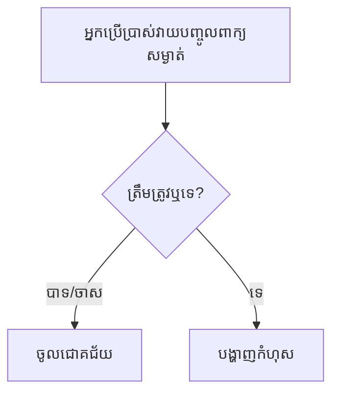
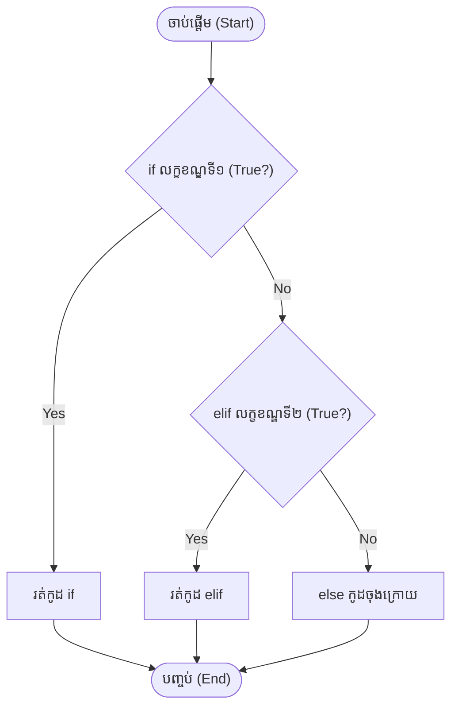
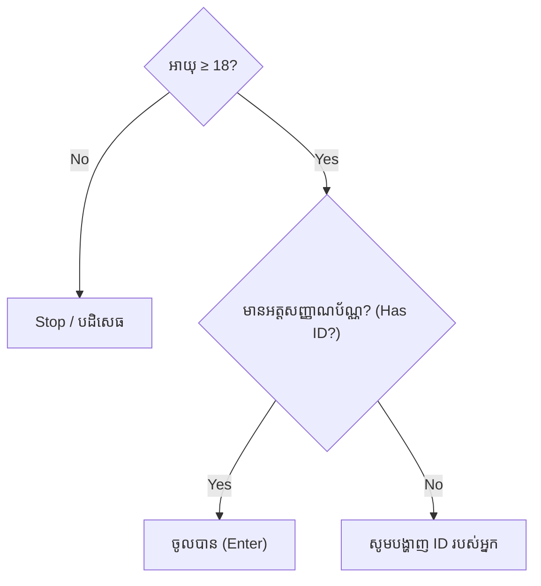
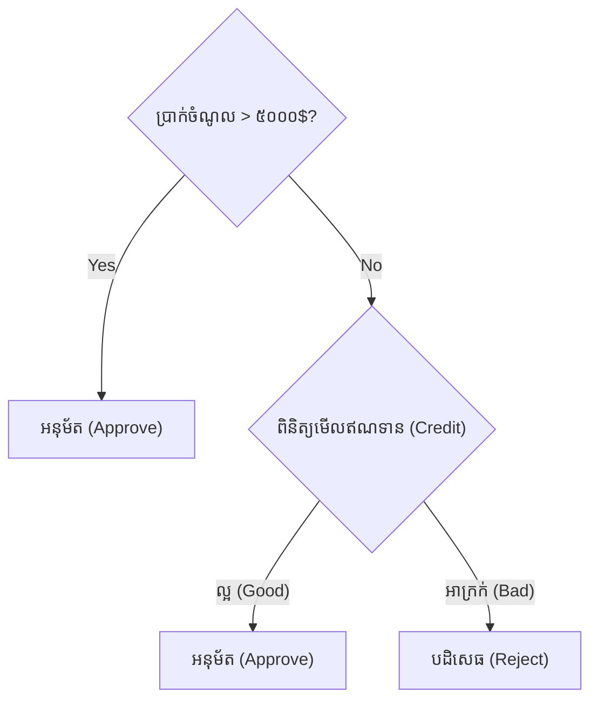

## 🎯 ហេតុអ្វីកុំព្យូទ័រត្រូវការការសម្រេចចិត្ត (Decisions)?

បើគ្មាន Conditionals (លក្ខខណ្ឌ) ទេ កម្មវិធីកុំព្យូទ័រគ្រប់ប្រភេទនឹងដំណើរការតែបញ្ជាដដែលៗគ្រប់ពេល ដោយគ្មានភាពឆ្លាតវៃអ្វីទាំងអស់។

ស្រមៃមើលប្រព័ន្ធ Login៖



កម្មវិធីកុំព្យូទ័រក្លាយជា **ឆ្លាតវៃ (Intelligent)** ក៏ដោយសារតែវាអាចជ្រើសរើសផ្លូវដើរខុសៗគ្នាដោយផ្អែកលើលក្ខខណ្ឌ។

ឧទាហរណ៍ជាក់ស្តែង៖
* ប្រព័ន្ធ Login ក្នុងវិបសាយ
* ទូ ATM ដែលឆែកមើលទឹកប្រាក់ក្នុងកុង
* ការបញ្ចុះតម្លៃ (Discounts) ពេលទិញអីវ៉ាន់អនឡាញ
* ប្រព័ន្ធផ្តល់យោបល់ (Recommendation systems) របស់ YouTube
* ការសម្រេចចិត្តរបស់បញ្ញាសិប្បនិម្មិត (AI decision making)

---

## 🧠 តក្កវិជ្ជាប៊ូលីនជាចម្បង (Boolean Logic First)

មុននឹងសរសេរកូដ សូមចងចាំច្បាប់មាសនេះ៖
> **អ្វីៗគ្រប់យ៉ាងដែលស្ថិតនៅក្នុង `if` statement ទីបំផុតត្រូវតែក្លាយទៅជា `True` ឬ `False`។**

ឧទាហរណ៍៖
```python
age >= 18
```
↓
```text
True
```
បន្ទាប់មកទើប Python យកភាពពិត (`True`) នោះ ទៅសម្រេចចិត្តថាតើត្រូវរត់កូដមួយណា។ នេះគឺជាការតភ្ជាប់ដោយផ្ទាល់ទៅនឹងមេរៀន Operators មុនរបស់យើង។

---

## 🔄 របៀបដែល Python វាយតម្លៃ `if` (Execution Flow)

សិស្សជាច្រើនគិតថា Python នឹងឆែកមើលគ្រប់លក្ខខណ្ឌទាំងអស់។ តាមពិតមិនមែនទេ! សូមមើលលំហូរនេះ៖



**ចំណុចសំខាន់បំផុត៖** 
> នៅក្នុងខ្សែបណ្តាញ `if`/`elif`/`else` មួយ មានតែ **ផ្លូវមួយគត់ (Only one branch)** ប៉ុណ្ណោះដែលត្រូវបានដំណើរការ។ ប្រសិនបើវាជួប `True` នៅកន្លែងណា វារត់កូដនោះ ហើយរំលងកូដខាងក្រោមចោលទាំងអស់។

---

## 🎭 គំនិតនៃ Truthy និង Falsy

នេះជាគំនិតដ៏សំខាន់បំផុតមួយក្នុង Python។ អ្នករៀនដំបូងគិតថាមានតែ `True` និង `False` ប៉ុណ្ណោះដែលអាចដាក់ក្នុង `if` បាន។

តាមពិតតម្លៃខាងក្រោមនេះ ចាត់ទុកថាជា **Falsy (មិនពិត)** ទាំងអស់៖
```python
False
None
0
0.0
""      # អត្ថបទដែលគ្មានអក្សរ
[]      # បញ្ជីទទេ
{}      # វចនានុក្រមទទេ
set()
```
ចំណែកតម្លៃផ្សេងពីនេះ **ទាំងអស់** ត្រូវបានចាត់ទុកថាជា **Truthy (ពិត)**!

**ឧទាហរណ៍៖**
```python
name = ""

if name:
    print("Has name")
else:
    print("Empty")
```
ដោយសារ `name` ជា `""` (Falsy) លទ្ធផលនឹងចេញ `Empty`។ នេះជាការសរសេរកូដដ៏ពេញនិយមបំផុតរបស់ Python ជំនាញ។

---

## 🪄 ការសរសេរលក្ខខណ្ឌដោយមិនបាច់ប្រៀបធៀប

ជំនួសឱ្យការសរសេរកូដវែងដូចកូនក្មេង៖
```python
if is_student == True:
```
អ្នកគួរតែសរសេរ៖
```python
if is_student:
```

ហើយជំនួសឱ្យការសរសេរ៖
```python
if is_student == False:
```
អ្នកគួរតែសរសេរ៖
```python
if not is_student:
```
ការសរសេររបៀបនេះត្រូវបានគេហៅថា **Pythonic Style** (ស្ទីលដ៏ស្រស់ស្អាតរបស់ Python)។

---

## 📦 លក្ខខណ្ឌត្រួតគ្នា (Nested Conditions) ជារូបភាព

កុំទាន់អាលមើលកូដ សូមមើលគំនូសតាងនេះ៖


នៅពេលអ្នកយល់ពីរូបភាពនេះ អ្នកនឹងអាចសរសេរ `if` ត្រួតគ្នាបានយ៉ាងងាយ។

---

## 🔗 លក្ខខណ្ឌចម្រុះ (Compound Conditions)

នៅពេលអ្នកឃើញកូដបែបនេះ៖
```python
if age >= 18 and salary > 500:
```
សូមបំបែកវានៅក្នុងខួរក្បាលរបស់អ្នក៖
```text
លក្ខខណ្ឌទី ១ (Condition 1)

AND (បូកបញ្ចូលជាមួយ)

លក្ខខណ្ឌទី ២ (Condition 2)

↓

លទ្ធផលចុងក្រោយ (Final Result)
```

---

## 🛡️ ការពារកូដ (Guard Clauses)

អ្នកសរសេរកម្មវិធីអាជីព មិនចូលចិត្តកូដដែលលិបចូលជ្រៅ (Nested) ពេកទេ។ 

ជំនួសឱ្យ៖
```python
if user:
    if user.is_admin:
        # ធ្វើអ្វីមួយ
```

ពួកគេតែងតែសរសេរ៖
```python
if not user:
    return  # បញ្ឈប់ការងារភ្លាមៗ

# កូដបន្ទាប់សម្រាប់ user ដែលជា admin អាចបន្តនៅទីនេះដោយសេរី
```
នេះជាការត្រួសត្រាយផ្លូវ ឆ្ពោះទៅកាន់ការសរសេរកូដអនុគមន៍ (Functions) ឱ្យបានស្អាតនាពេលអនាគត។

---

## ✨ ការសរសេរកូដខ្លី (Ternary Expressions)

តោះប្រៀបធៀប!

**ទម្រង់ធម្មតា (Normal)**
```python
if age >= 18:
    status = "Adult"
else:
    status = "Child"
```

**ទម្រង់កាត់ស្មើគ្នា (Equivalent)**
```python
status = "Adult" if age >= 18 else "Child"
```
> **ចំណាំ:** កុំប្រើទម្រង់កាត់នេះ បើលក្ខខណ្ឌរបស់អ្នកមានភាពស្មុគស្មាញពេក ព្រោះវានឹងធ្វើឱ្យកូដពិបាកអានខ្លាំង។

---

## 🧩 ការពិនិត្យសមាជិក (Membership Conditions)

ជួបញឹកញាប់ណាស់នៅក្នុង Data Science និង Web!

```python
if "admin" in roles:
```

```python
if country not in allowed_countries:
```

---

## 🆔 ការពិនិត្យអត្តសញ្ញាណ (Identity Checks)

រំលឹកមេរៀនចាស់ពី Operator `is`!

**របៀបត្រឹមត្រូវ (Good):**
```python
if user is None:
```

**របៀបមិនល្អ (Avoid):**
```python
if user == None:
```
ការប្រើ `is None` គឺជាក្បួនខ្នាត (Convention) ជាសកលរបស់ Python។

---

## 🌳 មែកធាងនៃការសម្រេចចិត្ត (Decision Trees)

នេះជាចំណេះដឹងដ៏មានតម្លៃសម្រាប់ Data Science។ 


នៅថ្ងៃអនាគត អ្នកនឹងដឹងថា ម៉ូដែល AI ធំៗដូចជា **Decision Trees** ឬ **Random Forests** សុទ្ធតែធ្វើការសម្រេចចិត្តដោយផ្អែកលើគំនិតនេះឯង!

---

## 🌍 ការអនុវត្តជាក់ស្តែងក្នុងអាជីវកម្មពិតៗ

ក្រៅពីឧទាហរណ៍ខាងលើ តោះមើលអ្វីដែលកៀកនឹងជីវិតជាក់ស្តែង៖

**១. ប្រព័ន្ធ Login**
```python
if password == saved_password:
```

**២. ការបញ្ចុះតម្លៃទំនិញ (E-commerce)**
```python
if total > 100:
```

**៣. ការព្យាករណ៍អាកាសធាតុ (Weather app)**
```python
if raining:
```

**៤. ការទស្សន៍ទាយរបស់ AI (AI Prediction)**
```python
if probability > 0.9:
```

---

## 🧱 គំរូកូដដែលជួបញឹកញាប់បំផុត (Common Patterns)

**១. ការពិនិត្យភាពត្រឹមត្រូវ (Validation)**
```python
if age < 0:
    print("Invalid age!")
```

**២. ការកំណត់ចន្លោះ (Range)**
```python
if 18 <= age <= 60:
```

**៣. ជម្រើសច្រើន (Multiple choices)**
```python
if grade == "A":
```

**៤. បញ្ជីទទេ (Empty list)**
```python
if not items:
```
គំរូទាំងនេះមានវត្តមានគ្រប់ទីកន្លែងក្នុងប្រព័ន្ធសូហ្វវែរធំៗ។

---

## ❌ កំហុសដែលអ្នកតែងតែជួប (Common Mistakes)

### ១. ការរៀបលំដាប់ខុស (Wrong order)
```python
if score >= 60:
    print("D")
elif score >= 90:
    print("A")
```
នៅទីនេះ ប្រសិនបើអ្នកបានពិន្ទុ `95` កូដនឹងរត់ចូល `score >= 60` មុនគេ រួចចេញអក្សរ `D` បាត់ទៅហើយ! ខ្សែទី២ គ្មានថ្ងៃបានរត់ឡើយ។ 
> **ដំណោះស្រាយ:** ត្រូវរៀបលក្ខខណ្ឌពី **អ្វីដែលជាក់លាក់បំផុត (តឹងរ៉ឹងបំផុត)** ទៅ **អ្វីដែលទូទៅបំផុត (ធូររលុងបំផុត)**។ (ឧ. ដាក់ `90` មុន `60`)។

### ២. ប្រើប្រាស់សញ្ញាកំណត់តម្លៃ ជំនួសសញ្ញាប្រៀបធៀប
```python
if score = 50:  # ខុស! នឹងចេញ Error!
```
អ្នកត្រូវតែប្រើសញ្ញាប្រៀបធៀប៖
```python
if score == 50: # ត្រូវ!
```

### ៣. ការប្រៀបធៀបលេខទសភាគ (Floating-point comparison)
ចូរចៀសវាងការសរសេរ៖
```python
if x == 0.1:
```
ដោយសារលេខទសភាគក្នុងកុំព្យូទ័រអាចមានបញ្ហាភាពមិនជាក់លាក់ (Precision issues)។

---

## 🧪 លំហាត់អនុវត្តន៍ (Practice Questions)

សូមទាយលទ្ធផល និងពន្យល់ពី **មូលហេតុ (Why)** របស់អ្នក!

**លំហាត់ទី ១:**
```python
age = 20

if age >= 18:
    print("Adult")
else:
    print("Child")
```

---
**លំហាត់ទី ២ (បញ្ឆោត):**
```python
x = ""

if x:
    print("Yes")
else:
    print("No")
```

---
**លំហាត់ទី ៣:**
```python
score = 95

if score >= 90:
    print("A")
elif score >= 80:
    print("B")
```
ហេតុអ្វីបានជាវាមិនព្រីនអក្សរ `B` ចេញមកដែរ ទាំងដែល `95` ក៏ធំជាង `80`?

---

## 🔮 សេចក្តីផ្តើមអំពី `match` (Preview)

នៅក្នុងជំនាន់ Python 3.10 មានការបន្ថែមមុខងារថ្មីមួយឈ្មោះថា `match` ដែលស្រដៀងនឹង `switch/case` ក្នុងភាសាដទៃ។ 

ទោះបីជាយើងមិនទាន់រៀនវាឥឡូវនេះ ប៉ុន្តែសូមដឹងថាសម្រាប់លក្ខខណ្ឌថេរច្រើនមុខ (Fixed choices) Python មានឧបករណ៍ទំនើបជាង `if/elif/else` ទៅទៀត ដែលអ្នកនឹងបានជួបនៅពេលក្រោយ។

---

## 📊 តារាងសេចក្តីសង្ខេប (Summary Table)

| គំនិត (Concept)            | គោលបំណង (Purpose)                                            |
| ------------------ | -------------------------------------------------- |
| `if`               | រត់កូដ ពេលលក្ខខណ្ឌពិត (True)              |
| `elif`             | ឆែកមើលលក្ខខណ្ឌមួយទៀត ប្រសិនបើលក្ខខណ្ឌខាងលើមិនពិត |
| `else`             | រត់កូដ ពេលគ្មានលក្ខខណ្ឌណាមួយខាងលើពិតទាល់តែសោះ          |
| Nested `if`        | ការធ្វើការសម្រេចចិត្ត ត្រួតលើការសម្រេចចិត្ត                    |
| Ternary expression | ការសរសេរលក្ខខណ្ឌកាត់ត្រឹមតែមួយបន្ទាត់                    |
| Truthy/Falsy       | រាល់តម្លៃទាំងអស់អាចវាយតម្លៃថាពិត ឬមិនពិត បានជានិច្ច        |

---

## Overall Rating
មេរៀននេះគឺជាគ្រឹះដ៏រឹងមាំបំផុតសម្រាប់ការបង្កើតប្រព័ន្ធសម្រេចចិត្តក្នុង Python។ ការយល់ដឹងពីរបៀបដែល Python វាយតម្លៃលក្ខខណ្ឌ និងតក្កវិជ្ជាប៊ូលីន មិនត្រឹមតែជួយឱ្យអ្នកសរសេរ `if`/`else` ស្ទាត់ជំនាញប៉ុណ្ណោះទេ ប៉ុន្តែថែមទាំងជាស្ពានចម្លងឆ្ពោះទៅកាន់ការសិក្សាពី Functions, ការគ្រប់គ្រងកំហុស (Exception Handling), និងការបង្កើតក្បួនដោះស្រាយសម្រាប់ AI ទៀតផង!
