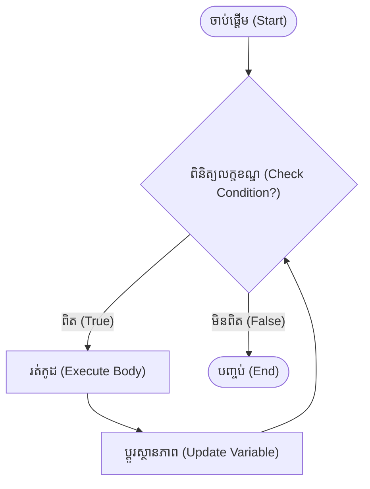

## 🌐 Overview

ការសរសេរកូដដោយប្រើ `for` loop គឺល្អនៅពេលដែលយើងដឹងច្បាស់ពីចំនួនដង (Iterations) ដែលត្រូវធ្វើការ។ ប៉ុន្តែចុះយ៉ាងណាបើយើងមិនដឹងចំនួនដងច្បាស់លាស់ ហើយគ្រាន់តែចង់ឱ្យកូដដំណើរការរហូតដល់លក្ខខណ្ឌណាមួយត្រូវបានបំពេញ? នេះគឺជាពេលដែល `while` loop ចូលខ្លួនមកជួយ!

---

## 📚 រៀនពាក្យបច្ចេកទេស (Definitions)

ដើម្បីយល់ស៊ីជម្រៅពី `while` មុនដំបូងអ្នកត្រូវស្គាល់ពាក្យទាំងនេះ៖

* **Loop Variable:** អថេរដែលប្រើសម្រាប់គ្រប់គ្រងស្ថានភាពរបស់ loop (ឧ. `count`)។
* **Loop Condition:** លក្ខខណ្ឌដែល Python ពិនិត្យមុននឹងចាប់ផ្តើមការវិលជុំ (iteration) ថ្មី។
* **Loop Body:** កូដដែលស្ថិតនៅខាងក្នុង `while` loop។
* **Infinite Loop:** រង្វិលជុំមិនចេះចប់ កើតឡើងពេលកូដខ្វះការផ្លាស់ប្តូរស្ថានភាព។

---

## 💡 គំនិតគោល (The Core Idea)

សូមមើលគំនូសតាងនេះ ដើម្បីយល់ពីដំណើរការទាំងមូលនៃ `while` loop៖



អ្វីដែលសំខាន់បំផុតរបស់ `while` loop គឺ៖
> ពិនិត្យលក្ខខណ្ឌ (Check Condition) → រត់កូដ (Execute Body) → ធ្វើបច្ចុប្បន្នភាពស្ថានភាព (Update State) → ធ្វើម្តងទៀត (Repeat)

ប្រសិនបើដំណាក់កាល **Update State** បាត់ នោះកូដអ្នកនឹងក្លាយទៅជា **Infinite Loop** ភ្លាម!

---

## 📖 ការសិក្សាស៊ីជម្រៅ (In Depth)

### ភាពខុសគ្នារវាង `while` ធៀបនឹង `for`

| `for` Loop | `while` Loop |
| ------------------- | ------------------------- |
| ដឹងចំនួនការវិលជុំ (Iterations) មុន | មិនដឹងចំនួន iterations មុនទេ |
| ដើរកាត់តាម (Iterate) ទិន្នន័យ (Iterable) | ដើររហូតទាល់តែលក្ខខណ្ឌ (Condition) ខុស |
| មានសុវត្ថិភាព (Safe) | ងាយនឹងធ្លាក់ចូល Infinite Loop |
| ត្រូវបានប្រើច្រើនបំផុត | ប្រើនៅពេលរង់ចាំលក្ខខណ្ឌអ្វីមួយ (Waiting) |

---

### លំហូរការងាររបស់ `while` (while Flow)

```text
while លក្ខខណ្ឌ (condition):
    កូដខាងក្នុង (body)
```

Python ធ្វើការតាមលំដាប់នេះ៖
```text
លក្ខខណ្ឌពិតទេ? (Condition?)

ពិត (True)
 ↓
រត់កូដខាងក្នុង (Body)
 ↓
ត្រលប់ទៅឆែកលក្ខខណ្ឌវិញ (Back to Condition)

មិនពិត (False)
 ↓
ចាកចេញ (Exit)
```

---

### ក្បួនពិសេស៖ `while ... else`

វគ្គសិក្សាជាច្រើនរំលងចំណុចនេះ ប៉ុន្តែវាមានប្រយោជន៍ណាស់។ នៅក្នុង Python រង្វិលជុំ `while` អាចមាន `else` ដូចនឹង `if` ដែរ។

```python
number = 1

while number <= 3:
    print(number)
    number += 1
else:
    print("Loop finished normally.")
```
**លទ្ធផល៖**
```text
1
2
3
Loop finished normally.
```

**ប៉ុន្តែចុះបើយើងបញ្ឈប់វាដោយប្រើ `break` វិញ?**
```python
number = 1

while number <= 5:
    if number == 3:
        break
    print(number)
    number += 1
else:
    print("Done")
```
**លទ្ធផល៖**
```text
1
2
```
តើអ្នកកត់សម្គាល់ទេ? អក្សរ `"Done"` នៅក្នុង `else` **មិនត្រូវបានដំណើរការ** នោះទេ ព្រោះរង្វិលជុំត្រូវបានបញ្ចប់ដោយ `break` (បញ្ចប់ខុសប្រក្រតី)។ `else` រត់លុះត្រាតែ loop ចប់ដោយឯកឯង (បញ្ចប់ធម្មតា)។

---

## 💻 ការបំបែកកូដ (Code Breakdown)

### ការប្រើប្រាស់ `continue`

នៅពេលដែល Python ជួប `continue` វាឈប់រត់កូដខាងក្រោម ហើយត្រលប់ទៅពិនិត្យលក្ខខណ្ឌរបស់ `while` វិញភ្លាមៗ។

```python
number = 0

while number < 6:
    number += 1

    if number % 2 == 0:
        continue # រំលងលេខគូ

    print(number)
```
**លទ្ធផល៖**
```text
1
3
5
```

---

## 🔄 ការផ្លាស់ប្តូរស្ថានភាព (State Change)

នេះជាគំនិតសំខាន់បំផុតដើម្បីបញ្ចៀសការគាំងកុំព្យូទ័រ!

ហេតុអ្វី Loop នេះដើរមិនចេះចប់?
```python
count = 0

while count < 5:
    print(count)
```
ព្រោះអថេរ `count` មានតម្លៃ `0` ជានិច្ច គ្មានអ្វីផ្លាស់ប្តូរនោះទេ។

អ្នកត្រូវតែប្រាប់វាឱ្យប្តូរ៖
```python
count += 1
```
ការបូកបន្ថែមនេះហើយ គឺជាអ្វីដែលយើងហៅថា **State Change**។

---

### បន្ទាត់ពេលវេលាជារូបភាព (Visual Timeline)

នេះជាអ្វីដែលកើតឡើងក្នុងខួរក្បាល Python ពេលអ្នកដាក់ `count += 1`:

```text
count = 0

count < 5 (✔ ពិត)

print(0)

count កើនដល់ 1

↓

count < 5 (✔ ពិត)

print(1)

↓

count កើនដល់ 2

↓

count កើនដល់ 3

↓

count កើនដល់ 4

↓

count កើនដល់ 5

↓

count < 5 (✘ មិនពិត! ព្រោះ 5 មិនតូចជាង 5 ទេ)

ចាកចេញពីរង្វិលជុំ (Exit)
```

---

## 🌍 ការអនុវត្តជាក់ស្តែង (Real-world Application)

### ១. ម៉ូដែលបញ្ញាសិប្បនិម្មិត (Machine Learning Training)
នៅក្នុង Data Science និង AI, `while` ត្រូវបានប្រើប្រាស់នៅពេលដែលយើងមិនដឹងថាតើត្រូវ Train ម៉ូដែលប៉ុន្មានជុំទើបវាឆ្លាតនោះទេ។ យើងអាចដាក់លក្ខខណ្ឌថា ឱ្យវា Train រហូតដល់បានកម្រិតភាពត្រឹមត្រូវ ៩៥%។

```python
accuracy = 0.80

while accuracy < 0.95:
    print(f"Training... {accuracy:.2f}")
    accuracy += 0.03 # កើនឡើងម្តង 3% ក្រោយពេលហ្វឹកហាត់

print("Target accuracy reached.")
```

### ២. កម្មវិធីបញ្ចូលពាក្យបញ្ជា (Sentinel Loop)
នេះគឺជាទម្រង់បញ្ជាកូដដែលអ្នកតែងតែប្រើក្នុង Terminal ផ្ទាល់!

```python
command = ""

while command != "exit":
    command = input("> ")
    print(command)

print("Program ended.")
```
កម្មវិធីនឹងបន្តរង់ចាំអ្នកវាយអក្សរជារៀងរហូត រហូតទាល់តែអ្នកវាយពាក្យ `"exit"` ទើបវាព្រមឈប់។

---

## 🔥 គំរូកូដដែលជួបញឹកញាប់បំផុត (Common Patterns)

ការរៀន Programming កម្រិតខ្ពស់ គឺការរៀនចាំនូវគំរូកូដ (Patterns) ទាំងនេះ៖

**១. Counter Loop (រាប់ចំនួនដងជុំ)**
```python
count = 0
while count < 10:
    # ធ្វើអ្វីមួយ
    count += 1
```

**២. Sentinel Loop (រង់ចាំពាក្យគន្លឹះដើម្បីឈប់)**
```python
while text != "quit":
```

**៣. Infinite Loop (រង្វិលជុំគ្មានទីបញ្ចប់)**
```python
while True:
    # ប្រើ `break` ដើម្បីបញ្ឈប់វានៅពេលណាមួយ
```

**៤. Retry Loop (ព្យាយាមឡើងវិញបើបរាជ័យ)**
```python
while retries < 3:
    # បើដំណើរការបរាជ័យ បន្តសាកល្បងម្តងទៀត
```

**៥. Event Loop (ប្រើក្នុងហ្គេម ជារៀងរាល់ Frame)**
```python
while game_running:
    # ធ្វើបច្ចុប្បន្នភាពរូបភាពហ្គេម
```

---

## ⚠️ កំហុសដែលអ្នកតែងតែជួប (Common Mistakes)

### ១. ផ្លាស់ប្តូរអថេរខុស (Changing Wrong Variable)
```python
count = 0

while count < 5:
    total += 1 # ខុស! អ្នកត្រូវបូក count មិនមែន total ទេ
```
ដោយសារ `count` មិនត្រូវបានផ្លាស់ប្តូរ វានឹងរត់មិនចេះចប់ (Infinite Loop)។

### ២. លក្ខខណ្ឌខុសតាំងពីដើម (Wrong Condition)
```python
count = 10

while count < 5:
    print("Hello")
```
Loop នេះនឹងមិនដំណើរការសូម្បីតែមួយដង ព្រោះ 10 មិនដែលតូចជាង 5 នោះទេ។

### ៣. `continue` ធ្វើឱ្យគាំងរង្វិលជុំ
នេះគឺជាកំហុសដ៏សាហាវបំផុតដែលអ្នកសរសេរកម្មវិធីតែងតែមើលរំលង!
```python
count = 0

while count < 5:
    if count == 2:
        continue # បញ្ហាធំនៅទីនេះ!
        
    count += 1
```
**ហេតុអ្វីវាគាំង?**
```text
ពេល count = 2
↓
ជួបពាក្យ continue (ត្រលប់ទៅខាងលើវិញភ្លាម)
↓
count អត់មានឱកាសបានបូកបន្ថែម ដូច្នេះវានៅតែ 2
↓
ជួបពាក្យ continue ម្តងទៀត (ជាប់គាំងគ្មានថ្ងៃចេញរួច)
```
**ដំណោះស្រាយ:** ត្រូវប្រាកដថា `count += 1` ត្រូវបានដំណើរការមុនពេលជួប `continue`។

---

## 🧪 លំហាត់អនុវត្តន៍ (Mini Exercises)

**លំហាត់ទី ១:** តើ Output ជាអ្វី?
```python
count = 3

while count > 0:
    print(count)
    count -= 1
```

**លំហាត់ទី ២:** តើ Loop នេះវិលបានប៉ុន្មានជុំ?
```python
i = 0

while i < 10:
    i += 2
```

**លំហាត់ទី ៣:** តើអក្សរ `"Finished"` នៅក្នុង `else` នឹងត្រូវបានព្រីនចេញមកឬអត់?
```python
x = 0

while x < 3:
    if x == 2:
        break
    x += 1
else:
    print("Finished")
```

**លំហាត់ទី ៤:** សូមកែកូដនេះដើម្បីកុំឱ្យវាចេញជា Infinite Loop៖
```python
count = 0

while count < 5:
    print(count)
```

---

## 💼 សំណួរសម្ភាសន៍ទូទៅ (Interview Question)

**សំណួរ៖** តើ `for` និង `while` loop មានលក្ខណៈខុសគ្នាយ៉ាងដូចម្តេច ហើយតើយើងគួរប្រើមួយណានៅពេលណា?

**ចម្លើយ៖**
* យើងប្រើ **`for` loop** នៅពេលដែលយើងដឹងពីចំនួនដងនៃការវិលជុំច្បាស់លាស់ (ឧទាហរណ៍ ធ្វើ ១០ដង) ឬនៅពេលដែលយើងចង់ទាញយកទិន្នន័យពីសំណុំទិន្នន័យ (Iterable) ដូចជា List, Dictionary, ឬ Range ជាដើម។ វាមានសុវត្ថិភាពនិងមិនងាយធ្លាក់ចូល Infinite Loop ទេ។
* យើងប្រើ **`while` loop** នៅពេលដែលយើង **មិនដឹង** ពីចំនួនដងនៃការវិលជុំជាមុន ហើយយើងចង់ឱ្យវាបន្តដំណើរការរហូតទាល់តែលក្ខខណ្ឌណាមួយប្រែជា `False` ឬកូដជួបពាក្យ `break`។ (ឧ. ការរង់ចាំអ្នកប្រើប្រាស់វាយពាក្យសម្ងាត់ត្រូវ)។

---

## 📊 តារាងសេចក្តីសង្ខេប (Summary Table)

| គំនិត (Concept)       | គោលបំណង (Purpose)                                         | ឧទាហរណ៍ (Example)                 |
| ------------- | ----------------------------------------------- | ----------------------- |
| `while`       | ដំណើរការដដែលៗដរាបណាលក្ខខណ្ឌនៅតែពិត (True)               | `while x < 5:`          |
| `break`       | ផ្តាច់ និងចាកចេញពីរង្វិលជុំភ្លាមៗ                       | `break`                 |
| `continue`    | រំលងការវិលជុំបច្ចុប្បន្ន ហើយទៅចាប់ផ្តើមជុំថ្មី                      | `continue`              |
| `else`        | ដំណើរការនៅពេល Loop បញ្ចប់ធម្មតា (មិនប៉ះ `break`) | `while ... else:`       |
| `while True`  | រង្វិលជុំមិនចេះចប់ (ប្រើ `break` ដើម្បីបញ្ឈប់វាវិញ)             | `while True:`           |
| Counter Loop  | រង្វិលជុំកំណត់ចំនួនដងដោយប្រើអថេររាប់ | `count += 1`            |
| Sentinel Loop | រង្វិលជុំរង់ចាំពាក្យគន្លឹះណាមួយដើម្បីបញ្ចប់         | `while text != "exit":` |
| Retry Loop    | រង្វិលជុំព្យាយាមសាកល្បងសាជាថ្មី    | `while retries < 3:`    |

---

## Overall Rating
មេរៀននេះរៀបចំអ្នកសម្រាប់បញ្ហាស្មុគស្មាញដែល `for` loop មិនអាចដោះស្រាយបាន។ ការយល់ដឹងពី State Change, Loop Flow, និងកំហុស Infinite Loops គឺជាមូលដ្ឋានគ្រឹះដ៏រឹងមាំសម្រាប់អ្នកសរសេរកម្មវិធីគ្រប់រូប ឆ្ពោះទៅកាន់ការកសាងកម្មវិធីហ្គេម (Game Dev), បណ្តាញទិន្នន័យ (Data Pipelines) និង ការបង្វឹកម៉ូដែលបញ្ញាសិប្បនិម្មិត (AI Training)។
