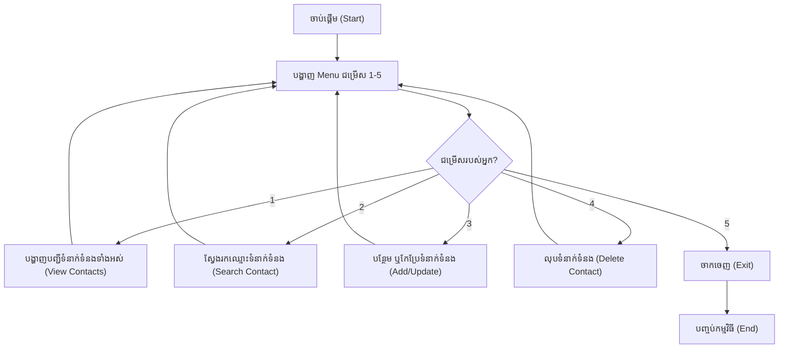

## 🌐 សេចក្តីផ្តើម (Overview)

ក្រោយពីអ្នកបានរៀន **Lists** និង **Tuples** រួចហើយ អ្នកនឹងជួប Data Structures ពីរដែលមានសារៈសំខាន់ខ្លាំងបំផុតនៅក្នុង Python គឺ **Dictionary** និង **Set**។

- **Dictionary** ប្រើសម្រាប់ផ្ទុកទិន្នន័យជា **Key → Value**។
- **Set** ប្រើសម្រាប់ផ្ទុកទិន្នន័យដែល **មិនអនុញ្ញាតឱ្យមានតម្លៃស្ទួន (Duplicate)**។

Data Structures ទាំងពីរនេះត្រូវបានប្រើប្រាស់ស្ទើរតែគ្រប់ Python Project រួមទាំង Web Development, Data Science, Machine Learning និង APIs។

---

## 📚 រៀនពាក្យបច្ចេកទេស (Definitions)

### 📖 Dictionary
Dictionary គឺជា Collection ដែលផ្ទុកទិន្នន័យជា **Key : Value Pair** (គូនៃសោ និងតម្លៃ)។

```python
student = {
    "name": "Alice",
    "age": 20
}
```
- **Key:** ត្រូវតែជាតម្លៃដែលប្លែកពីគេ (Unique) និងមិនអាចកែប្រែបាន (Immutable) ដូចជា String ឫ Number ជាដើម។
- **Value:** អាចជាប្រភេទទិន្នន័យណាក៏បាន (String, List, Number...)។

### 📦 Set
Set គឺជា Collection ពិសេសមួយដែល៖
- មិនអនុញ្ញាតឱ្យមានទិន្នន័យស្ទួន (No Duplicate)។
- មិនមានលេខរៀង (No Index)។
- មិនធានាលំដាប់នៃការរក្សាទុកទិន្នន័យ (Unordered)។

```python
numbers = {1, 2, 3}
```

---

## 💡 គំនិតគោល (The Core Idea)

ស្រមៃថា៖

### Dictionary = សៀវភៅទូរស័ព្ទ (Phonebook)
អ្នកស្គាល់ឈ្មោះមនុស្ស (Key)
↓
អ្នកអាចរកលេខទូរស័ព្ទបានភ្លាមៗ (Value)

```text
Alice → 012345678
Bob   → 098765432
```
អ្នកមិនចាំបាច់ដើររកពីទំព័រទី១ ទៅទំព័រចុងក្រោយទេ។ គ្រាន់តែស្គាល់ Key, Python អាចទាញយក Value បានភ្លាមៗ! នេះហៅថា **Fast Lookups**។

### Set = ប្រអប់ដែលបដិសេធរបស់ស្ទួន
ប្រសិនបើអ្នកមានលេខ៖
```text
1, 2, 2, 3, 3, 3
```
ពេលអ្នកបោះវាចូលទៅក្នុង Set៖
```python
{1, 2, 3}
```
អ្វីៗដែលស្ទួន (Duplicate) នឹងត្រូវបានបោះចោលដោយស្វ័យប្រវត្តិ។

---

## 📖 ការសិក្សាស៊ីជម្រៅ (In Depth)

**Dictionary** អនុញ្ញាតឱ្យយើង៖
- បន្ថែមទិន្នន័យ (Add)
- កែប្រែទិន្នន័យ (Update)
- លុបទិន្នន័យ (Delete)
- ស្វែងរកទិន្នន័យបានយ៉ាងលឿន (Search)
- លូកយកទិន្នន័យតាម Key និង Value (Iterate)

**Set** ផ្តល់អត្ថប្រយោជន៍ដ៏ធំលើ៖
- ការពិនិត្យមើលវត្តមានទិន្នន័យលឿនដូចផ្លេកបន្ទោរ (Membership Testing - `in`)
- ការលុបទិន្នន័យស្ទួនបានយ៉ាងងាយស្រួល (Remove Duplicates)
- ការប្រៀបធៀបទិន្នន័យតាមបែបគណិតវិទ្យា (Mathematical Set Operations)

---

## 💻 ការបំបែកកូដ (Code Breakdown)

### ទី១៖ ការបង្កើត Dictionary

```python
person = {
    "name": "Alice",
    "age": 30,
    "country": "France"
}

print(person)
```
**លទ្ធផល Output:**
```text
{'name': 'Alice', 'age': 30, 'country': 'France'}
```

---

### ទី២៖ ការទាញយកទិន្នន័យ (Access Values)

```python
print(person["name"])

print(person.get("email"))

print(person.get("email", "N/A"))
```
**លទ្ធផល Output:**
```text
Alice
None
N/A
```

**⚠️ ហេតុអ្វីយើងគួរប្រើ `.get()`?**
បើអ្នកប្រើ `person["email"]` តែ `email` គ្មាននៅក្នុង Dictionary នោះកូដនឹងបោះកំហុស `KeyError` រួចគាំងកម្មវិធីតែម្តង។ ប៉ុន្តែការប្រើ `person.get("email")` វាគ្រាន់តែបញ្ចេញពាក្យ `None` (ឬតម្លៃ `N/A` ដែលយើងកំណត់) ដោយសុវត្ថិភាព។

---

### ទី៣៖ ការបន្ថែម និងកែប្រែ (Add & Update)

```python
person["email"] = "alice@example.com" # បន្ថែមថ្មី (ព្រោះមិនទាន់មាន)
person["age"] = 31 # កែប្រែចាស់ (ព្រោះមាន age រួចហើយ)
```

---

### ទី៤៖ ការលុប (Delete)

```python
del person["country"]
```

---

### ទី៥៖ ការទាញយកទិន្នន័យទាំងអស់ (Loop Dictionary)

```python
for key, value in person.items():
    print(key, "→", value)
```
**លទ្ធផល Output:**
```text
name → Alice
age → 31
email → alice@example.com
```

---

### ទី៦៖ ការសរសេរកូដកាត់ (Dictionary Comprehension)

```python
squares = {
    n: n * n
    for n in range(1, 6)
}

print(squares)
```
**លទ្ធផល Output:**
```text
{1: 1, 2: 4, 3: 9, 4: 16, 5: 25}
```

---

### ទី៧៖ ការបង្កើត Set

```python
numbers = {1, 2, 2, 3, 3, 4}

print(numbers)
```
**លទ្ធផល Output:**
```text
{1, 2, 3, 4}
```
តម្លៃស្ទួនត្រូវបានលុបចេញដោយស្វ័យប្រវត្តិ។

---

### ទី៨៖ ការបំបាត់របស់ស្ទួនពី List (Remove Duplicates)

```python
raw_data = [1, 2, 2, 3, 4, 4, 5]

unique_data = list(set(raw_data))

print(unique_data)
```
**លទ្ធផល Output:**
```text
[1, 2, 3, 4, 5]
```

---

### ទី៩៖ ការពិនិត្យទិន្នន័យ (Membership Testing)

```python
students = {"Alice", "Bob", "Carol"}

print("Bob" in students)
print("David" in students)
```
**លទ្ធផល Output:**
```text
True
False
```

---

### ទី១០៖ ប្រមាណវិធីគណិតវិទ្យាលើ Set (Set Operations)

```python
A = {1, 2, 3, 4}
B = {3, 4, 5, 6}

print(A | B) # Union (បូកបញ្ចូលគ្នាទាំង២ តែមិនស្ទួន)
print(A & B) # Intersection (យកតែលេខដែលមាននៅទាំងសងខាង)
print(A - B) # Difference (យកលេខមានតែក្នុង A តែអត់មានក្នុង B)
print(A ^ B) # Symmetric Difference (យកលេខដែលមិនជាន់គ្នា)
```
**លទ្ធផល Output:**
```text
{1, 2, 3, 4, 5, 6}
{3, 4}
{1, 2}
{1, 2, 5, 6}
```

---

## 🧠 ការអនុវត្តក្នុង Data Science ពិតប្រាកដ (Real-world Application)

### ទី១៖ ការផ្ទុកទិន្នន័យសិស្ស (Student Database)
```python
students = {
    "001": "Alice",
    "002": "Bob",
    "003": "Carol"
}

print(students.get("002"))
```
**លទ្ធផល Output:** `Bob`

### ទី២៖ ការសម្អាតទិន្នន័យ (Data Cleaning)
Data Engineers ប្រើប្រាស់វិធីនេះដើម្បីសម្អាតទិន្នន័យ (Remove duplicates) មុនពេលបញ្ជូនវាទៅកាន់ Machine Learning Pipeline ឬ Database ធំៗ។

```python
emails = [
    "a@gmail.com",
    "b@gmail.com",
    "a@gmail.com",
    "c@gmail.com"
]

unique_emails = list(set(emails))

print(unique_emails)
```
**លទ្ធផល Output:** `['a@gmail.com', 'b@gmail.com', 'c@gmail.com']`

---

## ❌ កំហុសដែលអ្នកតែងតែជួប (Common Mistakes)

**១. ទាញយក Key ដែលមិនមាន**
```python
print(person["email"]) # អាចគាំងកូដ (KeyError)
```
✅ ដំណោះស្រាយ៖ ប្រើ `person.get("email")` ជំនួសវិញ។

**២. គិតថា Set មានលេខរៀង (Index)**
```python
print(numbers[0]) # ខុស!
```
✅ ចងចាំថា៖ Set មិនមាន Index ទេ (Unordered)។

**៣. គិតថា Set រក្សាលំដាប់**
✅ ចងចាំថា៖ Set មិនធានាលំដាប់នៃការរក្សាទុកទិន្នន័យឡើយ។ កុំយកវាទៅប្រើក្នុងកូដដែលទាមទារលំដាប់តឹងរ៉ឹង!

**៤. បង្កើត Key ស្ទួន (Duplicate Keys)**
```python
person = {
    "age": 20,
    "age": 30
}
```
**លទ្ធផល៖** `{"age": 30}`។ Key ចុងក្រោយនឹងជំនួស Key មុន!

---

## ✅ ចំណុចសំខាន់ៗដែលត្រូវចាំ (Key Takeaways)

- **Dictionary** ផ្ទុកទិន្នន័យជាកញ្ចប់ៗ (Key → Value)។
- **Key** ត្រូវតែជារបស់ប្លែកពីគេ (Unique)។
- ប្រើ `.get()` ដើម្បីទាញយកទិន្នន័យដោយសុវត្ថិភាព ជៀសវាងបញ្ហា `KeyError`។
- ប្រើ `.items()` ដើម្បីយកទាំង Key និង Value មកប្រើក្នុងការ Loop (Iterate)។
- **Dictionary Comprehension** ជួយឱ្យយើងបង្កើត Dictionary ដោយប្រើយ៉ាងខ្លីតែមួយបន្ទាត់។
- **Set** មិនអនុញ្ញាតឱ្យមានទិន្នន័យស្ទួនទេ។
- **Set** ពូកែខាងពិនិត្យទិន្នន័យ (Membership Testing) និងបំបាត់ទិន្នន័យស្ទួនបានយ៉ាងងាយ។
- ប្រើប្រាស់ **Set Operations** (`|`, `&`, `-`, `^`) ដើម្បីប្រៀបធៀប និងផ្គុំទិន្នន័យដ៏ឆ្លាតវៃ។

---

## 🚀 Mini-Project: កម្មវិធីគ្រប់គ្រងបញ្ជីទំនាក់ទំនងទូរសព្ទ (Contact Book Application)

### 🎯 គោលបំណងគម្រោង
អនុវត្តចំណេះដឹងពីមេរៀនទី ៣ អំពី **Dictionary** (Key-Value pairs, `.get()`, `.items()`, ការបន្ថែម/កែប្រែ/លុប) និង **Set** (ការទាញយក Unique Tags/Categories)។



### 💻 កូដពេញលេញ (Full Source Code)

```python
# -------------------------------------------------------------
# Mini-Project: Console Contact Book Application
# -------------------------------------------------------------

contacts = {
    "Sokha": {"phone": "012345678", "email": "sokha@gmail.com", "category": "Work"},
    "Bopha": {"phone": "098765432", "email": "bopha@hotmail.com", "category": "Family"},
    "Dara":  {"phone": "011223344", "email": "dara@dev.io",      "category": "Friend"}
}

def display_menu():
    print("\n==========================================")
    print("   📖 កម្មវិធីគ្រប់គ្រងបញ្ជីទំនាក់ទំនង (Contact Book)   ")
    print("==========================================")
    print("1. 📋 បង្ហាញបញ្ជីទំនាក់ទំនងទាំងអស់")
    print("2. 🔍 ស្វែងរកទំនាក់ទំនងតាមឈ្មោះ")
    print("3. ➕ បន្ថែម ឬកែប្រែទំនាក់ទំនង")
    print("4. 🗑️  លុបទំនាក់ទំនង")
    print("5. 🚪 ចាកចេញពីកម្មវិធី")
    print("==========================================")

while True:
    display_menu()
    choice = input("👉 សូមជ្រើសរើសជម្រើសមួយ (1-5): ").strip()

    if choice == "1":
        print("\n--- 📋 បញ្ជីទំនាក់ទំនងទាំងអស់ ---")
        if not contacts:
            print("📭 មិនមានទំនាក់ទំនងនៅក្នុងបញ្ជីនៅឡើយទេ។")
        else:
            for name, details in contacts.items():
                print(f"👤 {name:10} | 📞 {details['phone']} | 📧 {details['email']} | 🏷️ {details['category']}")
        
        # ប្រើ Set ដើម្បីបង្ហាញ Category ប្លែកៗទាំងអស់
        unique_categories = {details["category"] for details in contacts.values()}
        print(f"\n📂 ប្រភេទទាំងអស់ (Categories): {', '.join(unique_categories)}")

    elif choice == "2":
        search_name = input("\n🔍 សូមបញ្ចូលឈ្មោះដែលចង់ស្វែងរក: ").strip()
        contact = contacts.get(search_name)
        if contact:
            print(f"\n✅ រកឃើញព័ត៌មានរបស់ {search_name}:")
            print(f"   📞 លេខទូរសព្ទ: {contact['phone']}")
            print(f"   📧 អ៊ីមែល      : {contact['email']}")
            print(f"   🏷️  ប្រភេទ      : {contact['category']}")
        else:
            print(f"❌ រកមិនឃើញឈ្មោះ '{search_name}' នៅក្នុងបញ្ជីឡើយ។")

    elif choice == "3":
        name = input("\n👤 សូមបញ្ចូលឈ្មោះ: ").strip()
        phone = input("📞 សូមបញ្ចូលលេខទូរសព្ទ: ").strip()
        email = input("📧 សូមបញ្ចូលអ៊ីមែល: ").strip()
        category = input("🏷️ សូមបញ្ចូលប្រភេទ (Work/Family/Friend): ").strip()
        
        contacts[name] = {"phone": phone, "email": email, "category": category}
        print(f"✅ បានរក្សាទុកព័ត៌មានរបស់ '{name}' ដោយជោគជ័យ!")

    elif choice == "4":
        name = input("\n🗑️ សូមបញ្ចូលឈ្មោះដែលត្រូវលុប: ").strip()
        if name in contacts:
            del contacts[name]
            print(f"🗑️ បានលុប '{name}' ចេញពីបញ្ជីហើយ។")
        else:
            print(f"❌ ឈ្មោះ '{name}' មិនមាននៅក្នុងបញ្ជីទេ។")

    elif choice == "5":
        print("\n👋 សូមអរគុណសម្រាប់ការប្រើប្រាស់ Contact Book! ជួបគ្នាពេលក្រោយ។")
        break
    else:
        print("⚠️ ជម្រើសមិនត្រឹមត្រូវទេ! សូមជ្រើសរើសលេខចន្លោះពី 1 ដល់ 5។")
```

### 🖥️ ឧទាហរណ៍នៃការដំណើរការកូដ (Sample Run)
```text
==========================================
   📖 កម្មវិធីគ្រប់គ្រងបញ្ជីទំនាក់ទំនង (Contact Book)   
==========================================
1. 📋 បង្ហាញបញ្ជីទំនាក់ទំនងទាំងអស់
2. 🔍 ស្វែងរកទំនាក់ទំនងតាមឈ្មោះ
3. ➕ បន្ថែម ឬកែប្រែទំនាក់ទំនង
4. 🗑️  លុបទំនាក់ទំនង
5. 🚪 ចាកចេញពីកម្មវិធី
==========================================
👉 សូមជ្រើសរើសជម្រើសមួយ (1-5): 1

--- 📋 បញ្ជីទំនាក់ទំនងទាំងអស់ ---
👤 Sokha      | 📞 012345678 | 📧 sokha@gmail.com | 🏷️ Work
👤 Bopha      | 📞 098765432 | 📧 bopha@hotmail.com | 🏷️ Family
👤 Dara       | 📞 011223344 | 📧 dara@dev.io | 🏷️ Friend

📂 ប្រភេទទាំងអស់ (Categories): Work, Family, Friend
```

