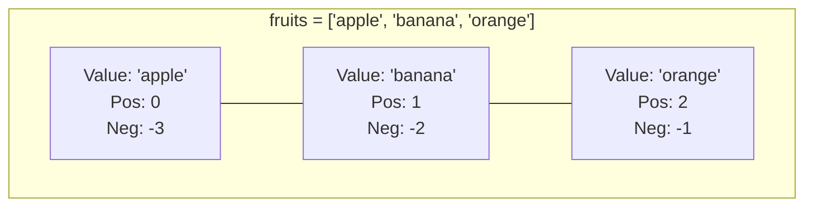

## 🌐 សេចក្តីផ្តើម (Overview)

នៅក្នុង Python ពេលខ្លះអ្នកមិនគ្រាន់តែចង់រក្សាទុកទិន្នន័យមួយទេ តែអ្នកចង់រក្សាទុកទិន្នន័យជាច្រើនក្នុងពេលតែមួយ។ នេះគឺជាពេលដែល Collection Types ចូលខ្លួនមកជួយ! ថ្ងៃនេះយើងនឹងសិក្សាពីប្រភេទដ៏មានអំណាចបំផុតពីរគឺ **List** (ដែលអាចកែប្រែបាន) និង **Tuple** (ដែលមិនអាចកែប្រែបាន)។

---

## 📚 រៀនពាក្យបច្ចេកទេស (Definitions)

- **List (`[]`):** ជាបណ្តុំទិន្នន័យដែលមានលំដាប់លំដោយ (Ordered) និងអាចកែប្រែបាន (Mutable) គ្រប់ពេល។
- **Tuple (`()`):** ជាបណ្តុំទិន្នន័យដែលមានលំដាប់លំដោយដូចគ្នា ប៉ុន្តែមិនអាចកែប្រែបានទេ (Immutable) បន្ទាប់ពីវាត្រូវបានបង្កើតរួច។
- **Index:** ជាលេខរៀងនៃទិន្នន័យក្នុង List/Tuple (ចាប់ផ្តើមពីលេខ 0 ជានិច្ច)។
- **Mutable (អាចកែបាន):** លក្ខណៈសម្បត្តិដែលអាចបន្ថែម លុប ឬកែប្រែទិន្នន័យខាងក្នុងដោយមិនចាំបាច់បង្កើតវាថ្មី។

---

## 💡 គំនិតគោល (The Core Idea)

### List គឺដូចជា ក្តារខៀនសរសេរដៃ
អ្នកអាចសរសេរអក្សរចូល លុបចោលវិញ ឬកែប្រែអ្វីដែលអ្នកបានសរសេរយ៉ាងងាយស្រួលគ្រប់ពេលវេលា។

### Tuple គឺដូចជា សំបុត្រអាពាហ៍ពិពាហ៍
ពេលដែលអ្នកព្រីនវាចេញមកហើយ វាត្រូវបានកត់ត្រាទុកយ៉ាងជាប់លាប់។ អ្នកមិនអាចយកជ័រលុបមកលុបឈ្មោះប្តូរបានទេ!

---

## 📖 ការសិក្សាស៊ីជម្រៅ (In Depth)

### ១. មូលដ្ឋាននៃការទាញយកទិន្នន័យ (Positive និង Negative Indexing)

រាល់ទិន្នន័យមានលេខរៀងរបស់វា ដែលរាប់ពីឆ្វេងទៅស្តាំ (ចាប់ផ្តើមពី 0)។ ប៉ុន្តែអ្វីដែលពិសេសគឺ Python អនុញ្ញាតឱ្យរាប់ពីស្តាំទៅឆ្វេង (ចាប់ផ្តើមពី -1)!

```python
fruits = ["apple", "banana", "orange"]

# រាប់ពីឆ្វេងទៅស្តាំ (Positive Index)
print(fruits[0])    # apple
print(fruits[1])    # banana

# រាប់ពីស្តាំទៅឆ្វេង (Negative Index)
print(fruits[-1])   # orange (ធាតុចុងក្រោយគេ)
print(fruits[-2])   # banana
```

**គំនូសតាងចំណាំ:**

> Negative Index គឺមានប្រយោជន៍ខ្លាំងណាស់ ពេលអ្នកចង់យករបស់ចុងក្រោយគេ ដោយមិនបាច់ខ្វល់ថា List នោះមានប្រវែងប៉ុន្មានឡើយ។

---

### ២. ការកាត់យកផ្នែកណាមួយ (Slicing `[:]`)

ជារឿយៗ អ្នកចង់បានទិន្នន័យច្រើនជាងមួយ មកពីកណ្តាល List។

```python
numbers = [10, 20, 30, 40, 50]

print(numbers[1:4])  # យកតាំងពី Index 1 ដល់ 3 (មិនរាប់ 4 ទេ) -> [20, 30, 40]
print(numbers[:3])   # យកតាំងពីដើម ដល់ Index 2 -> [10, 20, 30]
print(numbers[2:])   # យកតាំងពី Index 2 ដល់ចប់ -> [30, 40, 50]
print(numbers[::-1]) # បញ្ច្រាស List ទាំងមូល -> [50, 40, 30, 20, 10]
```

---

### ៣. មុខងារបន្ថែមរបស់ List (List Methods)

List មានអាវុធទំនើបៗជាច្រើនសម្រាប់លេងជាមួយទិន្នន័យ!

```python
cart = ["Apple", "Orange", "Milk"]

cart.append("Bread")   # បន្ថែមទៅខាងចុង
cart.insert(1, "Meat") # បញ្ចូលចន្លោះកណ្តាល (ត្រង់ Index 1)
cart.remove("Orange")  # លុបពាក្យ Orange ចេញ
last_item = cart.pop() # លុប និងទាញយកធាតុចុងក្រោយគេ

print(cart) # ['Apple', 'Meat']
```

**Methods សំខាន់ៗផ្សេងទៀត:**
```python
numbers = [4, 1, 5, 2]

numbers.sort()    # តម្រៀបពីតូចទៅធំ
print(numbers)    # [1, 2, 4, 5]

numbers.reverse() # បញ្ច្រាសលំដាប់
print(numbers)    # [5, 4, 2, 1]

print(numbers.index(4)) # រកមើលថា 4 នៅ Index លេខប៉ុន្មាន? -> 1
print(numbers.count(5)) # រាប់ថាមានលេខ 5 ចំនួនប៉ុន្មានដង? -> 1
```

---

### ៤. ការស្វែងរកសមាជិកភាព (Membership Testing)

សិស្សតែងតែប្រើវាញឹកញាប់ក្នុងការសរសេរកម្មវិធី។ គ្រាន់តែប្រើពាក្យ `in` ឬ `not in` គឺចប់!

```python
fruits = ["apple", "banana", "orange"]

if "apple" in fruits:
    print("Found apple!")

print("grape" not in fruits) # True
```

---

### ៥. ប្រវែងនៃ List (The `len()` function)

ប្រើសម្រាប់ដឹងថាមានទិន្នន័យប៉ុន្មាននៅក្នុងហ្នឹង។

```python
print(len(fruits)) # 3
```

---

### ៦. List ត្រួតលើ List (Nested Lists)

Python អនុញ្ញាតឱ្យយើងដាក់ List ទៅក្នុង List មួយទៀត (ជាមូលដ្ឋាននៃ Matrix ឬតារាងទិន្នន័យ 2D)។

```python
matrix = [
    [1, 2],
    [3, 4]
]

# យកជួរទី 0 បន្ទាប់មកយកខ្ទង់ទី 1
print(matrix[0][1]) # 2
```

---

### ៧. Tuple Packing និង Unpacking

Tuple គឺសាមញ្ញណាស់ សូម្បីតែវង់ក្រចកក៏ពេលខ្លះមិនបាច់ដាក់ដែរ។ នេះហៅថា **Packing**:
```python
student = "Alice", 20, "IT" # នេះគឺជា Tuple!
print(student) # ('Alice', 20, 'IT')
```

ការទាញយកទិន្នន័យពីវាមកអថេររៀងៗខ្លួនវិញ ហៅថា **Unpacking**:
```python
name, age, major = student
print(name) # Alice
```

---

### ៨. ប្រយ័ត្ន! Tuple ដែលមានតែសមាជិកមួយ (Single-element Tuple)

កំហុសដែលអ្នកចាប់ផ្តើមជួបញឹកញាប់បំផុត៖
```python
x = (5)
print(type(x)) # <class 'int'> រាប់ជាលេខធម្មតា!
```
ត្រឹមត្រូវ (ត្រូវតែមានសញ្ញាក្បៀស ជានិច្ច!):
```python
x = (5,)
print(type(x)) # <class 'tuple'>
```

---

### ៩. មុខងាររបស់ Tuple (Tuple Methods)

ដោយសារ Tuple មិនអាចកែប្រែបាន វាមិនមាន `append`, `pop`, ឬ `sort` ទេ។ វាមានតែពីរគត់៖
```python
t = (1, 2, 2, 3)

print(t.count(2)) # រាប់ថាមាន 2 ប៉ុន្មានដង? -> 2
print(t.index(3)) # រកមើល Index របស់លេខ 3 -> 3
```

---

## ⚖️ តារាងប្រៀបធៀប List និង Tuple (List vs Tuple)

តារាងនេះនឹងជួយឱ្យអ្នកចងចាំលក្ខណៈសម្បត្តិរបស់ពួកវាបានយ៉ាងល្អ៖

| លក្ខណៈពិសេស (Feature) | List | Tuple |
| --------- | ---- | ----- |
| **Syntax**    | `[]`   | `()`    |
| **Mutable (អាចកែប្រែបាន)** | ✅    | ❌     |
| **Ordered (រក្សាលំដាប់)**   | ✅    | ✅     |
| **Duplicate (អនុញ្ញាតស្ទួន)** | ✅    | ✅     |
| **Indexed (ប្រើលេខរៀង)**   | ✅    | ✅     |
| **Faster (ល្បឿនលឿនជាង)**    | ❌    | ✅     |
| **Memory (ទំហំស៊ី Memory)**    | ច្រើន (More) | តិច (Less) |

---

## 🛒 ការអនុវត្តក្នុងពិភពពិត (Real-world Application)

### កន្ត្រកទំនិញ (Shopping Cart) ជាមួយ List
ពេលអ្នកទិញទំនិញអនឡាញ កន្ត្រករបស់អ្នកត្រូវការប្រែប្រួលរហូត! ដូច្នេះយើងប្រើ List។
```python
cart = [
    "Apple",
    "Orange",
    "Milk"
]

cart.append("Bread") # អតិថិជនថែមនំប៉័ង
cart.remove("Orange") # អតិថិជនលុបក្រូចចេញពីកន្ត្រកវិញ

print(cart)
```

### ទំហំអេក្រង់ (Screen Size) ជាមួយ Tuple
ទំហំអេក្រង់ម៉ាស៊ីនមិនអាចផ្លាស់ប្តូរបានទេ (Fixed Data)។ ដូច្នេះយើងប្រើ Tuple។
```python
screen_size = (1920, 1080)

width, height = screen_size # Unpacking យ៉ាងងាយស្រួល!
```

---

## ❌ កំហុសដែលអ្នកតែងតែជួប (Common Mistakes)

**១. ហៅ Index ដែលមិនមាន (IndexError)**
```python
numbers = [1, 2, 3]

print(numbers[5]) # IndexError: list index out of range
```
**២. លុបធាតុច្រើនពេករហូតដល់ទទេស្អាត**
```python
numbers = [1]

numbers.pop()
numbers.pop() # IndexError: pop from empty list
```
**៣. ភ្លេចក្បៀស ពេលបង្កើត Single Tuple**
```python
t = (10)  # នេះជា Integer
t = (10,) # នេះទើបជា Tuple
```

---

## ✅ ចំណុចសំខាន់ៗដែលត្រូវចាំ (Key Takeaways)

- **Lists គាំទ្រ Methods ជាច្រើន** ដូចជា `append()`, `insert()`, `extend()`, `sort()`, `reverse()`, `pop()`, និង `remove()`។
- ប្រើ **Negative Index** (ឧទាហរណ៍ `-1`) ដើម្បីចូលទៅកាន់ធាតុចុងក្រោយបំផុតបានយ៉ាងរហ័ស។
- **Slicing (`[start:stop]`)** អនុញ្ញាតឱ្យយើងកាត់យកផ្នែកខ្លះនៃ List ឬ Tuple មកប្រើការ។
- ប្រើ **`in` និង `not in`** ដើម្បីពិនិត្យ Membership (ការមានវត្តមាន) បានយ៉ាងងាយស្រួល។
- **Tuple មិនអាចកែប្រែបានទេ (Immutable)** ដែលធ្វើឱ្យវាដំណើរការលឿនជាង និងស៊ី Memory តិចជាង List។ ត្រូវចាំដាក់សញ្ញាក្បៀស `,` បើ Tuple នោះមានសមាជិកតែមួយ។
