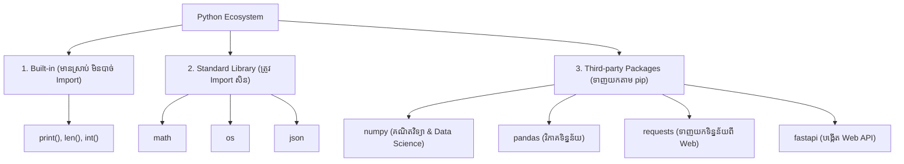

## 🌐 សេចក្តីផ្តើម (Overview)

ពេលអ្នកសរសេរកម្មវិធីកាន់តែធំ កូដរបស់អ្នកអាចនឹងមានប្រវែងរាប់ពាន់បន្ទាត់។ បើអ្នកទុកកូដទាំងអស់នៅក្នុងឯកសារតែមួយ វានឹងក្លាយជាសុបិន្តអាក្រក់ពេលចង់កែប្រែអ្វីមួយ។ 
**Modules និង Packages** គឺជាវិធីដែល Python អនុញ្ញាតឱ្យអ្នកបំបែកកូដធំៗទៅជាបំណែកតូចៗ (ឯកសារផ្សេងៗគ្នា) ដើម្បីងាយស្រួលគ្រប់គ្រង។ លើសពីនេះទៅទៀត វាអនុញ្ញាតឱ្យអ្នកទាញយកកូដដ៏មានអានុភាពដែលអ្នកដទៃបានសរសេររួច (Library) មកប្រើប្រាស់ដោយគ្រាន់តែវាយពាក្យមួយម៉ាត់ប៉ុណ្ណោះ!

---

## 📚 រៀនពាក្យបច្ចេកទេស (Definitions)

- **Module:** គឺជាឯកសារ Python សាមញ្ញមួយ (`.py`) ដែលមានផ្ទុក functions, classes, ឬ variables សម្រាប់អោយឯកសារផ្សេងទាញយកទៅប្រើ។
- **Package:** A directory that contains Python modules. ជា Folder ដែលរៀបចំ Modules ច្រើនជាក្រុម។ ជាទូទៅវាមាន `__init__.py` ប៉ុន្តែនៅក្នុង Modern Python (3.3+) វាអាចដំណើរការបានដោយគ្មាន `__init__.py` ផងដែរ (ហៅថា Namespace Packages)។
- **Import:** ការទាញយកកូដពី Module ឫ Package មួយមកប្រើប្រាស់ក្នុងឯកសាររបស់អ្នក។
- **pip:** កម្មវិធីគ្រប់គ្រងកញ្ចប់ (Package Manager) សម្រាប់ទាញយក Third-party Packages ពីអ៊ីនធឺណិត។
- **Virtual Environment (venv):** បន្ទប់ដាច់ដោយឡែកមួយសម្រាប់គម្រោងនីមួយៗ ដើម្បីកុំឱ្យ Library របស់វាជាន់គ្នា។

---

## 💡 គំនិតគោល (The Core Idea)

### ប្រព័ន្ធ Ecosystem របស់ Python

នៅក្នុង Python កូដទាំងអស់មិនមែនសុទ្ធតែស្ថិតនៅកន្លែងតែមួយនោះទេ។ វាត្រូវបានបែងចែកជា ៣ ផ្នែកធំៗ៖



---

## 📖 ការសិក្សាស៊ីជម្រៅ (In Depth)

### ១. តារាងនៃការ Import (Common Import Styles Table)

ការទាញយកកូដមកប្រើ មានទម្រង់ច្រើនយ៉ាង៖

| វាក្យសម្ព័ន្ធ (Syntax)          | ឧទាហរណ៍ជាក់ស្តែង (Example)                 | ការប្រើប្រាស់ (Usage)             |
| --------------- | ----------------------- | ----------------- |
| **Import ទាំងមូល**   | `import math`           | ទាញយក Module ទាំងមូល (ត្រូវប្រើ `math.sqrt`) |
| **Import តែមួយចំណែក** | `from math import sqrt` | ទាញយកតែមុខងារមួយ (អាចហៅ `sqrt` ផ្ទាល់តែម្តង) |
| **Alias (ប្តូរឈ្មោះកាត់)**           | `import numpy as np`    | ប្តូរឈ្មោះឱ្យខ្លីស្រួលសរសេរ (ប្រើ `np.array`)        |
| **Import ច្រើនក្នុងពេលតែមួយ** | `import os, json`       | ទាញយក Modules ច្រើនព្រមគ្នា  |

### ២. អាថ៌កំបាំងរបស់ `if __name__ == "__main__":`

សិស្សថ្មីថ្មោងតែងឆ្ងល់ថាហេតុអ្វីបានជាគេសរសេរឃ្លានេះនៅខាងចុងឯកសារ? 
ឧបមាថាអ្នកមានឯកសារ `calculator.py`:

```python
def add(a, b):
    return a + b

# ហេតុអ្វីត្រូវដាក់ឃ្លានេះ?
if __name__ == "__main__":
    print(add(5, 3))
```
**ការបកស្រាយ:** 
- `__name__ == "__main__"` មានន័យថា៖ "ប្រសិនបើអ្នកចុច Run ឯកសារ `calculator.py` នេះដោយផ្ទាល់ នោះកូដខាងក្រោមនឹងដើរ (ចេញលទ្ធផល `8`)។"
- **ប៉ុន្តែ** ប្រសិនបើអ្នក `import calculator` ពីឯកសារផ្សេង នោះកូដក្នុង `if` នេះនឹង **មិន** ដើរទេ! វាការពារកុំឱ្យមានលទ្ធផលលោតចេញមកដោយចៃដន្យពេលយើងទាញយក Module ។ (សំខាន់ខ្លាំងណាស់សម្រាប់ Flask, FastAPI, Django, ឬ Data Science)

### ៣. ការទាញយកកូដនៅក្បែរគ្នា (Relative Import)

ពេលប្រព័ន្ធកាន់តែធំ យើងមានថត (Folders) ច្រើន។
```text
my_project/
├── app/
│   ├── __init__.py
│   ├── models.py
│   └── utils.py
└── main.py
```
ប្រសិនបើអ្នកនៅក្នុង `models.py` ហើយចង់ទាញយកកូដពី `utils.py` ដែលនៅក្បែរគ្នា អ្នកត្រូវប្រើ **សញ្ញាចុច (.)**:
```python
# នៅក្នុង models.py
from .utils import helper_function
```
សញ្ញា `.` មានន័យថា "ស្វែងរកនៅក្នុងថត (Package) តែមួយ"។

---

## 💻 ការបំបែកកូដ (Code Breakdown)

### ១. ការគ្រប់គ្រងកញ្ចប់ជាមួយ Pip (Package Management)

ដើម្បីប្រើប្រាស់កូដដែលគេសរសេររួច (Third-party) យើងត្រូវប្រើ `pip` នៅក្នុង Terminal៖

**ការទាញយកកញ្ចប់ថ្មី (Install):**
```bash
pip install requests
```

**ការប្រើប្រាស់កញ្ចប់ដែលបានទាញយករួច:**
```python
import requests

response = requests.get("https://api.github.com")
print(response.status_code) # លទ្ធផល: 200 (ជោគជ័យ)
```

**ពាក្យបញ្ជាសំខាន់ៗផ្សេងទៀតរបស់ pip:**
- `pip list` : មើលកញ្ចប់ទាំងអស់ដែលបានដំឡើងក្នុងកុំព្យូទ័រ
- `pip show pandas` : មើលព័ត៌មានលម្អិតពីកញ្ចប់ `pandas`
- `pip uninstall pandas` : លុបកញ្ចប់ចេញ
- `pip install --upgrade pandas` : ដំឡើងទៅជំនាន់ថ្មីបំផុត (Update)

### ២. បន្ទប់ដាច់ដោយឡែក (Virtual Environment - venv) ⚠️ សំខាន់

អ្នកសរសេរកម្មវិធីអាជីព **មិនដែល** ទាញយក Library ផ្តេសផ្តាសចូលកុំព្យូទ័រផ្ទាល់ខ្លួននោះទេ! គេបង្កើត "បន្ទប់ដាច់ដោយឡែក" សម្រាប់ Project នីមួយៗ ដើម្បីកុំឱ្យ Library ជាន់ជំនាន់គ្នា។

**របៀបបង្កើត (សរសេរក្នុង Terminal នៅក្នុង Project របស់អ្នក):**
```bash
python -m venv .venv
```

**របៀបបើកដំណើរការ (Activate):**
- **Mac/Linux:** `source .venv/bin/activate`
- **Windows:** `.venv\Scripts\activate`

បន្ទាប់ពី Activate រួច ពេលអ្នក `pip install pandas numpy` វាចូលតែក្នុងបន្ទប់នេះប៉ុណ្ណោះ!

**របៀបរក្សាទុកបញ្ជី Library (ឱ្យមិត្តភក្តិ):**
```bash
pip freeze > requirements.txt
```

---

## 🛒 ការអនុវត្តក្នុងពិភពពិត (Professional Project Structure)

នៅពេលអ្នកធ្វើគម្រោង Data Science ឬ Backend អាជីព អ្នកត្រូវរៀបចំឯកសារអោយមានរបៀបរៀបរយ។ នេះគឺជារចនាសម្ព័ន្ធស្តង់ដារដែលគេនិយមប្រើ៖

```text
customer_analysis/
│
├── .venv/                  # បន្ទប់ផ្ទុក Library ដាច់ដោយឡែក (មិនដែល Upload ចូល GitHub ទេ)
├── main.py                 # ច្រកចូលដើមនៃកម្មវិធី (Entry Point)
│
├── data/                   # ថតផ្ទុកឯកសារទិន្នន័យ
│   └── customer.csv
│
├── src/                    # ថតផ្ទុកកូដសំខាន់ៗ (Source Code)
│   ├── __init__.py
│   ├── loader.py
│   ├── cleaning.py
│   └── model.py
│
└── requirements.txt        # ឯកសារបញ្ជាក់ពី Library ទាំងអស់ដែល Project ត្រូវការ
```

---

## ❌ កំហុសដែលអ្នកតែងតែជួប (Common Mistakes)

### ១. ដាក់ឈ្មោះឯកសារដូចគ្នានឹង Library ពិតប្រាកដ
ឧបមាថាអ្នកបង្កើតឯកសារខ្លួនឯងឈ្មោះ `math.py` ឫ `pandas.py`។ ពេលអ្នក `import math` Python នឹងទាញយកឯកសាររបស់អ្នកជំនួសឱ្យ Library របស់វាផ្ទាល់! កម្មវិធីនឹង Error ភ្លាម។
✅ **ដំណោះស្រាយ:** កុំដាក់ឈ្មោះ Module របស់អ្នកអោយជាន់នឹងឈ្មោះ Standard ឫ Third-party Library ។

### ២. ភ្លេច Activate Virtual Environment មុនពេល `pip install`
បើសិនជាភ្លេច វាមានន័យថាអ្នកបានទាញយកទិន្នន័យចូលទៅក្នុងកុំព្យូទ័រធំទាំងមូល (Global) ដែលវានឹងជាន់គ្នាជាមួយគម្រោងផ្សេងៗ។

---

## ✅ ចំណុចសំខាន់ៗដែលត្រូវចាំ (Key Takeaways)

- **Module** គឺជាឯកសារ Python មួយ ឯ **Package** គឺជាថត (Folder) ដែលផ្ទុក Module ច្រើន។
- **Namespace Packages** អនុញ្ញាតឱ្យ Folder ក្លាយជា Package ទោះបីជាគ្មាន `__init__.py` ក៏ដោយ (ក្នុង Python 3.3+)។
- ប្រើ **`if __name__ == "__main__":`** ដើម្បីបែងចែកកូដសម្រាប់ Run ផ្ទាល់ និងកូដសម្រាប់ Import ។
- ប្រើសញ្ញា **ចុច (`.`)** (ឧ. `from .utils import ...`) ដើម្បី Import Module ដែលនៅក្បែរគ្នា។
- **Standard Library** មកស្រាប់ជាមួយ Python (ឧ. `math`, `os`), ចំណែក **Third-party Packages** ត្រូវទាញយកតាមរយៈ `pip` (ឧ. `requests`, `pandas`)។
- បង្កើត **Virtual Environment (`.venv`)** ជានិច្ចរាល់ពេលចាប់ផ្តើមគម្រោងថ្មី ដើម្បីធានាសុវត្ថិភាពទិន្នន័យ និងកុំឱ្យខូច Project ដទៃ។
- ប្រើ **`pip freeze > requirements.txt`** ដើម្បីកត់ត្រាបញ្ជី Library ដែលអ្នកប្រើ ងាយស្រួលប្រគល់កូដអោយអ្នកផ្សេងដំណើរការបន្ត។
