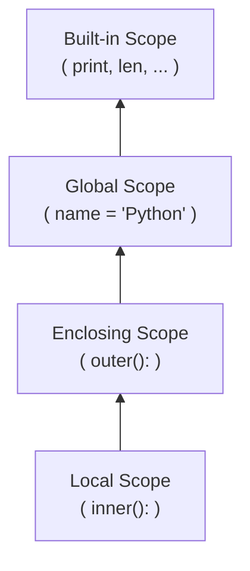
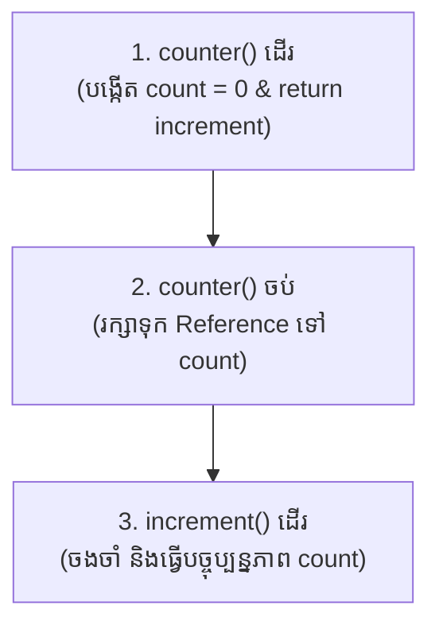
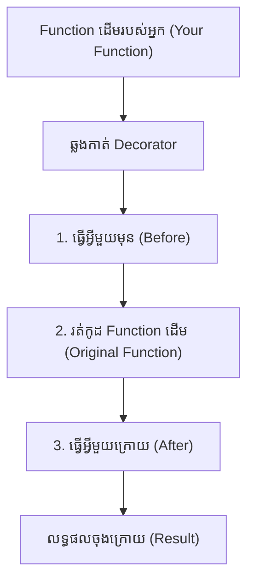

## 🌐 Overview

តើអ្នកធ្លាប់ជួបបញ្ហាដែលប្រកាសអថេរ (Variable) មួយហើយ ប៉ុន្តែកុំព្យូទ័រប្រាប់ថា "រកមិនឃើញ" (NameError) ទេ? នេះគឺដោយសារច្បាប់នៃ Scope (វិសាលភាព) នៅក្នុង Python។ ការយល់ដឹងពី Scope, Closures, និង Decorators នឹងជួយអ្នកឱ្យសរសេរកូដកាន់តែមានសុវត្ថិភាព និងបង្កើតមុខងារកម្រិតខ្ពស់ដែល Data Scientists អាជីពតែងតែប្រើ។

---

## 💡 ហេតុអ្វីយើងត្រូវរៀន Scope, Closures និង Decorators?

អ្នកចាប់ផ្តើមជាច្រើនគិតថា Decorators និង Closures គឺជាប្រធានបទកម្រិតខ្ពស់ ហើយមិនសូវប្រើប្រាស់ទេ។

ប៉ុន្តែការពិតគឺ Framework ល្បីៗស្ទើរតែទាំងអស់ប្រើវា៖
- **FastAPI** → `@app.get()`
- **Flask** → `@app.route()`
- **PyTest** → `@pytest.fixture`
- **TensorFlow** → `@tf.function`
- **Dataclasses** → `@dataclass`
- **functools** → `@lru_cache`

ដូច្នេះ ការយល់ពីមេរៀននេះមានន័យថា អ្នកកំពុងយល់ពីរបៀបដែល Framework ទំនើបៗធ្វើការនៅពីក្រោយឆាកយ៉ាងពិតប្រាកដ។

---

## 📚 រៀនពាក្យបច្ចេកទេស (Definitions)

- **Scope (វិសាលភាព):** តំបន់នៅក្នុងកូដ ដែលអថេរ (Variable) អាចត្រូវបានមើលឃើញ ឬយកទៅប្រើប្រាស់បាន។
- **Closure:** គឺជាបច្ចេកទេសដែល Function មួយអាច "ចងចាំ" នូវទិន្នន័យដែលនៅជុំវិញវា សូម្បីតែពេលដែល Function ខាងក្រៅបានដើរចប់ក៏ដោយ។
- **Decorator:** គឺជា Function ពិសេសមួយដែលទទួលយក Function មួយទៀត ហើយបន្ថែមសមត្ថភាពថ្មីឱ្យវា ដោយមិនចាំបាច់កែប្រែកូដដើម (ប្រើសញ្ញា `@`)។

---

## 🔍 ការស្វែងរកអថេរ និងច្បាប់ LEGB 

នៅក្នុង Python ពេលអ្នកប្រើប្រាស់ឈ្មោះអថេរណាមួយ វាស្វែងរកពីខាងក្នុងចេញមកខាងក្រៅតាមលំដាប់នេះ៖



**របៀបដែលវាដំណើរការ៖**
Python ស្វែងរក Variable ពីខាងក្នុងចេញមកខាងក្រៅ (Local → Enclosing → Global → Built-in)។
ពេលរកឃើញហើយ Python នឹងឈប់រកភ្លាម!

---

## ⚠️ ការបាំងឈ្មោះអថេរ (Name Shadowing)

នេះជាកំហុសដ៏សាហាវមួយ៖

```python
len = 100

print(len([1, 2, 3]))
```
**លទ្ធផល:**
```text
TypeError: 'int' object is not callable
```
**តើមានអ្វីកើតឡើង?**
អ្នកបានបង្កើត Variable ឈ្មោះ `len` ដែលវាបានទៅបាំង (Shadow) Function `len()` របស់ Built-in ដែលមានស្រាប់។ 

**បម្រាម:** សូមជៀសវាងប្រើឈ្មោះទាំងនេះជា Variable ដាច់ខាត៖
- `list`
- `str`
- `int`
- `max`
- `min`
- `sum`
- `print`

---

## 🌍 ការប្រើប្រាស់ `global`

```python
count = 0

def increase():
    global count
    count += 1

increase()
increase()

print(count) # 2
```
`global` អនុញ្ញាតឱ្យ Function អាចកែប្រែ Variable ដែលនៅក្រៅគេបំផុត (Global Scope) បាន។

> **ការណែនាំ:** ប្រើវាតែពេលចាំបាច់បំផុតប៉ុណ្ណោះ។ កូដស្តង់ដាររបស់ Python (Pythonic code) ភាគច្រើនតែងតែព្យាយាមជៀសវាងការប្រើ `global` ព្រោះវាធ្វើឱ្យពិបាករកកំហុស។

---

## 🔒 ការប្រើប្រាស់ `nonlocal` សម្រាប់ Closures

```python
def counter():
    count = 0

    def increment():
        nonlocal count
        count += 1
        return count

    return increment

c = counter()

print(c())
print(c())
print(c())
```
**លទ្ធផល Output:**
```text
1
2
3
```
`nonlocal` អនុញ្ញាតឱ្យ Function ខាងក្នុង (Inner) អាចកែប្រែទិន្នន័យរបស់ Function ខាងក្រៅ (Enclosing) បាន។ នេះគឺជាមូលដ្ឋានគ្រឹះនៃ Closure ដ៏ល្អឥតខ្ចោះ!

---

## 🧠 របៀបដែល Closure ធ្វើការនៅពីក្រោយខ្នង


**ចំណុចសំខាន់:** Closure មិនមែនគ្រាន់តែ "ចម្លង (Copy)" Variable នោះទេ ប៉ុន្តែវា **រក្សាទុកសេចក្តីយោង (Reference)** ទៅ Variable នោះតែម្តង។ ដូច្នេះទើបយើងអាចកែប្រែតម្លៃរបស់វានៅពេលក្រោយបាន។

---

## 🌍 តើ Closures ប្រើនៅឯណាខ្លះ?

- រោងចក្រផលិត Function (Function Factory)
- ការចងចាំលទ្ធផលគណនា (Memoization/Caching)
- ការកំណត់រចនាសម្ព័ន្ធ (Configuration)
- Callbacks ក្នុងការទាញទិន្នន័យ (API Calls)
- អ្នករៀបចំព្រឹត្តិការណ៍ (Event Handlers ក្នុង UI)
- **ការបង្កើត Decorators!**

---

## 🎁 សេចក្តីផ្តើមអំពី Decorators ជារូបភាព



---

## 🪄 ការសរសេរ Decorator សាមញ្ញមួយ

មុននឹងឈានដល់របស់ស្មុគស្មាញ តោះសរសេរ Decorator ដើម្បីបន្ថែមសកម្មភាពមុន និងក្រោយ៖

```python
def loud(func):
    def wrapper():
        print("Before")
        func()
        print("After")
    return wrapper

@loud
def hello():
    print("Hello")

hello()
```
**លទ្ធផល Output:**
```text
Before
Hello
After
```

---

## 🤔 តើសញ្ញា `@` មានន័យយ៉ាងម៉េចពិតប្រាកដ?

នៅពេលអ្នកសរសេរ៖
```python
@timer
def work():
    pass
```
នៅក្នុងខួរក្បាលរបស់ Python វាយល់ថា៖
```python
def work():
    pass

work = timer(work)
```
នេះហើយគឺជាអត្ថន័យពិតនៃ Decorators! វាយក Function ដើម ទៅបោះចូលក្នុង Function ផ្សេង រួចយកលទ្ធផលមកដាក់ឈ្មោះដដែល។

---

## 🛡️ ការពារកូដជាមួយ `functools.wraps()`

មានបញ្ហាមួយនៅពេលប្រើ Decorators: វាធ្វើឱ្យ Function របស់យើងបាត់បង់ឈ្មោះ និងឯកសារពន្យល់ (Docstring) ដើម។

```python
from functools import wraps

def timer(func):
    @wraps(func)
    def wrapper(*args, **kwargs):
        # ធ្វើអ្វីមួយ
        return func(*args, **kwargs)
    return wrapper
```
`@wraps` ជួយរក្សាទុក៖
- ឈ្មោះដើមរបស់ Function (Function Name)
- ឯកសារពន្យល់ (Documentation/Docstring)
- ព័ត៌មានលម្អិតផ្សេងៗ (Metadata)

> Frameworks ល្បីៗស្ទើរតែទាំងអស់សុទ្ធតែប្រើប្រាស់ `functools.wraps()`!

---

## 🏭 Decorator ដែលទទួល Arguments

ចុះបើយើងចង់បញ្ជា Decorator ទៀតនោះ? យើងត្រូវបង្កើតកម្រិតទី ៣ (Decorator Factory)!

```python
from functools import wraps

def repeat(n):
    def decorator(func):
        @wraps(func)
        def wrapper():
            for _ in range(n):
                func()
        return wrapper
    return decorator

@repeat(3)
def hello():
    print("Hi")
```
**លទ្ធផល Output:**
```text
Hi
Hi
Hi
```

---

## 🚀 ការអនុវត្តជាក់ស្តែងនៅក្នុង Framework ធំៗ

សិស្សជាច្រើនស្រឡាញ់ការប្រើប្រាស់ Decorators នៅពេលពួកគេឃើញវាប្រើក្នុង Framework ដូចជា FastAPI ជាដើម៖

```python
@app.get("/users")
def get_users():
    return []
```
**ការពន្យល់:** FastAPI មិនមែនមាន Keyword ឈ្មោះ `@app.get` តាំងពីកំណើតនោះទេ។ វាគ្រាន់តែជា **Decorator** ដែលគេសរសេរឡើងប៉ុណ្ណោះ។ ពេលយើងប្រើវា វានឹងយក Function `get_users` ទៅចុះឈ្មោះទុក ដើម្បីធ្វើជា API Endpoint!

---

## ❌ កំហុសដែលអ្នកតែងតែជួប (Common Mistakes)

- កុំប្រើ `global` ដើម្បីចែកចាយទិន្នន័យ (Share Data) ទូទាំង Project ឡើយ ព្រោះវានឹងធ្វើឱ្យទិន្នន័យរញ៉េរញ៉ៃ។
- កុំប្រើ Closures ជំនួស Classes ប្រសិនបើ State (ស្ថានភាព/ទិន្នន័យ) របស់អ្នកមានភាពស្មុគស្មាញពេក។
- ពេលសរសេរ Decorators ត្រូវចាំបាច់រក្សា Function Signature ដើមដោយប្រើប្រាស់ `functools.wraps()` ជានិច្ច។
- កុំប្រើ Nested Functions (អនុគមន៍ត្រួតលើអនុគមន៍) ច្រើនជាន់ពេក ប្រសិនបើវាមិនចាំបាច់ ព្រោះវាធ្វើឱ្យពិបាកអាន។

---

## 📝 សំណួរសម្ភាសន៍ទូទៅ (Common Interview Questions)

1. ច្បាប់ LEGB មានន័យដូចម្តេច?
2. តើ `global` និង `nonlocal` ខុសគ្នាយ៉ាងដូចម្តេច?
3. តើ Closure គឺជាអ្វី?
4. ហេតុអ្វី Closure អាចចងចាំ Variable ដែលវាធ្លាប់រស់នៅជាមួយបាន?
5. តើ Decorator ដំណើរការយ៉ាងដូចម្តេចនៅពីក្រោយខ្នង?
6. តើការសរសេរ `@decorator` ស្មើនឹងការសរសេរកូដដើមបែបណា?
7. ហេតុអ្វីយើងចាំបាច់ត្រូវប្រើប្រាស់ `functools.wraps()` ពេលបង្កើត Decorator?

---

## 🧪 លំហាត់អនុវត្តន៍ (Practice Exercises)

**Exercise 1:** តើលទ្ធផលចុងក្រោយនៃកូដនេះនឹងចេញអ្វី? មូលហេតុ?
```python
x = 100

def test():
    x = 50
    print(x)

test()
print(x)
```

**Exercise 2:** បង្កើតកម្មវិធីរាប់ (Counter) មួយដោយប្រើប្រាស់ `nonlocal`។

**Exercise 3:** បង្កើត Closure មួយដែលអាចចងចាំតួលេខ និងគុណលេខនោះជាមួយទិន្នន័យថ្មីដែលអ្នកបោះចូល (Multiplier Closure)។

**Exercise 4:** សរសេរ Decorator មួយដែលនឹងព្រីនអក្សរ `Starting...` មុនពេលរត់កូដ និង `Ending...` ក្រោយពេលរត់កូដចប់ សម្រាប់អនុវត្តលើ Function ណាមួយក៏បាន។

**Exercise 5:** សរសេរ Decorator សំខាន់មួយ ដែលវាស់ស្ទង់ពេលវេលាដំណើរការកូដរបស់ Function មួយ (Execution Time Measurer) ដោយប្រើយ៉ាងត្រឹមត្រូវនូវ `*args`, `**kwargs` និង `wraps`។

---

## 📊 តារាងសេចក្តីសង្ខេប (Summary Table)

| ប្រធានបទ (Topic) | គោលបំណង (Purpose) | ការប្រើប្រាស់ទូទៅ (Common Usage) |
| --------- | -------------------------- | ---------------------- |
| Scope     | កំណត់ទីតាំងដែលអថេររស់នៅ (Variable visibility) | នៅក្នុងគ្រប់កម្មវិធី Python ទាំងអស់ |
| LEGB      | លំដាប់នៃការស្វែងរកអថេរ (Variable lookup) | ការដោះស្រាយឈ្មោះអថេរ |
| `global`    | កែប្រែអថេរដែលនៅខាងក្រៅ (Modify global variables)    | កម្រនឹងប្រើណាស់ (Rare) |
| `nonlocal`  | កែប្រែអថេររបស់កូដកម្រិតកណ្តាល (Modify enclosing variables) | ប្រើក្នុង Closures |
| Closure   | ចងចាំទិន្នន័យ (Remember state)             | រោងចក្រផលិត Functions (Function factories) |
| Decorator | បន្ថែមសមត្ថភាពឱ្យកូដ (Wrap functions)             | ពេញនិយមខ្លាំងក្នុង FastAPI, Flask, PyTest |

---

## Overall Rating
សូមអបអរសាទរ! ប្រសិនបើអ្នកអាចយល់ពី LEGB, ការចាប់យកទិន្នន័យរបស់ Closures និងអត្ថន័យពិតនៃ `@` របស់ Decorators នោះមានន័យថាអ្នកបានឆ្លងផុតពីអ្នកសរសេរកូដធម្មតា ទៅកាន់អ្នកអភិវឌ្ឍន៍កម្មវិធីកម្រិតអាជីពហើយ! ចំណេះដឹងនេះគឺជាស្ពានដ៏ធំមួយសម្រាប់ការយល់ដឹងពីរបៀបដែល Framework ធំៗដូចជា FastAPI, Flask និង TensorFlow ធ្វើការនៅពីក្រោយឆាក។
