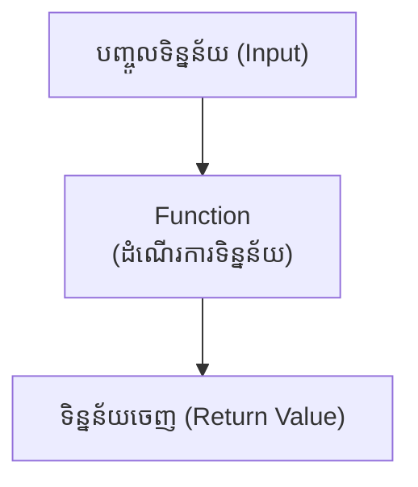
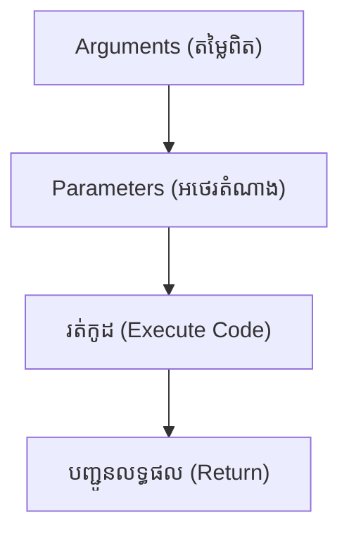
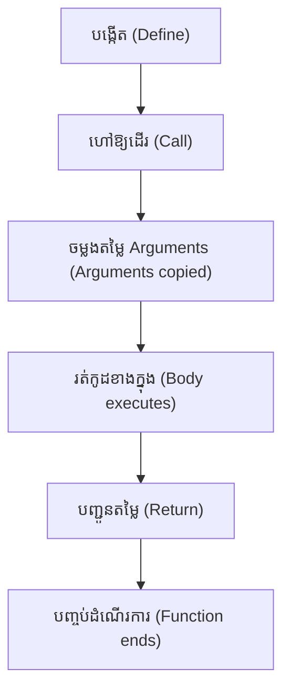

## ⭐ សេចក្តីផ្តើម (Overview)

> Functions គឺជាមូលដ្ឋានគ្រឹះនៃ Software Engineering។ ស្ទើរតែ Framework ទាំងអស់ (Django, Flask, FastAPI, Pandas, NumPy, TensorFlow) សុទ្ធតែបង្កើតឡើងពី Functions រាប់ពាន់។ ការយល់ Functions ឱ្យស៊ីជម្រៅ នឹងធ្វើឱ្យអ្នកអាចសរសេរកូដដែលអាចប្រើឡើងវិញ (Reusable), ងាយស្រួលថែទាំ (Maintainable) និងងាយស្រួលសាកល្បង (Testable)។

គ្រប់ពេលដែលអ្នកសរសេរកូដ អ្នកតែងតែចង់ឱ្យកូដរបស់អ្នកមានសណ្តាប់ធ្នាប់ ងាយអាន និងអាចយកទៅប្រើប្រាស់ម្តងទៀតបានដោយមិនចាំបាច់សរសេរឡើងវិញ។ នៅក្នុង Python វិធីដ៏ល្អបំផុតក្នុងការធ្វើបែបនេះគឺការប្រើប្រាស់ "Functions"។

---

## 📚 រៀនពាក្យបច្ចេកទេស (Definitions)

- **Function Call:** ការហៅ Function ឱ្យដំណើរការ។
- **Function Signature:** ឈ្មោះ Function រួមជាមួយ Parameters របស់វា។
- **Return Value:** តម្លៃលទ្ធផលដែល Function បញ្ជូនត្រឡប់មកវិញ។
- **Function Body:** កូដដែលស្ថិតនៅខាងក្នុង Function។
- **Scope:** ដែនកំណត់ ឬតំបន់ដែលអថេរ (Variable) អាចប្រើប្រាស់បាន។
- **Docstring:** អត្ថបទសម្រាប់ពន្យល់ពីអត្ថន័យ និងរបៀបប្រើ Function នោះ។

---

## 💡 គំនិតគោល (The Core Idea)

សូមមើលគំនូសតាងនេះ ដើម្បីយល់ពីតួនាទីរបស់ Function ក្នុងប្រព័ន្ធទាំងមូល៖



ម្យ៉ាងវិញទៀត អ្នកអាចគិតពីវាតាមលំហូរនេះ៖


---

## 📖 ការសិក្សាស៊ីជម្រៅ (In Depth)

### កាយវិភាគវិទ្យានៃ Function (Anatomy of a Function)

សូមពិនិត្យមើលរចនាសម្ព័ន្ធនេះ៖
```python
def add(a, b):
    return a + b
```

ការបំបែកធាតុផ្សំ៖
```text
def
 │
 ├── ពាក្យគន្លឹះ (keyword សម្រាប់បង្កើត)

add
 │
 ├── ឈ្មោះ Function (function name)

(a, b)
 │
 ├── ប៉ារ៉ាម៉ែត្រ (parameters)

:
 │
 ├── ចាប់ផ្តើមកូដ (start body)

return
 │
 ├── ពាក្យគន្លឹះបញ្ជូនតម្លៃ (return keyword)
```

---

### វដ្តជីវិតរបស់ Function (Function Lifecycle)

រាល់ Function ទាំងអស់មានលំហូរជីវិតដូចខាងក្រោម៖

ការយល់ដឹងពីលំហូរនេះជួយឱ្យអ្នកដឹងច្បាស់ថា កូដមិនរត់ដោយខ្លួនឯងទេ លុះត្រាតែមានអ្នកហៅវា។

---

## 👥 Parameters ទល់នឹង Arguments

សិស្សភាគច្រើនច្រឡំពាក្យទាំងពីរនេះ។

| Parameter    | Argument     |
| ------------ | ------------ |
| ប្រើនៅពេលបង្កើត (Define) | ប្រើនៅពេលហៅ (Call)   |
| ជាកន្លែងទុកចន្លោះ (Placeholder)  | ជាតម្លៃពិតប្រាកដ (Actual Value) |
| ឧ. `name`       | ឧ. `"Alice"`    |

**ឧទាហរណ៍ជាក់ស្តែង៖**
```python
def greet(name):
    print(name)

greet("Alice")
```
នៅក្នុងកូដនេះ៖
* **Parameter** គឺ `name`
* **Argument** គឺ `"Alice"`

---

## ⚠️ `Return` ទល់នឹង `Print` (សំខាន់បំផុត!)

សិស្សជាង 90% ច្រឡំត្រង់នេះ! តោះប្រៀបធៀប៖

**ប្រើ Print (អត់មាន Return):**
```python
def add(a, b):
    print(a + b)

x = add(10, 5)
print(x)
```
**លទ្ធផល Output:**
```text
15
None
```
*ហេតុអ្វីចេញ `None`?* ព្រោះកូដគ្រាន់តែ Print ឱ្យយើងមើល តែវាមិនបានបញ្ជូនទិន្នន័យពិតប្រាកដត្រឡប់មកឱ្យ `x` នោះទេ។

**ប្រើ Return (ត្រឹមត្រូវ):**
```python
def add(a, b):
    return a + b

x = add(10, 5)
print(x)
```
**លទ្ធផល Output:**
```text
15
```
នេះទើបជាការសរសេរ Function ដែលត្រឹមត្រូវ ព្រោះវាអនុញ្ញាតឱ្យយើងយកតម្លៃទៅប្រើបន្ត (ដូចជាការរក្សាទុកក្នុងអថេរ `x`)។

---

## 🌍 Local Scope ទល់នឹង Global Scope

តើអថេរមានអាយុកាលរស់នៅត្រឹមណា?

```python
name = "Python" # Global Scope

def greet():
    name = "Alice" # Local Scope
    print(name)

greet()
print(name)
```
**លទ្ធផល Output:**
```text
Alice
Python
```

**គំនូសតាង៖**
```text
Global Scope
(ពិភពខាងក្រៅ)
name = "Python"
↓
   ចូលក្នុង Function (Local Scope)
   name = "Alice" (មិនប៉ះពាល់អ្នកក្រៅទេ)
```

**ការប្រើប្រាស់ពាក្យ `global`:**
ប្រសិនបើអ្នកចង់ឱ្យ Function កែប្រែអថេរខាងក្រៅ អ្នកត្រូវប្រាប់វា៖
```python
count = 0

def increment():
    global count
    count += 1
```
> **ការណែនាំ:** ជាទូទៅ អ្នកសរសេរកម្មវិធីអាជីព មិនណែនាំឱ្យប្រើ `global` ញឹកញាប់ទេ ព្រោះវាធ្វើឱ្យកូដពិបាកថែទាំ និងពិបាកស៊ើបអង្កេតកំហុស (Debug)។ យកល្អគួរតែប្រើ `return`។

---

## 📦 ការបញ្ជូនតម្លៃច្រើនក្នុងពេលតែមួយ (Multiple Return Values)

មិនដូចភាសាដទៃ Python អាច Return ទិន្នន័យច្រើនព្រមគ្នាបានយ៉ាងងាយ!

```python
def calculate(a, b):
    return a + b, a - b

add, subtract = calculate(10, 5)
```
**លទ្ធផល (Values):** `add` ស្មើ 15, `subtract` ស្មើ 5។
អ្នកប្រហែលមិនដឹងទេថា អ្នកគ្រាន់តែបង្កើត Function មួយដែលអាចបញ្ចេញទិន្នន័យច្រើនយ៉ាងឆ្លាតវៃ!

---

## 📞 ទម្រង់នៃការហៅ Function (Calling Styles)

| Style (ទម្រង់)      | ឧទាហរណ៍        |
| ---------- | -------------- |
| Positional (តាមលំដាប់) | `add(2, 3)`     |
| Keyword (តាមឈ្មោះ)    | `add(a=2, b=3)` |
| Mixed (ចម្រុះ)      | `add(2, b=3)`   |

---

## ⚙️ ការកំណត់តម្លៃដើម (Default Parameter)

អ្នកអាចកំណត់តម្លៃត្រៀមទុកជាមុន ក្រែងលោគេភ្លេចបញ្ចូលតម្លៃ។

```python
def power(number, exponent=2):
    return number ** exponent

print(power(5))     # លទ្ធផល: 25 (ប្រើ exponent លំនាំដើមស្មើ 2)
print(power(5, 3))  # លទ្ធផល: 125 (ប្តូរ exponent ទៅជា 3 វិញ)
```

---

## 📄 ការសរសេរឯកសារជំនួយ (Docstring)

ជាទម្លាប់ដ៏ល្អមួយ អ្នកត្រូវតែសរសេរប្រាប់អ្នកដទៃ (ឬប្រាប់ខ្លួនឯងនៅថ្ងៃក្រោយ) ពីរបៀបប្រើ Function នោះ។

```python
def add(a, b):
    """
    បូកលេខពីរ និងបញ្ជូនលទ្ធផលត្រឡប់មកវិញ។
    """
    return a + b
```
នៅពេលអ្នករត់ពាក្យបញ្ជា `help(add)` កុំព្យូទ័រនឹងបង្ហាញអត្ថបទនោះមកប្រាប់អ្នកយ៉ាងច្បាស់។

---

## 📊 លំហូររបស់ Function ជារូបភាព (Function Flow Diagram)

```text
ហៅ (Call)
↓
បញ្ចូល Arguments
↓
ផ្ទេរចូល Parameters
↓
ប្រតិបត្តិ (Execute)
↓
បញ្ជូនលទ្ធផល (Return)
↓
កម្មវិធីបន្តដំណើរទៅមុខ (Continue Program)
```

---

## 🧠 ការអនុវត្តក្នុង Data Science ពិតប្រាកដ (Real-world Application)

នៅក្នុង Data Science និង Machine Learning ការកែច្នៃទិន្នន័យមានសារៈសំខាន់ណាស់។ នេះគឺជាឧទាហរណ៍ការធ្វើ Normalization លើទិន្នន័យ៖

```python
def normalize(value, minimum, maximum):
    return (value - minimum) / (maximum - minimum)

print(normalize(75, 0, 100))
```
អបអរសាទរ! នេះគឺជា Function មួយដែល Data Scientists ប្រើប្រាស់នៅលើ Datasets គ្រប់ពេលវេលា!

---

## ❌ កំហុសដែលអ្នកតែងតែជួប (Common Mistakes)

**១. ភ្លេចវង់ក្រចក (Forget Parentheses)**
```python
greet
```
វានឹងមិនរត់ទេ! អ្នកត្រូវតែប្រើ៖
```python
greet()
```

**២. ចំនួន Arguments មិនត្រូវគ្នា (Wrong Number of Arguments)**
```python
def add(a, b):
    return a + b

add(5)
```
នេះនឹងលោតកំហុសប្រភេទ `TypeError` ព្រោះខ្វះតម្លៃ `b`។

**៣. សរសេរកូដពីក្រោម Return (Code After Return)**
```python
def add():
    return 5
    print("Hello") # កូដនេះគ្មានថ្ងៃបានរត់ឡើយ!
```

**៤. ដាក់ឈ្មោះជាន់នឹងរបស់ដែលមានស្រាប់ (Shadowing Built-ins)**
```python
def list():
    # កុំធ្វើឱ្យសោះ ព្រោះ list ជាពាក្យដើមរបស់ Python!
```

---

## 🧪 លំហាត់អនុវត្តន៍ (Mini Exercises)

**Exercise 1:** តើ Output របស់កូដនេះជាអ្វី?
```python
def square(x):
    return x * x

print(square(6))
```

**Exercise 2:** តើ `x` មានតម្លៃប៉ុន្មាន?
```python
def hello():
    print("Hello")

x = hello()
print(x)
```

**Exercise 3:** បង្កើត Function រកក្រឡាផ្ទៃ!
```python
def area(w, h):
    return w * h

print(area(4, 5))
```

**Exercise 4:** តើកូដនេះនឹងចេញប្រទេសអ្វី?
```python
country = "Cambodia"

def test():
    country = "Japan"

test()
print(country)
```

**Exercise 5 (កិច្ចការផ្ទះ):** សូមបង្កើត Function មួយឈ្មោះ `fahrenheit_to_celsius()`!

---

## 💼 សំណួរសម្ភាសន៍ (Interview Questions)

**Q1: តើខុសគ្នាយ៉ាងដូចម្តេចរវាង `print()` និង `return`?**
ចម្លើយ៖ `print()` គ្រាន់តែបង្ហាញអក្សរលើអេក្រង់សម្រាប់ឱ្យមនុស្សមើល។ ឯ `return` បញ្ជូនទិន្នន័យចេញពី Function ដើម្បីឱ្យកូដផ្សេងទៀតអាចយកទៅគណនាបន្តបាន។

**Q2: Parameter និង Argument ខុសគ្នាដូចម្តេច?**
ចម្លើយ៖ Parameter គឺជាអថេរនៅពេលបង្កើត Function (Placeholder) ចំណែក Argument គឺជាតម្លៃពិតប្រាកដដែលយើងបោះចូលពេលហៅវាប្រើ (Actual value)។

**Q3: ប្រសិនបើ Function មួយមិនមានពាក្យ `return` ទេ តើវានឹង Return អ្វី?**
ចម្លើយ៖ `None`

**Q4: តើ Local Variable និង Global Variable ខុសគ្នាដូចម្តេច?**
ចម្លើយ៖ Local រស់នៅតែក្នុង Function របស់វាប៉ុណ្ណោះ។ Global រស់នៅខាងក្រៅ ហើយអាចប្រើប្រាស់បានទូទាំងកម្មវិធី។

---

## 🏆 ការអនុវត្តដ៏ល្អបំផុត (Best Practices)

### ការដាក់ឈ្មោះ (Naming)
ត្រូវដាក់ឈ្មោះជា **កិរិយាសព្ទ (Verb)** ព្រោះ Function គឺជាសកម្មភាព!
✅ គួរធ្វើ៖
```python
calculate_salary()
send_email()
find_user()
```
❌ មិនគួរធ្វើ៖
```python
abc()
temp()
x()
```

### ការទទួលខុសត្រូវតែមួយ (One Responsibility)
Function មួយ គួរតែធ្វើការងារតែមួយប៉ុណ្ណោះ ទើបងាយស្រួលថែទាំ។
✅ ល្អ៖
```python
calculate_tax()
send_email()
```
❌ មិនល្អ៖
```python
calculate_tax_and_send_email_and_save_database()
```

---

## 📊 តារាងសេចក្តីសង្ខេប (Summary Table)

| គំនិត (Concept)           | ការពិពណ៌នា (Description)             | ឧទាហរណ៍ (Example)               |
| ----------------- | ----------------------- | --------------------- |
| `def`             | បង្កើត Function (Define a function)       | `def greet():`        |
| Call              | ហៅ Function ឱ្យរត់ (Execute a function)      | `greet()`             |
| Parameter         | អថេររង់ចាំតម្លៃ (Placeholder variable)    | `name`                |
| Argument          | តម្លៃពិតប្រាកដ (Actual value)            | `"Alice"`             |
| `return`          | បញ្ជូនលទ្ធផលត្រឡប់ (Send value back)         | `return total`        |
| Local Scope       | ប្រើបានតែខាងក្នុង (Exists inside function)  | `x = 5` (ក្នុង Function)               |
| Global Scope      | ប្រើបានទូទាំងកូដ (Exists outside function) | `count = 0`           |
| Default Parameter | តម្លៃលំនាំដើម (Default value)           | `country="Cambodia"`  |
| Keyword Argument  | បោះតម្លៃតាមឈ្មោះ (Pass by name)            | `greet(name="Alice")` |
| Docstring         | ឯកសារពន្យល់ (Function documentation)  | `"""..."""`           |

---

## Overall Rating
មេរៀននេះគឺជាគ្រឹះដ៏សំខាន់បំផុតមួយសម្រាប់អ្នក។ មិនថាអ្នកនឹងរៀនពី Lambda Functions, Decorators, ការសរសេរកម្មវិធីបែប OOP ឬ Machine Learning នៅថ្ងៃមុខនោះទេ អ្នកនឹងត្រូវប្រើប្រាស់ការយល់ដឹងពី Scope, Return vs Print, និង Parameters ដែលអ្នកទើបតែទទួលបានពីរមេរៀននេះជាមិនខាន!
