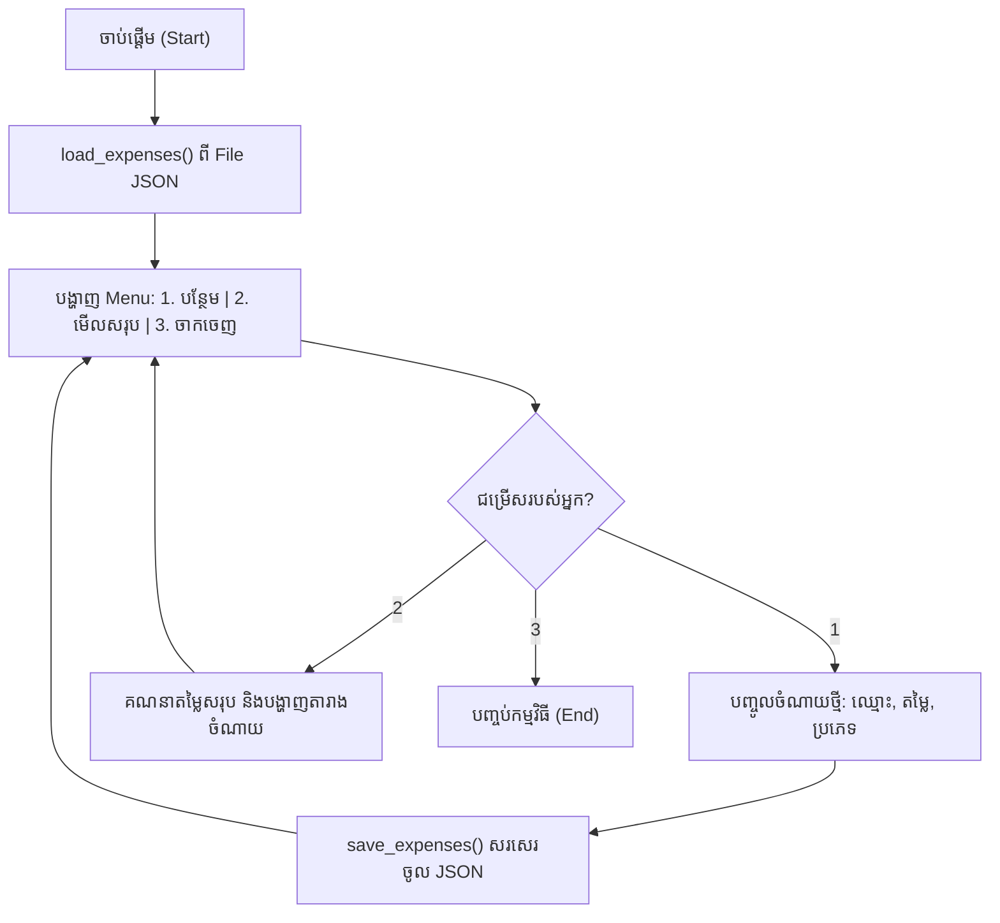

## 🌐 សេចក្តីផ្តើម (Overview)

នៅក្នុងពិភពពិត ទិន្នន័យភាគច្រើនមិនមែនជាអត្ថបទ (Text) ធម្មតាៗនោះទេ ប៉ុន្តែវាត្រូវបានរៀបចំជារចនាសម្ព័ន្ធច្បាស់លាស់។ 
- បើអ្នកធ្វើការជា Data Analyst អ្នកនឹងជួបប្រទះ **CSV** (Comma-Separated Values) ជារៀងរាល់ថ្ងៃ ដែលវាប្រៀបបាននឹងតារាង Excel។
- បើអ្នកធ្វើការជា Web Developer ឬបង្កើត AI ភ្ជាប់ទៅកាន់ប្រព័ន្ធផ្សេងៗ អ្នកនឹងជួប **JSON** (JavaScript Object Notation) ដែលជាភាសាសកលសម្រាប់ផ្លាស់ប្តូរទិន្នន័យនៅលើអ៊ីនធឺណិត។

ក្នុងមេរៀននេះ យើងនឹងរៀនពីរបៀបឱ្យ Python "និយាយជាមួយ" ទម្រង់ទិន្នន័យដ៏មានប្រជាប្រិយទាំងពីរនេះ។

---

## 📚 រៀនពាក្យបច្ចេកទេស (Definitions)

- **CSV (Comma-Separated Values):** ជាឯកសារដែលរក្សាទុកទិន្នន័យជាទម្រង់តារាង (Table) ដោយប្រើសញ្ញាក្បៀស (`,`) ដើម្បីបែងចែកចន្លោះ Column នីមួយៗ។
- **JSON (JavaScript Object Notation):** ជាទម្រង់អត្ថបទស្តង់ដារសម្រាប់រក្សាទុកទិន្នន័យជាលក្ខណៈគូ (Key-Value pairs) ដែលមានមុខមាត់ស្រដៀងនឹង Dictionary របស់ Python បេះបិទ។
- **Serialization:** ការបំប្លែងទិន្នន័យពី Python Object ទៅជា JSON String ដើម្បីផ្ញើតាមអ៊ីនធឺណិត ឬរក្សាទុកក្នុងឯកសារ។
- **Deserialization:** ការស្រាយបំប្លែងទិន្នន័យពី JSON String ត្រឡប់មកជា Python Object វិញ ដើម្បីឱ្យយើងងាយស្រួលទាញយកទិន្នន័យ។

---

## 🔄 ការបំប្លែងប្រភេទទិន្នន័យ (Python ⇄ JSON Type Mapping)

សិស្សតែងតែឆ្ងល់ថា ហេតុអ្វី `True` ក្លាយទៅជា `true` ពេលប្តូរទៅជា JSON។ នេះគឺជាច្បាប់នៃការបំប្លែង៖

| ក្នុង Python          | ក្នុង JSON        |
| --------------- | ----------- |
| `dict`          | Object `{}` |
| `list`, `tuple` | Array `[]`  |
| `str`           | String      |
| `int`, `float`  | Number      |
| `True`          | `true`      |
| `False`         | `false`     |
| `None`          | `null`      |

ការយល់ដឹងពីតារាងនេះ នឹងជួយអ្នកឱ្យធ្វើការជាមួយ API របស់ពិភពលោកបានយ៉ាងងាយស្រួល!

---

## 📊 ការប្រើប្រាស់ឯកសារ CSV

### ១. ការសរសេរទិន្នន័យចូល CSV
យើងប្រើ `csv.writer` ដើម្បីសរសេរទិន្នន័យរាងជា List ចូលទៅក្នុងឯកសារ។

```python
import csv

students = [
    ["Name", "Age", "Score"],
    ["Sok", 20, 95],
    ["Bopha", 21, 88],
]

with open("students.csv", "w", newline="", encoding="utf-8") as file:
    writer = csv.writer(file)
    writer.writerows(students)

print("CSV created successfully!")
```

### ២. ការសរសេរទិន្នន័យដោយប្រើ `DictWriter`
នៅក្នុង Project ជាក់ស្តែង គេតែងតែប្រើប្រាស់ Dictionary ដើម្បីសរសេរកូដ៖

```python
import csv

students = [
    {"name": "Sok", "score": 95},
    {"name": "Bopha", "score": 88},
]

with open("students_dict.csv", "w", newline="", encoding="utf-8") as file:
    writer = csv.DictWriter(
        file,
        fieldnames=["name", "score"]
    )

    writer.writeheader() # សរសេរក្បាលតារាង (Header)
    writer.writerows(students)
```

---

## 🌐 ការប្រើប្រាស់ JSON

### ១. ចងចាំភាពខុសគ្នារវាង `dump` និង `dumps`

សិស្សថ្មីភាគច្រើន ច្រឡំគ្នារវាង `load` ទល់នឹង `loads` ឬ `dump` ទល់នឹង `dumps`។

| ឈ្មោះ Function       | ធ្វើការជាមួយ (Works With) |
| -------------- | ---------- |
| `json.dump()`  | ឯកសារ (File)       |
| `json.dumps()` | អត្ថបទ (String)     |
| `json.load()`  | ឯកសារ (File)       |
| `json.loads()` | អត្ថបទ (String)     |

> 💡 **គន្លឹះចងចាំ:** មានអក្សរ **s = string** (មានន័យថាធ្វើការជាមួយអក្សរផ្ទាល់ៗ មិនមែនឯកសារទេ)។

---

### ២. ការរៀបចំទម្រង់ JSON ឱ្យស្អាត (Pretty Printing JSON)

ពេលខ្លះ JSON មានសភាពរញ៉េរញ៉ៃ។ អ្នកអាចរៀបចំវាឱ្យងាយអានបានដោយប្រើ `indent`។

```python
import json

data = {
    "name": "Sok",
    "age": 20
}

# ព្រីនធម្មតា (ពិបាកអាន)
print(json.dumps(data))

# ព្រីនឱ្យស្អាត (មានរបៀប)
print(json.dumps(data, indent=4))
```

---

### ៣. ការគ្រប់គ្រងភាសាខ្មែរក្នុង JSON (Unicode Example)

នេះជារឿងដ៏សំខាន់សម្រាប់អ្នកសរសេរកម្មវិធីនៅកម្ពុជា!

```python
import json

person = {
    "name": "សុខា"
}

# គ្មាន ensure_ascii=False វានឹងចេញកូដចម្លែកៗ
print(json.dumps(person))

# ត្រូវតែប្រើ ensure_ascii=False ទើបចេញអក្សរខ្មែរ
print(json.dumps(person, ensure_ascii=False))
```
**មូលហេតុ:** បើមិនប្រើប្រាស់ `ensure_ascii=False` ទេ អក្សរខ្មែរនឹងត្រូវបំប្លែងទៅជាកូដ Unicode escape sequences ដូចជា `\u179f\u17bb\u1781\u17b6`។

---

### ៤. ការសរសេរ និងអាន JSON File ផ្ទាល់

**សរសេរ (Writing):**
```python
import json

config = {
    "theme": "dark",
    "language": "kh"
}

with open("config.json", "w", encoding="utf-8") as file:
    json.dump(config, file, indent=4, ensure_ascii=False)
```

**អាន (Reading):**
```python
import json

with open("config.json", encoding="utf-8") as file:
    config = json.load(file)

print(config["theme"]) # dark
```

---

### ៥. ទិន្នន័យត្រួតគ្នា (Nested JSON)

APIs ភាគច្រើន តែងតែផ្តល់ទិន្នន័យមានលក្ខណៈត្រួតគ្នា (Nested)។

```python
response = {
    "user": {
        "name": "Alice",
        "age": 30
    },
    "skills": [
        "Python",
        "SQL"
    ]
}

print(response["user"]["name"]) # Alice
print(response["skills"][0])    # Python
```

---

## 🚀 ឧទាហរណ៍ទាញយក JSON ពីអុីនធឺណិត (requests + JSON)

មេរៀនសឹងតែគ្រប់កន្លែងអំពី Backend និង API ត្រូវប្រើរឿងនេះ៖

```python
import requests

response = requests.get("https://jsonplaceholder.typicode.com/users/1")

# បំប្លែងទិន្នន័យដែលទាញបានពី JSON ឱ្យទៅជា Dictionary របស់ Python ស្វ័យប្រវត្តិ
user = response.json()

print(user["name"])
```

---

## ⚖️ តារាងប្រៀបធៀប (CSV vs JSON)

| លក្ខណៈ (Feature)                   | CSV   | JSON      |
| ------------------------- | ----- | --------- |
| **ទម្រង់ (Structure)**                 | តារាង (Table) | ត្រួតគ្នា (Nested)    |
| **មនុស្សអាចអានបាន (Human readable)**            | ✅     | ✅         |
| **មានការត្រួតគ្នា (Nested data)**               | ❌     | ✅         |
| **បើកក្នុង Excel បានងាយ (Excel compatible)**          | ✅     | ❌         |
| **ស្តង់ដារ Web API**              | ❌     | ✅         |
| **ប្រើជាសំណុំទិន្នន័យ Machine Learning** | ✅     | ពេលខ្លះ (Sometimes) |
| **ប្រើធ្វើជាឯកសារកំណត់រចនាសម្ព័ន្ធ (Config)**       | ❌     | ✅         |

---

## 🛒 ឧទាហរណ៍នៃការប្រើប្រាស់ក្នុងពិភពពិត (Better Real-world Examples)

**កន្លែងដែលគេតែងតែប្រើប្រាស់ CSV:**
* បើកជាមួយ Excel ឬ Google Sheets
* ទាញយក Data ចេញពី Kaggle (សម្រាប់ Machine Learning)
* របាយការណ៍លក់ (Sales Reports)
* បញ្ជីពិន្ទុសិស្ស ឬបញ្ជីបុគ្គលិក

**កន្លែងដែលគេតែងតែប្រើប្រាស់ JSON:**
* ការផ្លាស់ប្តូរទិន្នន័យតាមរយៈ REST APIs
* ចម្លើយឆ្លើយតបពី AI Models (ដូចជា ChatGPT API)
* ឯកសារ Config កម្មវិធី
* ប្រព័ន្ធ Database ដូចជា Firebase និង MongoDB

---

## ⚡ កំណត់ចំណាំអំពីល្បឿន (Performance Tip)

* **CSV:** មានទំហំតូច និងដំណើរការលឿនជាង សម្រាប់ទិន្នន័យបែបតារាងធំៗ (tabular datasets) ព្រោះវាគ្រាន់តែប្រើសញ្ញាក្បៀស។
* **JSON:** មានភាពបត់បែនខ្ពស់ ប៉ុន្តែស៊ីទំហំធំជាងបន្តិច ព្រោះទិន្នន័យនីមួយៗត្រូវភ្ជាប់មកជាមួយនឹង Key របស់វារហូត។

---

## ❌ កំហុសដែលអ្នកតែងតែជួប (Common Mistakes)

អ្នកចាប់ផ្តើមភាគច្រើនតែងតែគិតថា JSON String គឺជា Dictionary! វាមិនពិតទេ។

```python
import json

person = {
    "name": "Sok"
}

text = json.dumps(person) # ឥឡូវ text គឺជា អក្សរ (String)

# ❌ ខុស! (ព្រោះអក្សរគ្មានសោទេ)
print(text["name"]) # TypeError

# ✅ ត្រឹមត្រូវ! (យើងត្រូវទាញវាត្រឡប់មកជា Dictionary វិញសិន)
data = json.loads(text)
print(data["name"])
```

---

## ✅ ចំណុចសំខាន់ៗដែលត្រូវចាំ (Key Takeaways)

- ប្រើប្រាស់ **CSV** សម្រាប់រក្សាទុកទិន្នន័យបែបតារាង និងសំណុំទិន្នន័យ Machine Learning។
- ប្រើប្រាស់ **JSON** សម្រាប់ទិន្នន័យត្រួតគ្នា (Nested) ជាពិសេសសម្រាប់ការធ្វើការជាមួយ Web APIs។
- ប្រើ `csv.DictReader()` និង `csv.DictWriter()` ដើម្បីធ្វើឱ្យកូដ CSV កាន់តែងាយស្រួលអាន (ប្រើតាម Key)។
- សូមចងចាំឱ្យច្បាស់៖
  - `load()` / `dump()` → ប្រើសម្រាប់ **ឯកសារ (Files)**
  - `loads()` / `dumps()` → ប្រើសម្រាប់ **អក្សរ (Strings)**
- ត្រូវប្រើយ៉ាងចាំបាច់នូវ `ensure_ascii=False` ប្រសិនបើអ្នកចង់រក្សាទុកអក្សរខ្មែរឱ្យបានត្រឹមត្រូវក្នុង JSON។
- ប្រើ `indent=4` ក្នុង `json.dumps()` ដើម្បីឱ្យទិន្នន័យមើលទៅស្អាត និងមានសណ្តាប់ធ្នាប់។
- JSON គឺជាទម្រង់ស្តង់ដារសម្រាប់បណ្តាញអុីនធឺណិតទំនើបៗ ចំណែកឯ CSV គឺជារាជានៃពិភព Data Analysis!

---

## 🚀 Mini-Project: កម្មវិធីកត់ត្រាចំណាយប្រចាំថ្ងៃ (Daily Expense Tracker)

### 🎯 គោលបំណងគម្រោង
អនុវត្តចំណេះដឹងពីមេរៀនទី ៥ អំពីការអាន/សរសេរទិន្នន័យចូល File JSON ដោយប្រើ `with open()`, ការប្រើប្រាស់ `json.dump()` និង `json.load()`, និងការគ្រប់គ្រង Error ដោយ `try...except` ករណី File មិនទាន់មាន។



### 💻 កូដពេញលេញ (Full Source Code)

```python
# -------------------------------------------------------------
# Mini-Project: Daily Expense Tracker with JSON Persistence
# -------------------------------------------------------------
import json
import os

FILE_NAME = "expenses.json"

def load_expenses():
    """អានទិន្នន័យចំណាយពី JSON File ប្រសិនបើមាន បើគ្មានត្រឡប់ list ទទេ"""
    if not os.path.exists(FILE_NAME):
        return []
    try:
        with open(FILE_NAME, "r", encoding="utf-8") as f:
            return json.load(f)
    except (json.JSONDecodeError, IOError):
        return []

def save_expenses(expenses):
    """រក្សាទុកទិន្នន័យចំណាយចូលក្នុង JSON File"""
    with open(FILE_NAME, "w", encoding="utf-8") as f:
        json.dump(expenses, f, ensure_ascii=False, indent=4)

def add_expense(expenses):
    """បន្ថែមចំណាយថ្មី"""
    title = input("\n📝 សូមបញ្ចូលឈ្មោះចំណាយ (ឧ. បាយថ្ងៃត្រង់): ").strip()
    try:
        amount = float(input("💵 សូមបញ្ចូលតម្លៃទឹកប្រាក់ ($): "))
    except ValueError:
        print("⚠️ តម្លៃទឹកប្រាក់មិនត្រឹមត្រូវទេ! សូមបញ្ចូលជាលេខ។")
        return
    
    category = input("🏷️ សូមបញ្ចូលប្រភេទ (Food/Transport/Bills/Other): ").strip()

    new_item = {
        "title": title,
        "amount": amount,
        "category": category
    }
    expenses.append(new_item)
    save_expenses(expenses)
    print(f"✅ បានកត់ត្រាចំណាយ '{title}' ចំនួន ${amount:.2f} ដោយជោគជ័យ!")

def view_expenses(expenses):
    """បង្ហាញសេចក្តីសង្ខេបនៃចំណាយទាំងអស់"""
    print("\n" + "=" * 45)
    print("        📊 តារាងកត់ត្រាចំណាយសរុប        ")
    print("=" * 45)
    
    if not expenses:
        print("📭 មិនទាន់មានកំណត់ត្រាចំណាយនៅឡើយទេ។")
        print("=" * 45)
        return

    total = 0.0
    for idx, item in enumerate(expenses, 1):
        print(f"{idx:2}. {item['title']:18} | ${item['amount']:6.2f} | 🏷️ {item['category']}")
        total += item["amount"]

    print("-" * 45)
    print(f"💰 ចំណាយសរុបទាំងអស់     : ${total:.2f}")
    print("=" * 45)

def main():
    expenses = load_expenses()
    
    while True:
        print("\n==========================================")
        print("   💰 កម្មវិធីកត់ត្រាចំណាយ (Expense Tracker)   ")
        print("==========================================")
        print("1. ➕ កត់ត្រាចំណាយថ្មី")
        print("2. 📊 មើលរបាយការណ៍ចំណាយសរុប")
        print("3. 🚪 រក្សាទុក និងចាកចេញ")
        print("==========================================")
        
        choice = input("👉 សូមជ្រើសរើសជម្រើសមួយ (1-3): ").strip()
        
        if choice == "1":
            add_expense(expenses)
        elif choice == "2":
            view_expenses(expenses)
        elif choice == "3":
            print("\n👋 បានរក្សាទុកទិន្នន័យរួចរាល់។ សូមអរគុណ!")
            break
        else:
            print("⚠️ ជម្រើសមិនត្រឹមត្រូវទេ!")

if __name__ == "__main__":
    main()
```

### 🖥️ ឧទាហរណ៍នៃការដំណើរការកូដ (Sample Run)
```text
==========================================
   💰 កម្មវិធីកត់ត្រាចំណាយ (Expense Tracker)   
==========================================
1. ➕ កត់ត្រាចំណាយថ្មី
2. 📊 មើលរបាយការណ៍ចំណាយសរុប
3. 🚪 រក្សាទុក និងចាកចេញ
==========================================
👉 សូមជ្រើសរើសជម្រើសមួយ (1-3): 1

📝 សូមបញ្ចូលឈ្មោះចំណាយ (ឧ. បាយថ្ងៃត្រង់): អាហារថ្ងៃត្រង់
💵 សូមបញ្ចូលតម្លៃទឹកប្រាក់ ($): 4.50
🏷️ សូមបញ្ចូលប្រភេទ (Food/Transport/Bills/Other): Food
✅ បានកត់ត្រាចំណាយ 'អាហារថ្ងៃត្រង់' ចំនួន $4.50 ដោយជោគជ័យ!
```

