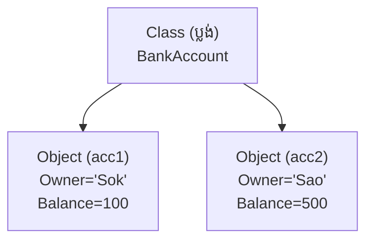
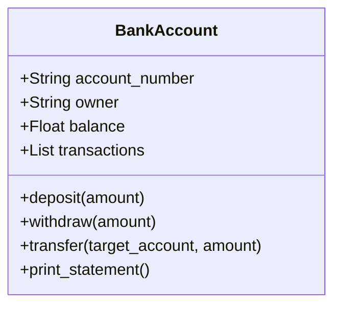

## 🌐 សេចក្តីផ្តើម (Overview)

តើអ្នកធ្លាប់ឆ្ងល់ទេថាហេតុអ្វីបានជា Python អាចឱ្យយើងសរសេរ `[1, 2].append(3)` បាន? នោះក៏ព្រោះតែនៅក្នុង Python អ្វីៗទាំងអស់សុទ្ធតែត្រូវបានបង្កើតឡើងដោយប្រើ **Object-Oriented Programming (OOP)**។ ការយល់ដឹងពី Classes និង Objects នឹងបំប្លែងអ្នកពីអ្នកសរសេរកូដធម្មតា ទៅជាអ្នករចនាប្រព័ន្ធ (System Designer) ដ៏ចំណានម្នាក់។

---

## 🧠 អ្វីៗគ្រប់យ៉ាងសុទ្ធតែជា Object (Everything is an Object)

Python គឺជាភាសា Object-Oriented ដ៏ពិតប្រាកដ។ ស្ទើរតែគ្រប់យ៉ាងនៅក្នុង Python សុទ្ធតែជា Object៖

```python
x = 10
name = "Sok"
numbers = [1, 2, 3]
```

ទោះបីជា `int`, `float`, `str`, `bool`, `list`, `tuple`, `dict`, ឬសូម្បីតែ `function` ក៏សុទ្ធតែជា Objects ទាំងអស់។

**ឧទាហរណ៍៖**
```python
print(type(10))       # <class 'int'>
print(type("Hello"))  # <class 'str'>
print(type([1,2]))    # <class 'list'>
```
ដូច្នេះ នៅពេលអ្នករៀនបង្កើត Class ផ្ទាល់ខ្លួន អ្នកកំពុងតែបង្កើត **"Object ប្រភេទថ្មីមួយ"** សម្រាប់ប្រព័ន្ធរបស់អ្នក!

---

## 📚 រៀនពាក្យបច្ចេកទេស (Definitions)

- **Class (ប្លង់/គំរូ):** ប្លង់ដែលកំណត់ថាតើ Object មួយមានរាងរៅយ៉ាងណា និងអាចធ្វើអ្វីបានខ្លះ (ឧ. ប្លង់ផ្ទះ)។
- **Object / Instance (វត្ថុពិត):** វត្ថុដែលត្រូវបានបង្កើតចេញពី Class នោះ (ឧ. ផ្ទះដែលសាងសង់រួចរាល់)។
- **Attribute (លក្ខណៈ):** អថេរ (Variables) ដែលនៅក្នុង Class (ឧ. ពណ៌របស់ផ្ទះ, ចំនួនបន្ទប់)។
- **Method (សកម្មភាព):** អនុគមន៍ (Functions) ដែលនៅក្នុង Class (ឧ. ចាក់សោទ្វារ, បើកភ្លើង)។
- **Instantiation:** ដំណើរការនៃការបង្កើត Object ថ្មីចេញពី Class មួយ។

---

## 💡 គំនិតគោល (The Core Idea)

### ១. គំនូសតាង (Visual Diagram)

សូមក្រឡេកមើលពីរបៀបដែល Class បង្កើត Objects ជាច្រើនដាច់ដោយឡែកពីគ្នា៖



### ២. ការបំបែក Memory របស់ Object

Class គឺជាប្លង់។ ពេលយើងបង្កើត Object `acc1` និង `acc2` ពួកវាមាន Memory ផ្ទាល់ខ្លួនរៀងៗខ្លួននៅក្នុងកុំព្យូទ័រ។ ដូច្នេះ បើយើងកែប្រែ `acc1.balance` វានឹង **មិនប៉ះពាល់** ដល់ `acc2.balance` ឡើយ!

---

## 📖 ការសិក្សាស៊ីជម្រៅ (In Depth)

### ១. ដំណើរការរបស់ Constructor (`__init__`)

ពាក្យថា Constructor (`__init__`) គឺជាអ្នករៀបចំទិន្នន័យដំបូងគេបង្អស់។ តើមានអ្វីកើតឡើងពេលអ្នកសរសេរ `BankAccount("Sok", 100)` ?

```text
BankAccount("Sok", 100)
       ↓
បង្កើត Object ទទេស្អាតមួយ
       ↓
រត់កូដក្នុង __init__()
       ↓
រក្សាទុកឈ្មោះ "Sok" ចូលក្នុង Owner
       ↓
រក្សាទុកលុយ 100 ចូលក្នុង Balance
       ↓
បញ្ជូន Object សម្រេចទៅអោយអថេររបស់អ្នក
```

### ២. អាថ៌កំបាំងរបស់ពាក្យ `self` 

សិស្សថ្មីភាគច្រើនស្អប់ពាក្យ `self` ណាស់។ ប៉ុន្តែវាសាមញ្ញបំផុត!

នៅពេលអ្នកបញ្ជាឱ្យ Object ធ្វើអ្វីមួយ៖
```python
acc1.deposit(100)
```
នៅពីក្រោយខ្នង, Python បានបំប្លែងវាទៅជា៖
```python
BankAccount.deposit(acc1, 100)
```
នោះមានន័យថា **`self` គឺជា `acc1` ហ្នឹងឯង!** វាគ្រាន់តែជាពាក្យតំណាងឱ្យខ្លួនឯងប៉ុណ្ណោះ។ បើអ្នកហៅ `acc2.deposit(100)` នោះ `self` នឹងក្លាយជា `acc2`។ ងាយៗ!

### ៣. វដ្តជីវិតរបស់ Object (Object Lifecycle)

```text
បង្កើត Object ថ្មី (Create)
       ↓
បញ្ចូលទិន្នន័យដំបូងតាមរយៈ __init__ (Initialize)
       ↓
ប្រើប្រាស់ Object នោះ (Use)
       ↓
នៅពេលឈប់ប្រើ, Python Garbage Collector នឹងសម្អាតវាចេញពី Memory (Destroy)
```

---

## 💻 ការបំបែកកូដ (Code Breakdown)

### ១. ការបង្កើត Class ពេញលេញ និង ការអាន Attribute (Dot Notation)

```python
class BankAccount:
    
    def __init__(self, owner, balance):
        self.owner = owner
        self.balance = balance

acc1 = BankAccount("Sok", 100)

# Dot Notation គឺប្រើសញ្ញា (.) 
print(acc1.owner)   # អាន Attribute
print(acc1.balance)

# កែប្រែ Attribute
acc1.balance = 500  
print(acc1.balance)
```

### ២. ការបន្ថែម Dunder Method ដ៏អស្ចារ្យ (`__str__`)

បើអ្នកប្រើ `print(acc1)` វាចេញរាងអាក្រក់មើលណាស់ `<__main__.BankAccount object at ...>`។ យើងអាចដោះស្រាយវាបានដោយ `__str__` ៖

```python
class BankAccount:
    def __init__(self, owner, balance):
        self.owner = owner
        self.balance = balance

    def __str__(self):
        return f"គណនីរបស់ {self.owner}: ${self.balance}"

acc1 = BankAccount("Sok", 100)
print(acc1) # ចេញរាងស្អាត: "គណនីរបស់ Sok: $100"
```

### ៣. ភាពខុសគ្នារវាង `type()` និង `isinstance()`

```python
print(type(acc1)) # ប្រាប់តែពី Class ជាក់លាក់ប៉ុណ្ណោះ

# ប៉ុន្តែ isinstance ឆ្លាតជាង វានឹងពិនិត្យមើលខ្សែស្រឡាយ (Inheritance) ផងដែរ
print(isinstance(acc1, BankAccount)) # True
```

---

## 🛒 ការអនុវត្តក្នុងពិភពពិត (Real-world Example)

### កម្មវិធីលក់ទំនិញ (E-Commerce Product)

```python
class Product:
    def __init__(self, name, price):
        self.name = name
        self.price = price

    def __str__(self):
        return f"{self.name} - ${self.price:.2f}"

    def discount(self, percent):
        # គណនាតម្លៃថ្មីបន្ទាប់ពីបញ្ចុះតម្លៃរួច
        return self.price * (1 - percent / 100)

# ការប្រើប្រាស់
laptop = Product("MacBook Pro", 2000)
mouse = Product("Logitech Master", 100)

print(laptop)
print(f"តម្លៃក្រោយបញ្ចុះ 10%: ${laptop.discount(10):.2f}")
```

---

## ❌ កំហុសដែលអ្នកតែងតែជួប (Common OOP Traps)

### អន្ទាក់ Mutable Class Attribute!

នេះគឺជាកំហុស OOP ដ៏ពេញនិយមបំផុតរបស់ Python ។ 

```python
class Student:
    # កុំប្រកាស List នៅត្រង់នេះ! ព្រោះវាជា Class Attribute (វាចែកគ្នារួម)
    subjects = [] 

a = Student()
b = Student()

a.subjects.append("Python")

print(b.subjects) # លទ្ធផល: ['Python'] ស្រាប់តែ b ក៏ចេះរៀន Python ដែរ!
```

✅ **ដំណោះស្រាយត្រឹមត្រូវ:** ត្រូវតែដាក់វានៅក្នុង `__init__` ដើម្បីអោយសិស្សម្នាក់ៗមាន List ផ្ទាល់ខ្លួន។

```python
class Student:
    def __init__(self):
        self.subjects = [] # ឥឡូវនេះម្នាក់ៗមាន Memory ផ្សេងគ្នាហើយ
```

---

## ⭐ ការអនុវត្តដ៏ល្អបំផុត (Best Practices)

- **Class Names:** ត្រូវសរសេរជា `PascalCase` (ឧទាហរណ៍ `BankAccount`, `ShoppingCart`, មិនមែន `bankAccount` ទេ)។
- **Method Names:** ត្រូវសរសេរជា `snake_case` ដូចទៅនឹងអនុគមន៍ធម្មតាដែរ (ឧទាហរណ៍ `deposit_money()`)។
- **Single Responsibility:** Class មួយគួរតែតំណាងឱ្យរបស់តែមួយមុខប៉ុណ្ណោះ (កុំដាក់មុខងារច្រើនហួសហេតុក្នុង Class តែមួយ)។

---

## 🛠️ លំហាត់អនុវត្តន៍ (Practice Exercises)

### លំហាត់ទី១៖ រថយន្ត
បង្កើត Class ឈ្មោះ `Car` ដែលមាន Attributes `brand`, `model`, `year`។ បន្ទាប់មកបង្កើត Method `display_info()` ដើម្បីព្រីនព័ត៌មានរថយន្ត។

### លំហាត់ទី២៖ ចតុកោណកែង
បង្កើត Class ឈ្មោះ `Rectangle` ។ បង្កើត Methods ពីរគឺ `area()` (ក្រឡាផ្ទៃ) និង `perimeter()` (បរិមាត្រ) ។

### លំហាត់ទី៣៖ សិស្សសាលា
បង្កើត Class ឈ្មោះ `Student` ដែលមាន Method `add_score()` សម្រាប់បញ្ចូលពិន្ទុ និង `average()` ដើម្បីគណនាមធ្យមភាគពិន្ទុ។

### លំហាត់ទី៤៖ សៀវភៅ
បង្កើត Class ឈ្មោះ `Book` ដោយមាន Class Attribute ឈ្មោះ `library_name` និងមាន Instance Attributes ឈ្មោះ `title` ព្រមទាំង `author` ។

### លំហាត់ទី៥៖ គណនីធនាគារ (រួមបញ្ជូល Exception)
បង្កើត Class ឈ្មោះ `BankAccount` ។ បង្កើត Methods ឈ្មោះ `deposit()`, `withdraw()`, និង `show_balance()` ។
* លក្ខខណ្ឌពិសេស៖ ប្រសិនបើដកប្រាក់រហូតដល់សល់លុយអវិជ្ជមាន សូមធ្វើឱ្យកម្មវិធីគាំងដោយ `raise ValueError("ទឹកប្រាក់មិនគ្រប់គ្រាន់")`!

---

## ➡️ Preview សម្រាប់មេរៀនបន្ទាប់

នៅមេរៀនបន្ទាប់ យើងនឹងរៀនអំពីសសរស្តម្ភដ៏មានឥទ្ធិពលទាំង ៤ នៃ Object-Oriented Programming (OOP)៖

- **Inheritance** (ការទទួលមរតក)
- **Encapsulation** (ការលាក់បាំងទិន្នន័យ)
- **Polymorphism** (ការផ្លាស់ប្តូររូបរាងកូដ)
- **Abstraction** (ការបំបាំងភាពស្មុគស្មាញ)

---

## 🚀 Mini-Project: ប្រព័ន្ធគ្រប់គ្រងគណនីធនាគារ (Bank Account Management System)

### 🎯 គោលបំណងគម្រោង
អនុវត្តចំណេះដឹងពីមេរៀនទី ៦ តាមរយៈការបង្កើត `class BankAccount`, ការប្រើប្រាស់ `__init__`, `self`, Instance Attributes (`account_number`, `owner`, `balance`), និង Methods (`deposit`, `withdraw`, `transfer`, `get_statement`)។



### 💻 កូដពេញលេញ (Full Source Code)

```python
# -------------------------------------------------------------
# Mini-Project: OOP Bank Account Management System
# -------------------------------------------------------------

class BankAccount:
    bank_name = "ABA Advanced Bank"  # Class Attribute

    def __init__(self, account_number: str, owner: str, initial_balance: float = 0.0):
        self.account_number = account_number
        self.owner = owner
        self.balance = initial_balance
        self.transactions = [f"បើកគណនីដំបូង: +${initial_balance:.2f}"]

    def deposit(self, amount: float):
        """ដាក់ប្រាក់ចូលគណនី"""
        if amount <= 0:
            print("⚠️ ចំនួនទឹកប្រាក់ដាក់ត្រូវតែធំជាង 0!")
            return False
        self.balance += amount
        self.transactions.append(f"ដាក់ប្រាក់ (Deposit): +${amount:.2f}")
        print(f"✅ បានដាក់ប្រាក់ ${amount:.2f} ចូលគណនី {self.account_number}។ សមតុល្យបច្ចុប្បន្ន: ${self.balance:.2f}")
        return True

    def withdraw(self, amount: float):
        """ដកប្រាក់ចេញពីគណនី"""
        if amount <= 0:
            print("⚠️ ចំនួនទឹកប្រាក់ដកត្រូវតែធំជាង 0!")
            return False
        if amount > self.balance:
            print(f"❌ បរាជ័យ! សមតុល្យទឹកប្រាក់មិនគ្រប់គ្រាន់ (នៅសល់ត្រឹម ${self.balance:.2f})")
            return False
        self.balance -= amount
        self.transactions.append(f"ដកប្រាក់ (Withdraw): -${amount:.2f}")
        print(f"✅ បានដកប្រាក់ ${amount:.2f} ជោគជ័យ។ សមតុល្យនៅសល់: ${self.balance:.2f}")
        return True

    def transfer(self, target_account: 'BankAccount', amount: float):
        """ផ្ទេរប្រាក់ទៅកាន់គណនីផ្សេង"""
        print(f"\n🔄 កំពុងផ្ទេរប្រាក់ ${amount:.2f} ពី {self.owner} ទៅ {target_account.owner}...")
        if self.withdraw(amount):
            target_account.deposit(amount)
            self.transactions.append(f"ផ្ទេរចេញទៅ {target_account.owner}: -${amount:.2f}")
            target_account.transactions.append(f"ទទួលផ្ទេរពី {self.owner}: +${amount:.2f}")
            print("🎉 ការផ្ទេរប្រាក់ទទួលបានជោគជ័យពេញលេញ!")
            return True
        return False

    def print_statement(self):
        """បង្ហាញរបាយការណ៍សង្ខេបនៃចរន្តទឹកប្រាក់"""
        print("\n" + "=" * 45)
        print(f"   🏦 {BankAccount.bank_name} — របាយការណ៍គណនី   ")
        print("=" * 45)
        print(f"👤 ម្ចាស់គណនី  : {self.owner}")
        print(f"🔢 លេខគណនី   : {self.account_number}")
        print(f"💰 សមតុល្យសរុប : ${self.balance:.2f}")
        print("-" * 45)
        print("📜 ប្រវត្តិប្រតិបត្តិការ (Transaction History):")
        for t in self.transactions:
            print(f"   • {t}")
        print("=" * 45)

# --- ដំណាក់កាលដំណើរការតេស្តកូដ (Simulation) ---
acc1 = BankAccount("001-987-111", "Sokha Mean", initial_balance=500.0)
acc2 = BankAccount("002-334-222", "Bopha Roth", initial_balance=100.0)

# ប្រតិបត្តិការ
acc1.deposit(200.0)
acc1.withdraw(50.0)
acc1.transfer(acc2, 150.0)

# បង្ហាញរបាយការណ៍
acc1.print_statement()
acc2.print_statement()
```

### 🖥️ ឧទាហរណ៍នៃការដំណើរការកូដ (Sample Run)
```text
✅ បានដាក់ប្រាក់ $200.00 ចូលគណនី 001-987-111។ សមតុល្យបច្ចុប្បន្ន: $700.00
✅ បានដកប្រាក់ $50.00 ជោគជ័យ។ សមតុល្យនៅសល់: $650.00

🔄 កំពុងផ្ទេរប្រាក់ $150.00 ពី Sokha Mean ទៅ Bopha Roth...
✅ បានដកប្រាក់ $150.00 ជោគជ័យ។ សមតុល្យនៅសល់: $500.00
✅ បានដាក់ប្រាក់ $150.00 ចូលគណនី 002-334-222។ សមតុល្យបច្ចុប្បន្ន: $250.00
🎉 ការផ្ទេរប្រាក់ទទួលបានជោគជ័យពេញលេញ!

=============================================
   🏦 ABA Advanced Bank — របាយការណ៍គណនី   
=============================================
👤 ម្ចាស់គណនី  : Sokha Mean
🔢 លេខគណនី   : 001-987-111
💰 សមតុល្យសរុប : $500.00
---------------------------------------------
📜 ប្រវត្តិប្រតិបត្តិការ (Transaction History):
   • បើកគណនីដំបូង: +$500.00
   • ដាក់ប្រាក់ (Deposit): +$200.00
   • ដកប្រាក់ (Withdraw): -$50.00
   • ដកប្រាក់ (Withdraw): -$150.00
   • ផ្ទេរចេញទៅ Bopha Roth: -$150.00
=============================================
```

