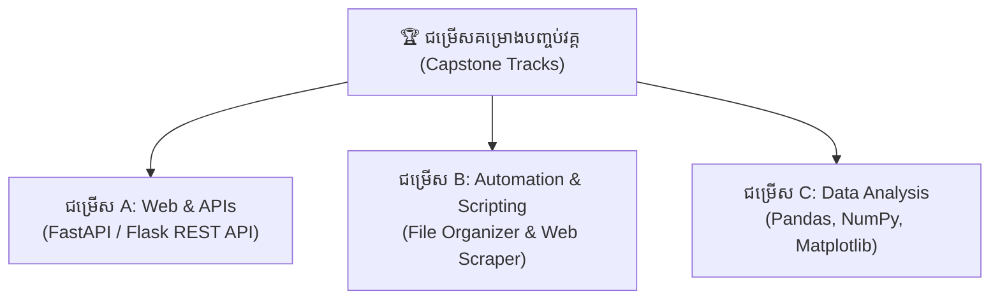

## 🌐 Overview

សូមអបអរសាទរដែលបានធ្វើដំណើរមកដល់ម៉ូឌុលចុងក្រោយ! រហូតមកដល់ពេលនេះ កម្មវិធីរបស់អ្នកគ្រាន់តែជាកូដដែលអ្នកចុច "Run" នៅក្នុងកូដ Editor ប៉ុណ្ណោះ។ តើអ្នកចង់បង្កើតកម្មវិធីពិតប្រាកដមួយ ដែលមិត្តភក្តិរបស់អ្នកអាចវាយបញ្ជានៅក្នុង Terminal (Command Prompt) ដូចជាពួកគេកំពុងប្រើកម្មវិធី Hackers ដែរឬទេ?
កម្មវិធីបែបនេះហៅថា **CLI (Command Line Interface)**។ ឧបករណ៍ទំនើបៗដូចជា `git`, `pip`, ឬ `npm` សុទ្ធតែជាកម្មវិធី CLI។ នៅក្នុងមេរៀននេះ យើងនឹងរៀនប្រើ **`argparse`** ដើម្បីអភិវឌ្ឍកម្មវិធី CLI ខ្នាតតូចមួយដែលអាចជួយសម្រួលការងារប្រចាំថ្ងៃបាន។

---

## 📚 Definitions

- **CLI (Command-Line Interface):** ប្រភេទកម្មវិធីដែលប្រាស្រ័យទាក់ទងជាមួយអ្នកប្រើប្រាស់ តាមរយៈការវាយអត្ថបទបញ្ជា (Text commands)។
- **Arguments:** ទិន្នន័យបន្ថែមដែលអ្នកវាយបញ្ចូលបន្ទាប់ពីឈ្មោះកម្មវិធី (ឧ. `python script.py data.csv`) ដែល `data.csv` ជា Argument។
- **Options / Flags:** ការកំណត់រចនាសម្ព័ន្ធបណ្តោះអាសន្ន តែងតែមានសញ្ញា `-` ឬ `--` (ឧ. `git commit -m "update"`) ទីនេះ `-m` គឺជា Flag។
- **`argparse`:** បណ្ណាល័យស្តង់ដាររបស់ Python (មិនបាច់ដំឡើង) សម្រាប់ទទួល និងបកប្រែពាក្យបញ្ជាដែលវាយបញ្ចូលពី Terminal យ៉ាងមានប្រសិទ្ធភាព។

---

## 💡 The Core Idea

ស្រមៃថា **កម្មវិធីរបស់អ្នកគឺជាហាងកាហ្វេ**។
- ការសរសេរកូដធម្មតា ដោយប្តូរអថេរ (Variable) ក្នុងកូដ គឺដូចជាអតិថិជនដើរចូលហាង ហើយចូលទៅឆុងកាហ្វេខ្លួនឯង (ពិបាក និងអាចមានកំហុស)។
- **កម្មវិធី CLI (ជាមួយ argparse):** គឺដូចជាហាងមាន "អ្នកទទួលកុម្ម៉ង់ (Cashier)" យ៉ាងជំនាញ។ អតិថិជនគ្រាន់តែនិយាយថា៖
  👉 *"ខ្ញុំយកកាហ្វេ១កែវ (`Argument`) សុំផ្អែមតិច (`--sugar=low`) និងថែមទឹកកក (`--ice`)"*។
  អ្នកទទួលកុម្ម៉ង់ (`argparse`) នឹងកត់ត្រាសំណើនេះ រួចបញ្ជូនទៅកូដរបស់អ្នកឱ្យដំណើរការយ៉ាងរលូន។

---

## 📖 In Depth

**ការយល់ដឹងពីប្រភេទ Arguments ក្នុង Argparse:**
1. **Positional Arguments:** ជាកាតព្វកិច្ចដែលត្រូវតែមាន ហើយទីតាំងរបស់វាសំខាន់ណាស់។ បង្កើតដោយមិនបាច់មានសញ្ញា `-` ពីមុខ (ឧទាហរណ៍ `parser.add_argument("filename")`)។
2. **Optional Arguments (Flags):** មិនមានក៏បាន (បើគ្មាន វានឹងយកតម្លៃលំនាំដើម Default)។ បង្កើតដោយមានសញ្ញា `-` ឬ `--` (ឧទាហរណ៍ `parser.add_argument("-v", "--verbose")`)។
3. **ការបង្កើត Help Menu:** លក្ខណៈពិសេសបំផុតរបស់ `argparse` គឺវាបង្កើតសៀវភៅណែនាំ (Help Menu) ដោយស្វ័យប្រវត្តិ។ អ្នកគ្រាន់តែវាយ `python app.py -h` វានឹងបង្ហាញរបៀបប្រើប្រាស់ទាំងអស់។

---

## 💻 Code Breakdown

តោះ! ឥឡូវនេះយើងនឹងបង្កើតកម្មវិធី CLI មួយឈ្មោះថា `FileOrganizer` ដែលមានតួនាទីរៀបចំឯកសាររញ៉េរញ៉ៃ ចូលទៅក្នុងថត (Folders) ផ្សេងៗគ្នាទៅតាមប្រភេទរបស់វា (រូបភាពទៅថតរូបភាព ឯកសារទៅថតឯកសារ)។

សូមបង្កើតឯកសារឈ្មោះ `organize.py` រួចសរសេរកូដដូចខាងក្រោម៖

```python
import argparse
import os
import shutil
from pathlib import Path

def organize_files(target_dir, verbose=False):
    """អនុគមន៍សម្រាប់រៀបចំឯកសារ (Core Logic)"""
    
    # កំណត់ប្រភេទឯកសារ
    extensions = {
        'Images': ['.jpg', '.jpeg', '.png', '.gif'],
        'Documents': ['.pdf', '.docx', '.txt', '.xlsx'],
        'Code': ['.py', '.js', '.html']
    }
    
    # ពិនិត្យមើលថាតើ Directory មានពិតឬទេ
    base_path = Path(target_dir)
    if not base_path.exists():
        print(f"❌ រកមិនឃើញថត: {target_dir}")
        return

    # អានគ្រប់ឯកសារទាំងអស់ក្នុងថត
    moved_count = 0
    for file_path in base_path.iterdir():
        if file_path.is_file(): # ប្រាកដថាវាជាឯកសារ មិនមែនជាថត
            file_ext = file_path.suffix.lower()
            
            # រកមើលថាតើវាជាប្រភេទអ្វី
            for category, exts in extensions.items():
                if file_ext in exts:
                    # បង្កើតថតថ្មីបើសិនជាវាមិនទាន់មាន
                    dest_folder = base_path / category
                    dest_folder.mkdir(exist_ok=True)
                    
                    # ផ្លាស់ទីឯកសារ
                    dest_path = dest_folder / file_path.name
                    shutil.move(str(file_path), str(dest_path))
                    moved_count += 1
                    
                    if verbose:
                        print(f"បានរៀបចំ: {file_path.name} -> {category}/")
                    break

    print(f"✅ រួចរាល់! បានផ្លាស់ទីឯកសារចំនួន {moved_count} ។")

# នេះជាផ្នែកសំខាន់នៃ CLI របស់យើង (Argparse Setup)
if __name__ == "__main__":
    # ១. បង្កើតអ្នកទទួលកុម្ម៉ង់ (Parser)
    parser = argparse.ArgumentParser(
        description="កម្មវិធីរៀបចំឯកសារ (File Organizer) ដ៏ឆ្លាតវៃ។ វានឹងរៀបចំឯកសាររបស់អ្នកទៅតាមប្រភេទនីមួយៗ (Images, Documents, Code)។"
    )
    
    # ២. បន្ថែម Positional Argument (កាតព្វកិច្ច)
    parser.add_argument(
        "directory", 
        type=str, 
        help="ផ្លូវ (Path) ទៅកាន់ថតដែលអ្នកចង់រៀបចំ"
    )
    
    # ៣. បន្ថែម Optional Argument (Flag សម្រាប់លោតសារលម្អិត)
    parser.add_argument(
        "-v", "--verbose", 
        action="store_true", # បើគេវាយ -v តម្លៃវានឹងក្លាយជា True (default: False)
        help="បង្ហាញព័ត៌មានលម្អិតនៃឯកសារនីមួយៗដែលបានផ្លាស់ទី"
    )
    
    # ៤. អានទិន្នន័យដែលគេវាយចូល
    args = parser.parse_args()
    
    # ៥. បញ្ជូនទិន្នន័យទៅឱ្យអនុគមន៍ធ្វើការ
    organize_files(args.directory, verbose=args.verbose)
```

---

## 🌐 ការអនុវត្តជាក់ស្តែង (Real-world Application)

**របៀបប្រើប្រាស់កម្មវិធីដែលយើងទើបបង្កើត:**

ឧបមាថាអ្នកបានសរសេរកូដខាងលើរួចរាល់ នេះជារបៀបដែលអ្នក (ឬមិត្តភក្តិអ្នក) យកវាទៅប្រើក្នុង Command Prompt ឬ Terminal៖

1. **សុំជំនួយ (មើលសៀវភៅណែនាំ):**
   ```bash
   python organize.py -h
   # ឬ
   python organize.py --help
   ```
   *លទ្ធផល:* វានឹងបង្ហាញសារពន្យល់ពីរបៀបប្រើប្រាស់ និង Arguments ទាំងអស់យ៉ាងស្អាត ដោយអ្នកមិនបាច់សរសេរកូដ Print ខ្លួនឯងនោះទេ។

2. **ដំណើរការធម្មតា (ត្រូវផ្តល់ទីតាំង Folder):**
   ```bash
   python organize.py /Users/john/Downloads
   ```
   *លទ្ធផល:* "✅ រួចរាល់! បានផ្លាស់ទីឯកសារចំនួន ៤៥ ។"

3. **ដំណើរការដោយបើកមុខងារលម្អិត (Verbose Flag):**
   ```bash
   python organize.py /Users/john/Downloads -v
   ```
   *លទ្ធផល:*
   បានរៀបចំ: image1.jpg -> Images/
   បានរៀបចំ: report.pdf -> Documents/
   ✅ រួចរាល់! បានផ្លាស់ទីឯកសារចំនួន ៤៥ ។

កម្មវិធីនេះអាចយកទៅដាក់ក្នុង Crontab (Linux/Mac) ឬ Task Scheduler (Windows) ដើម្បីឱ្យវារត់រៀបចំ Folder Downloads របស់អ្នកជារៀងរាល់ថ្ងៃនៅម៉ោង ១២ យប់ ដោយស្វ័យប្រវត្តិ! នេះហើយជាអំណាចនៃកម្មវិធី CLI។

---

## ❌ Common Mistakes

- **សរសេរ `sys.argv` ដោយផ្ទាល់ជំនួសឱ្យ `argparse`:** អ្នកអភិវឌ្ឍន៍ថ្មីៗតែងតែប្រើប្រាស់ `import sys` ហើយអាន `sys.argv[1]` ដើម្បីទទួលទិន្នន័យពី Terminal។ វិធីនេះគឺពិបាកណាស់ ព្រោះបើគេវាយខុស អ្នកត្រូវសរសេរកូដបង្ហាញលោត Error ខ្លួនឯង និងគ្មាន Help Menu ស្វ័យប្រវត្តិទេ។ សូមប្រើ `argparse` (ឬបណ្ណាល័យទំនើបជាងនេះដូចជា `Click` ឬ `Typer`)។
- **ភ្លេច `if __name__ == "__main__":`:** នៅពេលបង្កើតកម្មវិធី CLI អ្នកត្រូវតែដាក់កូដ `argparse` ក្នុង Block នេះ។ បើអ្នកមិនដាក់ទេ ពេលអ្នកផ្សេង `import` កូដរបស់អ្នកដើម្បីយកអនុគមន៍ `organize_files` ទៅប្រើ វានឹងលោតសួររក Arguments ធ្វើឱ្យគាំងកូដគេ។

---

## ✅ Key Takeaways

- កម្មវិធី **CLI** គឺជាកម្មវិធីដែលអត់មានផ្ទាំងចុច (GUI) តែវាអាចបញ្ជាបានលឿនតាម Terminal និងងាយស្រួលធ្វើស្វ័យប្រវត្តិកម្ម (Automation)។
- បណ្ណាល័យ **`argparse`** ជាឧបករណ៍ស្តង់ដារសម្រាប់ចាប់យក និងបកប្រែពាក្យបញ្ជាដែលអ្នកប្រើប្រាស់វាយបញ្ចូល ព្រមទាំងបង្កើតសៀវភៅណែនាំ `-h` (Help Menu) ដោយស្វ័យប្រវត្តិ។
- ប្រើប្រាស់ **Positional Arguments** សម្រាប់ទិន្នន័យចាំបាច់ដែលខ្វះមិនបាន (ឧ. ទីតាំង Folder)។
- ប្រើប្រាស់ **Optional Arguments (Flags)** សម្រាប់ជម្រើសបន្ថែមដែលអាចបិទឬបើក (ឧ. `-v` សម្រាប់ Verbose)។

---

## 🎓 គម្រោងបញ្ចប់វគ្គសិក្សា (Capstone Project Tracks)

អ្នកអាចជ្រើសរើសផ្លូវមួយក្នុងចំណោមជម្រើសទាំង ៣ ខាងក្រោមនេះ ដើម្បីកសាងគម្រោងធំចុងក្រោយរបស់អ្នក៖



---

### 🌐 ជម្រើស A: Web & APIs Track (បង្កើត REST API Backend)
* **គោលបំណង:** បង្កើត Web API សម្រាប់ផ្តល់ទិន្នន័យ JSON ទៅឱ្យ Frontend ឬ Mobile App។
* **បណ្ណាល័យសំខាន់ៗ:** `fastapi`, `uvicorn`, `pydantic`
* **ឧទាហរណ៍កូដសាមញ្ញ:**
```python
from fastapi import FastAPI
from pydantic import BaseModel

app = FastAPI()

class Student(BaseModel):
    name: str
    major: str
    gpa: float

@app.get("/")
def home():
    return {"message": "សូមស្វាគមន៍មកកាន់ Tech Academy API!"}

@app.post("/students/")
def add_student(student: Student):
    return {"status": "success", "data": student}
```

---

### 🤖 ជម្រើស B: Automation & Scripting Track (ស្វ័យប្រវត្តិកម្ម)
* **គោលបំណង:** បង្កើត Script ដែលទាញទិន្នន័យពី Website (Web Scraping) និងចាត់ចែង Files ក្នុងកុំព្យូទ័រដោយស្វ័យប្រវត្តិ។
* **បណ្ណាល័យសំខាន់ៗ:** `beautifulsoup4`, `requests`, `argparse`, `os`, `shutil`

---

### 📊 ជម្រើស C: Data Analysis Track (ការវិភាគ និងមើលឃើញទិន្នន័យ)
* **គោលបំណង:** អានទិន្នន័យពី CSV/Excel, សម្អាតទិន្នន័យស្ទួន, គណនាស្ថិតិ និងគូសក្រាហ្វិកវិភាគអាជីវកម្ម។
* **បណ្ណាល័យសំខាន់ៗ:** `pandas`, `numpy`, `matplotlib`, `seaborn`
* **ឧទាហរណ៍កូដសាមញ្ញ:**
```python
import pandas as pd
import matplotlib.pyplot as plt

# អានទិន្នន័យ និងគូរក្រាហ្វិក
data = {"Month": ["Jan", "Feb", "Mar", "Apr"], "Revenue": [1200, 1500, 1800, 2200]}
df = pd.DataFrame(data)

df.plot(x="Month", y="Revenue", kind="bar", color="skyblue")
plt.title("Monthly Revenue Growth")
plt.ylabel("Revenue in USD ($)")
plt.savefig("revenue_chart.png")
print("✅ បានបង្កើតក្រាហ្វិកវិភាគដោយជោគជ័យ!")
```

